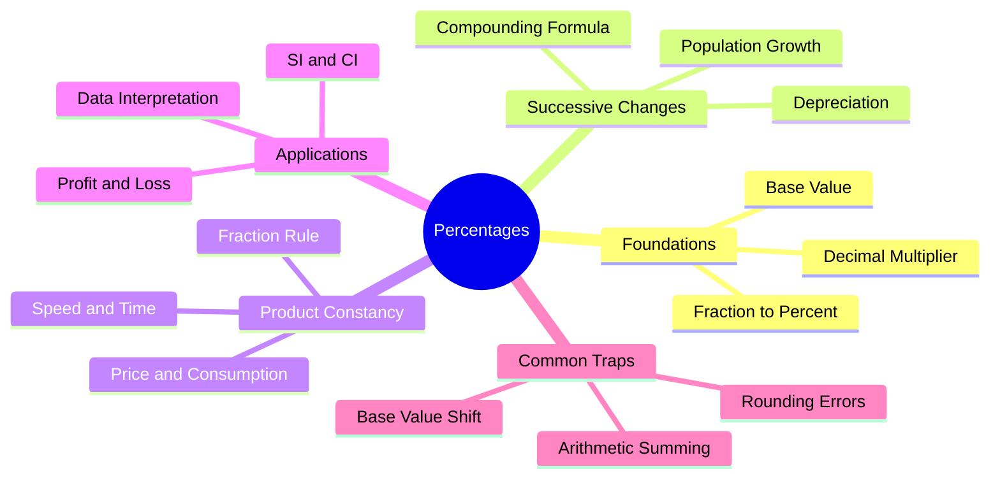

# Percentage — Mindmap

This file provides a structured mindmap of Percentage applications and core concepts.

---

## Explanation of Branches

1.  **Foundations:** The basic building blocks (identifying the base, converting fractions, and scaling values).
2.  **Successive Changes:** Calculating net values over multiple periods (growth and depreciation).
3.  **Product Constancy:** Balancing changes between inversely proportional variables.
4.  **Applications:** How percentages integrate with other key quantitative topics on the NQT.
5.  **Common Traps:** Common candidate errors to avoid during exam pressure.
