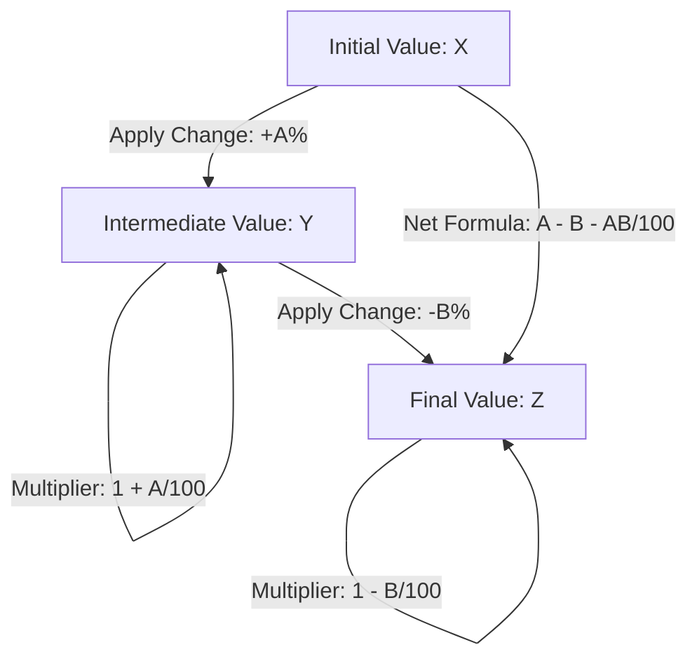
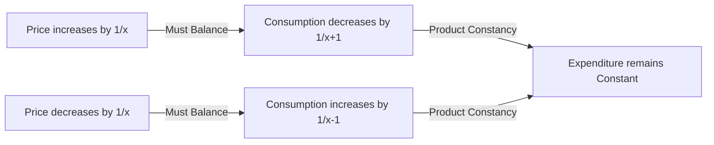

# Percentage — Visual Diagrams

This file provides visual representations of percentage workflows and equations.

---

## 1. Successive Percentage Change Flowchart

This flowchart demonstrates the compounding steps of applying consecutive percentage changes to a base value.

---

## 2. Product Constancy Relationship (Balancing Act)

This diagram shows how variables adjust to maintain a constant product (e.g., Price and Consumption).

---

## 3. Calculation Workflow

To solve any percentage word problem:
1.  **Identify the Base:** Determine the value to which the percentage is applied (comes after "than" or "of").
2.  **Convert to Fraction/Multiplier:** Use fractional equivalents to simplify the math.
3.  **Perform Operation:** Apply the scale factor.
4.  **Verify Integrity:** Check if the final value makes logical sense (e.g., increase leads to a larger number).
