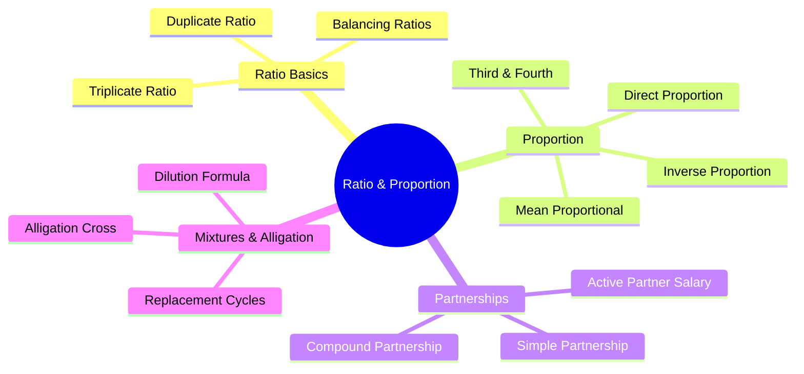

# Ratio & Proportion — Mindmap

This file provides a structured mindmap of Ratio, Proportion, Partnership, and Mixture & Alligation.

---

## Branch Overviews

1.  **Ratio Basics:** Covers combining ratios, duplicate ratios, and operations on ratios.
2.  **Proportion:** Examines direct and inverse variations, and proportional terms.
3.  **Partnerships:** Analyzes profit-sharing models (simple vs. compound) and partner classifications.
4.  **Mixtures & Alligation:** Focuses on blending ingredients, mean values, and dilution cycles.
