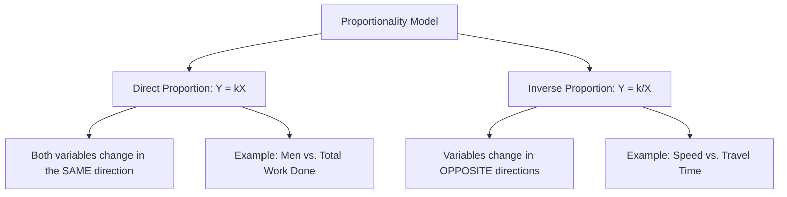
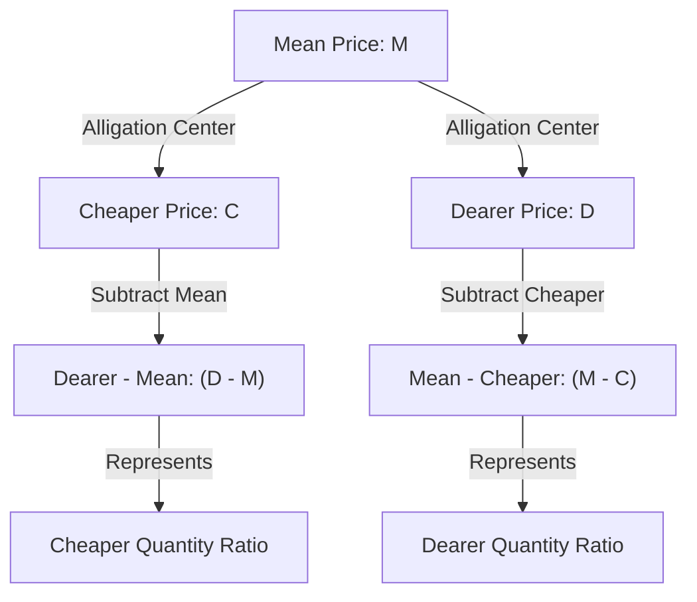

# Ratio & Proportion — Visual Diagrams

This file provides visual models of proportion relationships and the alligation cross-method.

---

## 1. Direct vs. Inverse Proportion Models

---

## 2. The Alligation Cross-Diagram

This diagram visualizes how the ratio of two ingredients is derived from their individual prices and the target mean price.

---

## 3. Dilution Process (Successive Replacements)

For successive replacements of a pure liquid with water:
1.  **Start:** Pure liquid of volume $V$.
2.  **Step 1:** Remove $x$ liters of mixture, add $x$ liters of water. Concentration drops by factor $(1 - x/V)$.
3.  **Step 2:** Repeat. Concentration drops again by factor $(1 - x/V)$.
4.  **Formula representation:** $\text{Liquid Volume} = V \times (1 - x/V)^n$.
