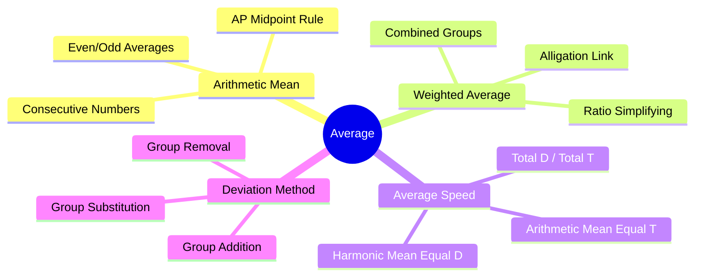

# Average — Mindmap

This file provides a structured mindmap of Average, Weighted Average, Average Speed, and Group Deviations.

---

## Branch Overviews

1.  **Arithmetic Mean:** The standard mean, covering properties of consecutive numbers and arithmetic series.
2.  **Weighted Average:** Combining groups of unequal sizes, and how it links to alligation.
3.  **Average Speed:** Differentiating between equal distance segments (harmonic) and equal time intervals (arithmetic).
4.  **Deviation Method:** Using group balance shortcuts instead of long multiplication equations.
