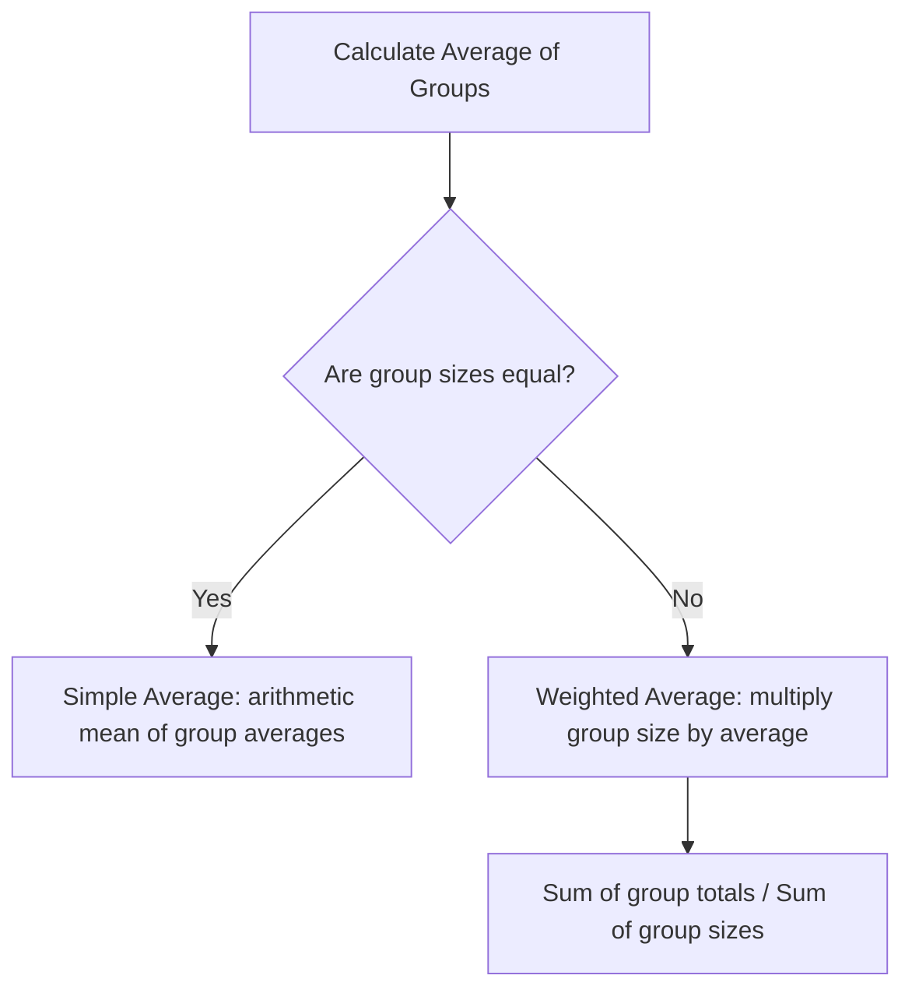
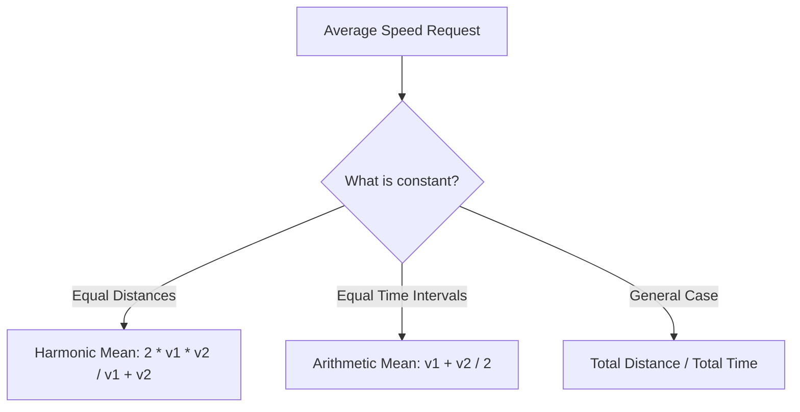

# Average — Visual Diagrams

This file provides visual models of weighted averages, average speeds, and group deviations.

---

## 1. Weighted Average vs. Simple Average

This flowchart shows the decision tree for choosing between simple arithmetic mean and weighted average.

---

## 2. Average Speed Decision Tree

This diagram maps the speed calculation path based on equal distance vs. equal time intervals.

---

## 3. Group Deviation Balance

For any group of elements with average $A$:
1.  **Values above average:** Positive deviation sum $+D$.
2.  **Values below average:** Negative deviation sum $-D$.
3.  **Equilibrium:** The net deviation sum is always zero:
    $$\sum (X_i - A) = 0$$
4.  **Application:** If a new element is added, the new average adjusts to maintain the net deviation balance of $0$.
