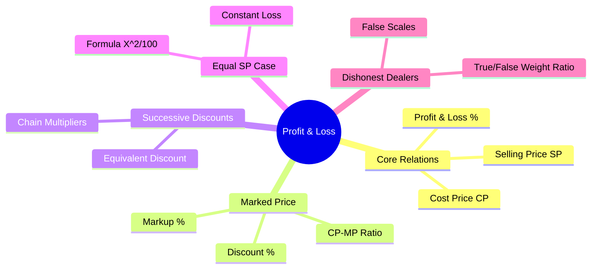

# Profit & Loss — Mindmap

This file provides a structured mindmap of Profit, Loss, Markup, Discount, and Dishonest Dealer relationships.

---

## Branch Overviews

1.  **Core Relations:** Basic definitions of cost, revenue, and profit/loss margins.
2.  **Marked Price:** Price listings, markups, discounts, and the MP/CP ratio.
3.  **Successive Discounts:** Combining multiple discount events into a single equivalent rate.
4.  **Equal SP Case:** Analyzing transactions with equal Selling Prices and opposite margins.
5.  **Dishonest Dealers:** Solving scale cheating problems using weight ratios.\n