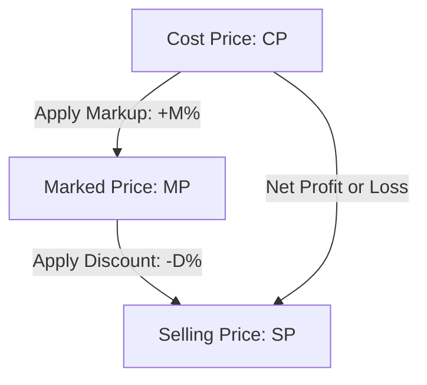

# Profit & Loss — Visual Diagrams

This file provides visual representations of price flows and dishonest dealer transactions.

---

## 1. Price Flowchart: CP to MP to SP

This flowchart demonstrates the sequence of pricing adjustments, showing where markup and discount are applied.

---

## 2. Dishonest Dealer Balance (Ratio Scaling)

This diagram visualizes how false weight scales the profit multiplier.

---

## 3. Decision Rules
1.  **Markup:** Calculated on Cost Price.
2.  **Discount:** Calculated on Marked Price.
3.  **Profit/Loss:** Calculated on Cost Price.
4.  **Transaction Values:** Taxes are applied to the final Selling Price (SP).\n