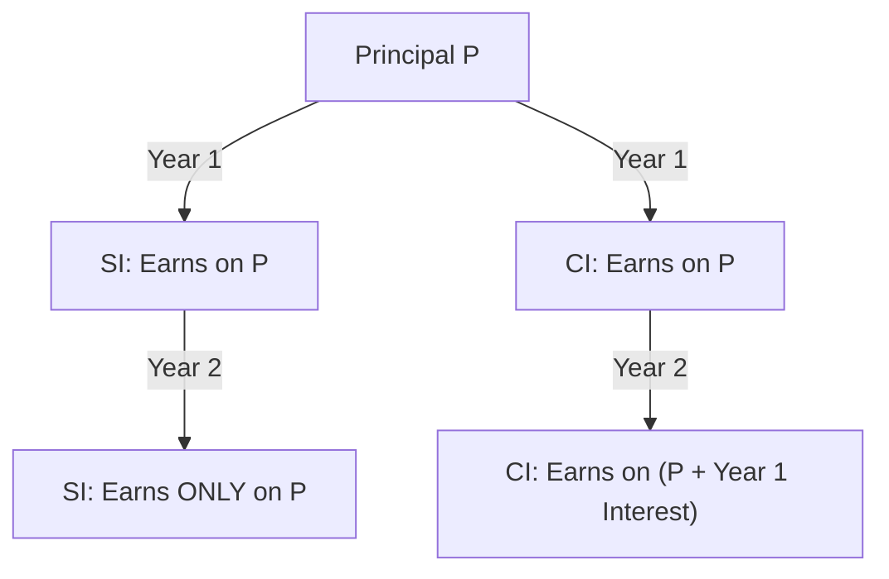
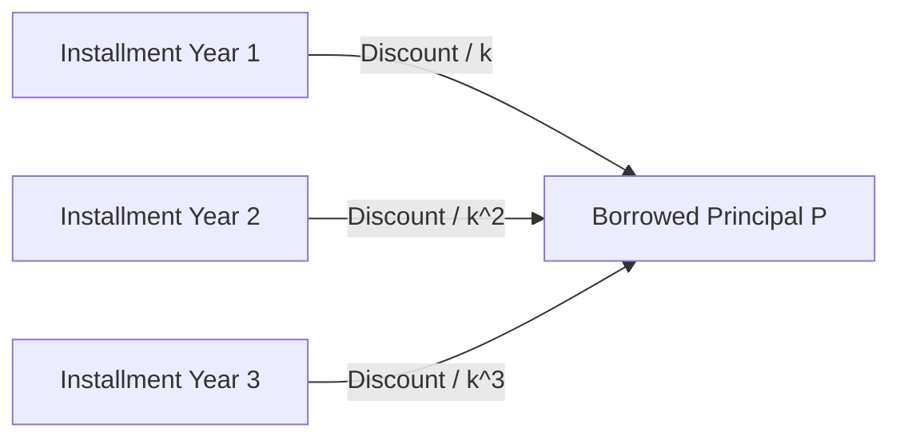

# Simple & Compound Interest — Visual Diagrams

This file visualizes the differences in growth between linear (SI) and exponential (CI) interest rates and loan installment timelines.

---

## 1. Linear vs. Exponential Growth Flow

This diagram illustrates how SI remains constant over time while CI compounds iteratively on accumulated interest.

---

## 2. Installment Present Value Discounting (CI)

This diagram visualizes how future payments are discounted to equal the current borrowed amount.

---

## 3. Comparison Summary
1.  **Simple Interest:** Fixed growth, constant rate per year.
2.  **Compound Interest:** compounding growth, rate scales exponentially over periods.
3.  **Installments:** Present value represents the sum of discounted cash flows.\n