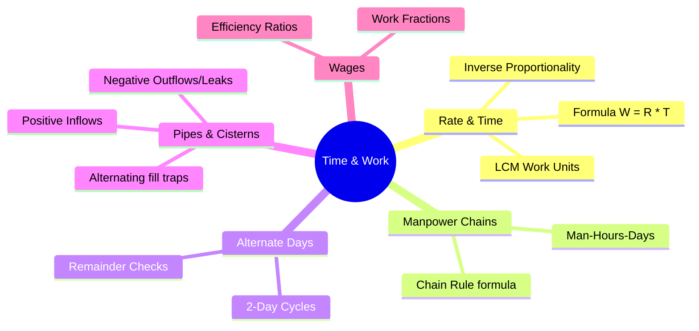

# Time & Work — Mindmap

This file provides a structured mindmap of Time & Work, LCM efficiencies, pipes & cisterns, and wages.

---

## Branch Overviews

1.  **Rate & Time:** Basic equations, LCM method, and rate addition.
2.  **Manpower Chains:** Solving scaling problems using man-days-hours.
3.  **Alternate Days:** Symmetrical cycle calculations and remainders.
4.  **Pipes & Cisterns:** Multi-flow systems and negative work.
5.  **Wages:** Distributing payments based on efficiency and work done.\n