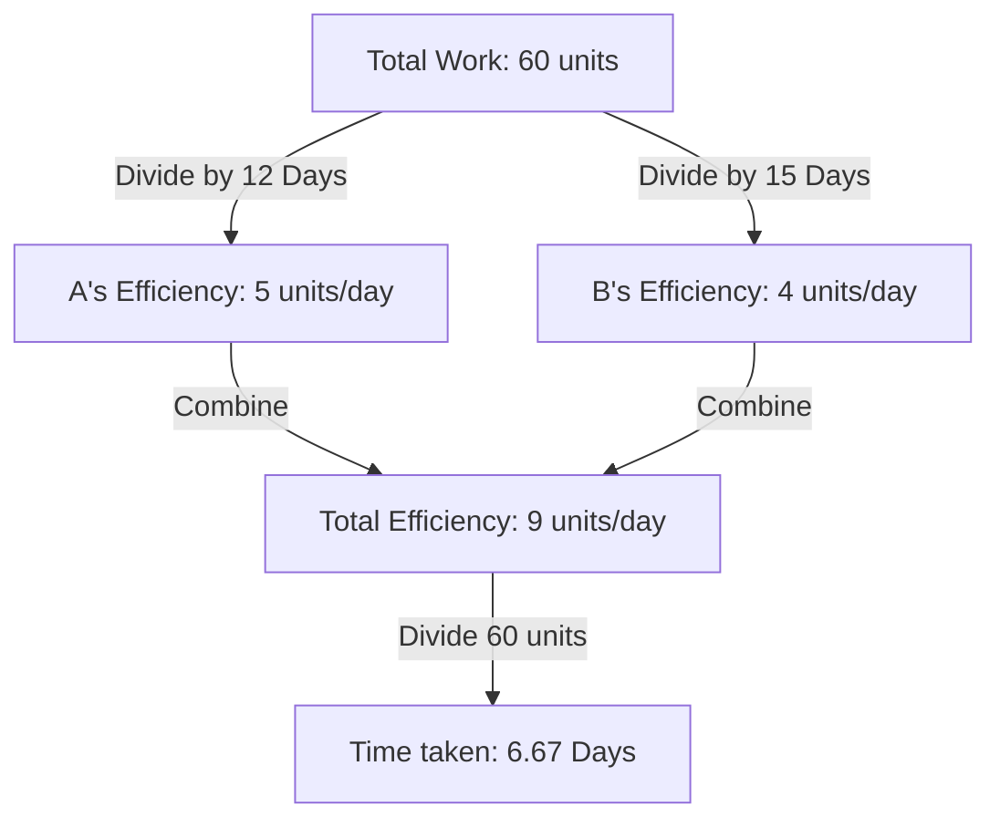
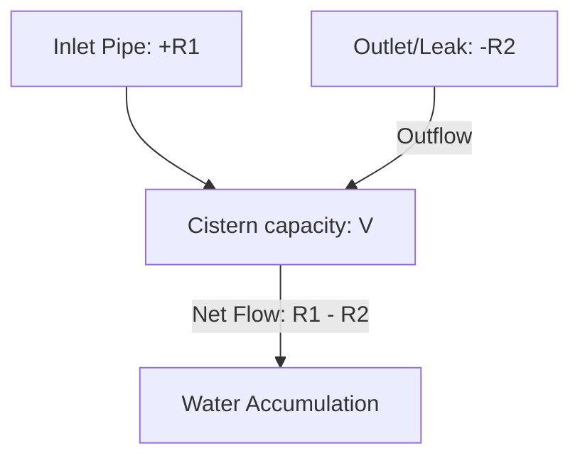

# Time & Work — Visual Diagrams

This file visualizes task allocation, LCM work units, and pipes & cisterns flow systems.

---

## 1. LCM Work Unit Allocation

This diagram illustrates how a total work of 60 units is divided based on individual efficiencies.

---

## 2. Pipes & Cisterns Flow Dynamics (Inlet vs. Leak)

This diagram visualizes a cistern with an inlet pipe and a leak at the bottom.

---

## 3. Alternating Days Timeline
For alternating days work (A on Day 1, B on Day 2):
*   **Cycle 1:** Day 1 (A) $
ightarrow$ Day 2 (B) $
ightarrow$ Total: $E_A + E_B$.
*   **Cycle 2:** Day 3 (A) $
ightarrow$ Day 4 (B) $
ightarrow$ Total: $E_A + E_B$.
*   **Final Step:** Remaining work divided by the active worker's efficiency.\n