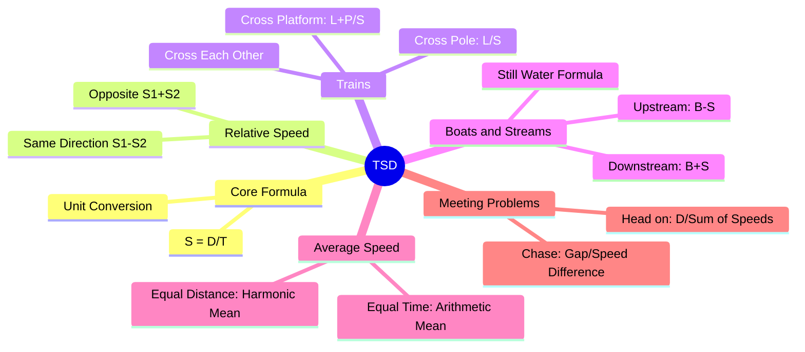

# Time, Speed & Distance — Mindmap

```mermaid
mindmap
  root((TSD))
    Core Formula
      S = D/T
      Unit Conversion
    Relative Speed
      Same Direction S1-S2
      Opposite S1+S2
    Trains
      Cross Pole: L/S
      Cross Platform: L+P/S
      Cross Each Other
    Boats and Streams
      Downstream: B+S
      Upstream: B-S
      Still Water Formula
    Average Speed
      Equal Distance: Harmonic Mean
      Equal Time: Arithmetic Mean
    Meeting Problems
      Head on: D/Sum of Speeds
      Chase: Gap/Speed Difference
```
