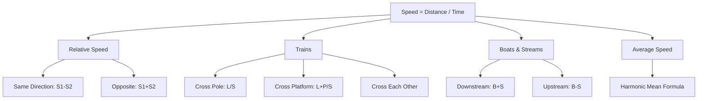

# Time, Speed & Distance — Diagrams

## 1. TSD Concept Map



## 2. Train Crossing Platform — Length Diagram

```
|<---- Train L1 ---->|
                     |<--- Platform L2 --->|
[=================== PLATFORM ===================]
```

Total distance to cover = L1 + L2

## 3. Boats & Streams Direction

```
Upstream (against current)
<===  [BOAT] ←←←←←← [CURRENT →→→→→→]

Downstream (with current)
[CURRENT →→→→→→] →→→→→→ [BOAT]  ===>
```

Effective speed upstream = B - S
Effective speed downstream = B + S

## 4. Relative Speed — Same vs Opposite Direction

```
Same Direction:
→ A(fast) .... B(slow) →
Relative speed = A - B (A catches B slowly)

Opposite Direction:
→ A ....distance D.... B ←
Relative speed = A + B (close gap quickly)
```
