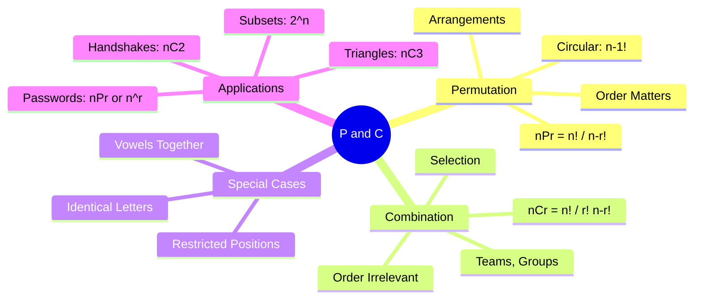

# Permutation & Combination — Mindmap

```mermaid
mindmap
  root((P and C))
    Permutation
      nPr = n! / n-r!
      Order Matters
      Arrangements
      Circular: n-1!
    Combination
      nCr = n! / r! n-r!
      Order Irrelevant
      Selection
      Teams, Groups
    Special Cases
      Identical Letters
      Vowels Together
      Restricted Positions
    Applications
      Handshakes: nC2
      Triangles: nC3
      Passwords: nPr or n^r
      Subsets: 2^n
```
