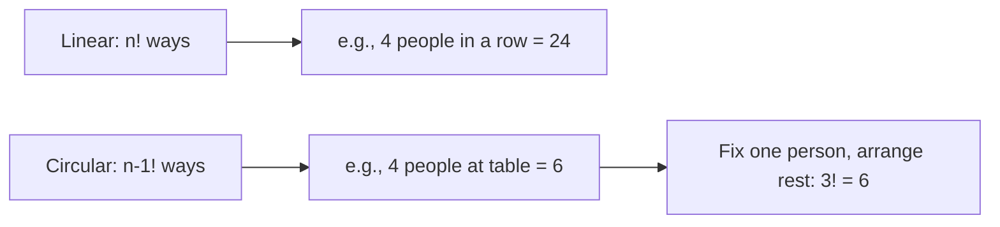

# Permutation & Combination — Diagrams

## 1. P vs C Decision Tree

```mermaid
graph TD
    A[Problem asks about items] --> B{Does ORDER matter?}
    B -->|Yes| C[Use Permutation: nPr]
    B -->|No| D[Use Combination: nCr]
    C --> E[Arrange: n!/(n-r)!]
    D --> F[Select: n!/r!(n-r)!]
    E --> G[Example: Arrange 3 from 5 = 60]
    F --> H[Example: Choose 3 from 5 = 10]
```

## 2. Circular vs Linear Seating



## 3. Counting Paths — Pascal's Triangle
Row n, position r = nCr value:
```
n=0:         1
n=1:        1 1
n=2:       1 2 1
n=3:      1 3 3 1
n=4:     1 4 6 4 1
n=5:    1 5 10 10 5 1
```

## 4. Subset Tree (n=3 items: A, B, C)
2^3 = 8 subsets:
- {} (empty)
- {A}, {B}, {C}
- {AB}, {AC}, {BC}
- {ABC}
