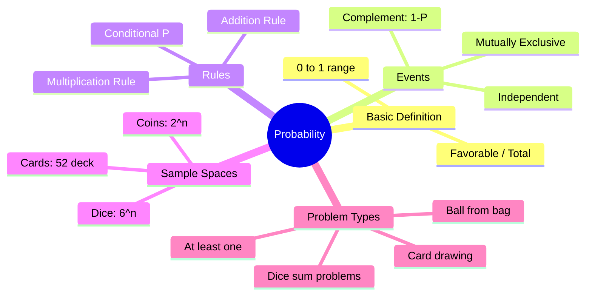

# Probability — Mindmap

```mermaid
mindmap
  root((Probability))
    Basic Definition
      Favorable / Total
      0 to 1 range
    Events
      Complement: 1-P
      Mutually Exclusive
      Independent
    Rules
      Addition Rule
      Multiplication Rule
      Conditional P
    Sample Spaces
      Coins: 2^n
      Dice: 6^n
      Cards: 52 deck
    Problem Types
      Dice sum problems
      Card drawing
      Ball from bag
      At least one
```
