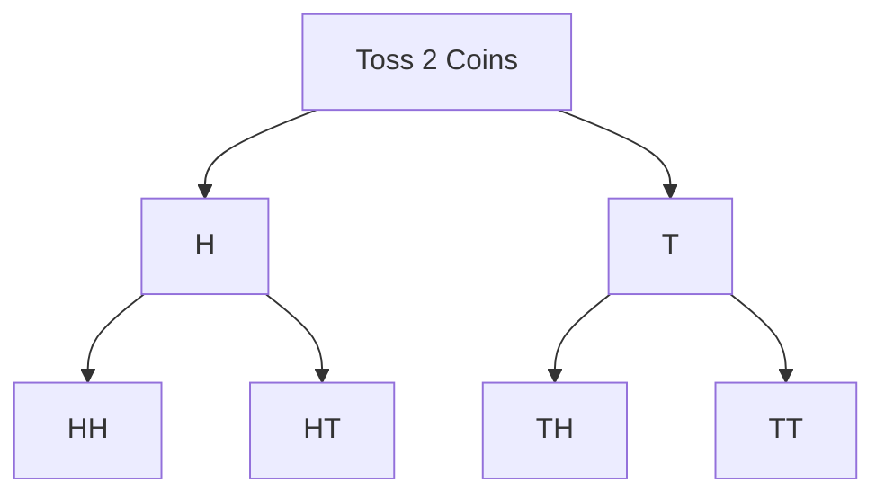

# Probability — Diagrams

## 1. Sample Space Tree — 2 Coins



4 equally likely outcomes: HH, HT, TH, TT

## 2. Venn Diagram — Addition Rule

```
Universe (all outcomes)
+------------------------+
|  A  |  A∩B  |   B    |
+------------------------+
P(A∪B) = P(A) + P(B) - P(A∩B)
```

## 3. Card Deck Structure

```
52 Cards
├── 26 Red
│   ├── 13 Hearts (♥)
│   └── 13 Diamonds (♦)
└── 26 Black
    ├── 13 Spades (♠)
    └── 13 Clubs (♣)

Each suit: A 2 3 4 5 6 7 8 9 10 J Q K
Face cards: J Q K (3 per suit = 12 total)
Aces: 4 total
```

## 4. Two Dice Outcome Grid

```
Die1\Die2  1  2  3  4  5  6
    1    (1,1)(1,2)...(1,6)
    2    (2,1)(2,2)...(2,6)
    ...
    6    (6,1)(6,2)...(6,6)
Total = 36 outcomes
```
