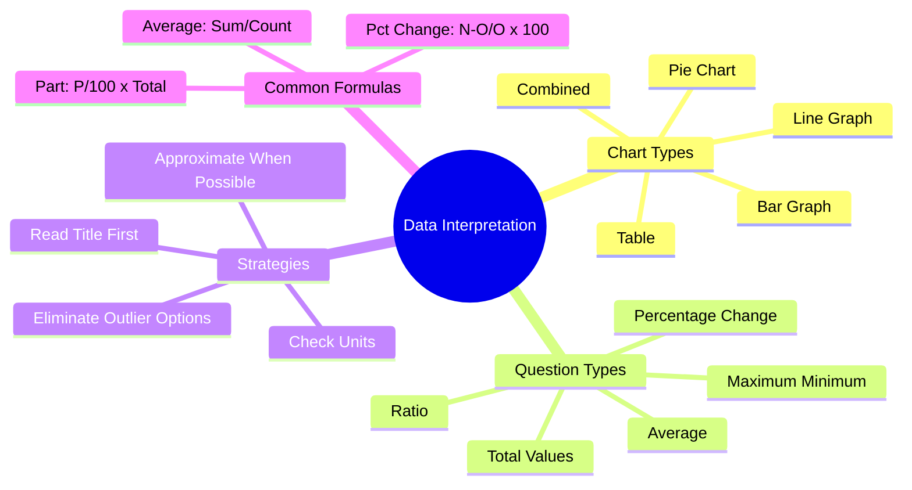

# Data Interpretation — Mindmap

```mermaid
mindmap
  root((Data Interpretation))
    Chart Types
      Table
      Bar Graph
      Pie Chart
      Line Graph
      Combined
    Question Types
      Percentage Change
      Ratio
      Average
      Maximum Minimum
      Total Values
    Strategies
      Read Title First
      Check Units
      Approximate When Possible
      Eliminate Outlier Options
    Common Formulas
      Pct Change: N-O/O x 100
      Part: P/100 x Total
      Average: Sum/Count
```
