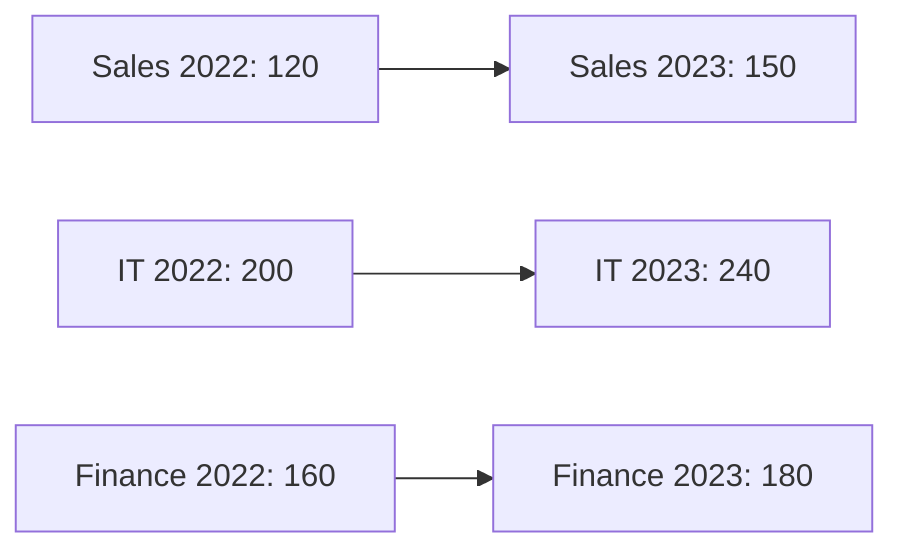

# Data Interpretation — Sample Charts

## 1. Sample Bar Graph Data Set

Company Revenue (in crores) for 5 departments across 2 years:

```
Department | 2022 | 2023
-----------+------+------
Sales      |  120 |  150
Marketing  |   80 |   90
IT         |  200 |  240
HR         |   40 |   35
Finance    |  160 |  180
```



## 2. Sample Pie Chart Data

Student Distribution by Stream (Total: 2000 students):
```
Engineering: 35%
Commerce:    25%
Arts:        20%
Science:     15%
Others:       5%
```

Values:
- Engineering = 35% of 2000 = 700
- Commerce = 25% of 2000 = 500
- Arts = 20% of 2000 = 400
- Science = 15% of 2000 = 300
- Others = 5% of 2000 = 100

## 3. Sample Line Graph

Production (units) over 5 years:
```
Year:       2019  2020  2021  2022  2023
Production: 1200  1400  1300  1600  1800
```

Year-on-year changes:
- 2019→2020: +200 (+16.7%)
- 2020→2021: -100 (-7.1%)
- 2021→2022: +300 (+23.1%) ← highest growth
- 2022→2023: +200 (+12.5%)


