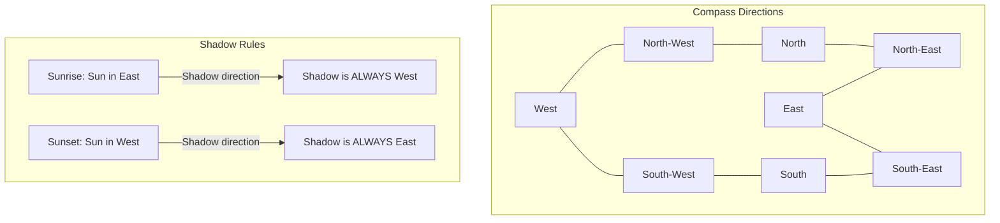

# TCS NQT 2026 — Reasoning Ability
### Complete Preparation Guide · Exam: June 28, 2026

> **Section Stats:** 20 Questions · 25 Minutes · ~75 sec/question · No Negative Marking
> 
> **FIB Strategy:** For fill-in-the-blank reasoning questions (like series or codes), check spelling and case sensitivity. Type exactly as requested.

---

## Quick Navigation

| Block | Topics | Weight |
|-------|--------|--------|
| [A — Series & Patterns](#block-a--series--patterns) | Number Series, Alphabet Series, Alphanumeric Series | ~4Q |
| [B — Logical Deduction](#block-b--logical-deduction) | Syllogisms, Statement & Conclusions, Coding-Decoding, Blood Relations | ~6Q |
| [C — Arrangement & Direction](#block-c--arrangement--direction) | Seating Arrangement, Direction & Distance, Ranking & Ordering | ~6Q |
| [D — Analytical](#block-d--analytical) | Data Sufficiency, Clocks & Calendars, Cubes & Dice, Analogy | ~4Q |
| [Strategy](#⏱️-last-5-minutes-strategy) | Last 5 Minutes Game Plan | — |

---

# BLOCK A — Series & Patterns

---

## 1. Number Series ⭐⭐

### Concept
Number series test pattern recognition, arithmetic growth, and sequence identification. In TCS NQT, these patterns usually involve multiple levels of differences or algebraic changes like squares/cubes.

### Real-World Anchor
> A security pattern where a backup timer runs at exponential intervals (e.g. 2, 9, 28, 65 seconds) to prevent synchronized server requests.

### Key Mappings
For sequence identification, check the following common series structures:

| Series Pattern | Formula | Example |
|----------------|---------|---------|
| Arithmetic Difference | $T_n = T_{n-1} + d$ | 2, 5, 8, 11 (+3) |
| Geometric / Factorial | $T_n = T_{n-1} \times k$ | 4, 6, 12, 30 ($\times 1.5, \times 2, \times 2.5$) |
| Square/Cube Offset | $T_n = n^2 \pm k$ or $n^3 \pm k$ | 2, 9, 28, 65 ($n^3 + 1$) |
| Prime Increment | $T_n = T_{n-1} + P_n$ | 7, 11, 13, 17 (+4, +2, +4 consecutive primes) |

### ⚡ Shortcut Tricks
1. **Difference Table ($D_1 \to D_2 \to D_3$)**: If the pattern is not immediately obvious, write down the first difference row ($D_1$), then the second ($D_2$). A constant second difference indicates a quadratic sequence.
2. **Alternating Splits**: If numbers go up and down irregularly, split the series into two independent alternating sequences (odd positions vs. even positions) and solve them separately.

### ⚠️ Common Error
> Overlooking prime differences (e.g., $+2, +3, +5, +7, +11$) and automatically writing $+9$ because you assumed it was an odd-number series.

### 30-Second Exam Trick
Create a differences table on your scratch sheet immediately. Alternating series are the most common NQT variant; if you spot 6+ numbers in a question, split them by index right away.

---

### PYQ-Style Questions (TCS NQT Pattern)

**Q1.** Find the missing term: **2, 9, 28, 65, 126, ?**
<details>
<summary>Solution</summary>
The pattern is $n^3 + 1$:
* $1^3 + 1 = 2$
* $2^3 + 1 = 9$
* $3^3 + 1 = 28$
* $4^3 + 1 = 65$
* $5^3 + 1 = 126$
* Next term $= 6^3 + 1 = 216 + 1 = $ **217** ✓
</details>

**Q2.** Identify the wrong term in the series: **3, 5, 8, 13, 21, 33, 55**
<details>
<summary>Solution</summary>
This follows a Fibonacci-like summation pattern:
* $3 + 5 = 8$
* $5 + 8 = 13$
* $8 + 13 = 21$
* $13 + 21 = 34$ (not 33)
* $21 + 34 = 55$
Thus, **33** is the wrong term. ✓
</details>

**Q3.** Find the missing term: **7, 11, 13, 17, 19, 23, ?**
<details>
<summary>Solution</summary>
These are consecutive prime numbers. The next prime number after 23 is **29**. ✓
</details>

**Q4.** Find the missing term: **4, 6, 12, 30, 90, 315, ?**
<details>
<summary>Solution</summary>
The multiplying factor grows by 0.5 at each step:
* $4 \times 1.5 = 6$
* $6 \times 2 = 12$
* $12 \times 2.5 = 30$
* $30 \times 3 = 90$
* $90 \times 3.5 = 315$
* $315 \times 4.0 = $ **1260** ✓
</details>

**Q5.** Find the missing term in: **10, 12, 16, 24, 40, ?**
<details>
<summary>Solution</summary>
The difference row ($D_1$) is: $+2, +4, +8, +16$.
These are powers of 2. The next difference is $+32$.
* Next term $= 40 + 32 = $ **72** ✓
</details>

---

### 🎯 Expected June 2026 Questions

| # | Question | Answer |
|---|----------|--------|
| 1 | Find the missing term: **5, 16, 49, 148, ?** (Hint: $3x + 1$) | **445** |
| 2 | Find the missing term: **1, 4, 27, 256, ?** (Hint: $n^n$) | **3125** |

---

## 2. Alphabet/Letter Series ⭐⭐

### Concept
Alphabet series test forward and backward alphabetical positional shifts. These are best solved by converting letters to numbers.

### Real-World Anchor
> Hexadecimal hashing offsets where indices shift by a cyclic alphabetical formula.

### Key Mappings
Use the **EJOTY** anchor to recall letter positions quickly:

| Letter | E | J | O | T | Y |
|--------|---|---|---|---|---|
| Position | 5 | 10 | 15 | 20 | 25 |

### ⚡ Shortcut Tricks
1. **Numeric Conversion**: Immediately convert letters to numbers. For example, $A=1, B=2, \dots, Z=26$.
2. **Opposite Pairs**: Memorize opposites: $A-Z$, $B-Y$, $C-X$, $D-W$, $E-V$, $F-U$, $G-T$, $H-S$, $I-R$, $J-Q$, $K-P$, $L-O$, $M-N$. (Sum of positions is always 27).

### ⚠️ Common Error
> Miscalculating circular transitions (e.g. $Z + 3$ goes back to $C$, and $A - 2$ wraps back to $Y$).

### 30-Second Exam Trick
Write the numbers 1 to 26 and their corresponding letters on your scratch sheet during the 15-minute login buffer to avoid mental slip-ups under time pressure.

---

### PYQ-Style Questions (TCS NQT Pattern)

**Q1.** Find the next term: **A, C, F, J, O, ?**
<details>
<summary>Solution</summary>
Convert to numbers: $1, 3, 6, 10, 15$.
The differences are: $+2, +3, +4, +5$.
* Next difference $= +6 \implies 15 + 6 = 21$.
* Letter at 21 is **U**. ✓
</details>

**Q2.** Find the next term: **Z, W, S, N, H, ?**
<details>
<summary>Solution</summary>
Convert to numbers: $26, 23, 19, 14, 8$.
The differences are: $-3, -4, -5, -6$.
* Next difference $= -7 \implies 8 - 7 = 1$.
* Letter at 1 is **A**. ✓
</details>

**Q3.** Complete the series: **AB, DE, GH, JK, ?**
<details>
<summary>Solution</summary>
Track the first letters: $A(1) \to D(4) \to G(7) \to J(10) \implies M(13)$.
The terms are consecutive letter pairs.
* Term after $M$ is $N$.
* Result is **MN**. ✓
</details>

**Q4.** Find the next term: **B, D, H, N, ?**
<details>
<summary>Solution</summary>
Convert to numbers: $2, 4, 8, 14$.
Differences are: $+2, +4, +6$.
* Next difference $= +8 \implies 14 + 8 = 22$.
* Letter at 22 is **V**. ✓
</details>

**Q5.** Find the next term: **AZ, CX, EV, GT, ?**
<details>
<summary>Solution</summary>
These are opposite letter pairs starting at odd indices:
* $A(1)-Z(26)$, $C(3)-X(24)$, $E(5)-V(22)$, $G(7)-T(20)$.
* Next odd letter is $I(9)$, whose opposite is $R(18)$.
* Result is **IR**. ✓
</details>

---

### 🎯 Expected June 2026 Questions

| # | Question | Answer |
|---|----------|--------|
| 1 | Find the next term: **DF, GJ, KM, NQ, RT, ?** | **UX** |
| 2 | Find the next term: **Z, U, Q, N, L, ?** | **K** |

---

## 3. Alphanumeric Series ⭐⭐

### Concept
Alphanumeric series combine alphabetical shifting with numerical progress in a single sequence.

### Real-World Anchor
> Car license plate numbers or invoice IDs that cycle through prefix characters and sequential digits.

### ⚡ Shortcut Tricks
1. **Deconstruct**: Separate the letter terms and number terms. Solve them as two independent problems.
2. **Options Match**: Check options after solving the number component first; numbers are usually quicker to compute and will immediately eliminate incorrect choices.

---

### PYQ-Style Questions (TCS NQT Pattern)

**Q1.** Find the next term: **2A11, 4D13, 12G17, 48J25, ?**
<details>
<summary>Solution</summary>
Deconstruct the parts:
1. First Number: $2 \times 2 = 4, 4 \times 3 = 12, 12 \times 4 = 48 \implies 48 \times 5 = 240$.
2. Letter: $A \to D(+3) \to G(+3) \to J(+3) \implies M$.
3. Second Number: $11 \to 13(+2) \to 17(+4) \to 25(+8) \implies 41(+16)$.
* Combined result: **240M41** ✓
</details>

**Q2.** Complete the series: **F3M, I6P, L12S, O24V, ?**
<details>
<summary>Solution</summary>
Deconstruct the parts:
1. First Letter: $F(6) \to I(9) \to L(12) \to O(15) \implies R(18)$.
2. Number: $3 \times 2 = 6, 6 \times 2 = 12, 12 \times 2 = 24 \implies 48$.
3. Last Letter: $M(13) \to P(16) \to S(19) \to V(22) \implies Y(25)$.
* Combined result: **R48Y** ✓
</details>

---

### 🎯 Expected June 2026 Questions

| # | Question | Answer |
|---|----------|--------|
| 1 | Complete the series: **3C3, 5E5, 9I9, 17Q17, ?** | **33G33** |
| 2 | Complete the series: **A1Z, B4Y, C9X, D16W, ?** | **E25V** |

---

# BLOCK B — Logical Deduction

---

## 4. Syllogisms ⭐⭐

### Concept
Syllogisms test deductive logic. A set of statements is given, and you must verify which conclusions are 100% logically valid.

### Real-World Anchor
> Database querying logic (e.g. checking if a subset of records under Filter A is entirely contained within Filter B).

### Venn Diagram Rules

| Statement | Representation |
|-----------|----------------|
| All A are B | A is entirely inside B. |
| Some A are B | A and B overlap. |
| No A is B | A and B are completely separate. |
| Some A are not B | At least some part of A cannot touch B. |

### ⚡ Shortcut Tricks
1. **Minimum Overlap Rule**: Always start by drawing the standard Venn diagram representing the minimum possible overlap.
2. **Definite vs. Possible**: A conclusion is valid ONLY if it holds true in all possible diagrams, including maximum overlap configurations.

---

### PYQ-Style Questions (TCS NQT Pattern)

**Q1.** **Statements**: All cats are dogs. All dogs are birds.  
**Conclusions**: I. All cats are birds. II. Some birds are cats.
<details>
<summary>Solution</summary>
Draw the Venn diagram:
* Cats are inside Dogs. Dogs are inside Birds.
* Since Cats are completely inside Birds, Conclusion I is true.
* The Birds circle overlaps with the Cats circle, so Conclusion II is true.
* **Both I and II follow** ✓
</details>

**Q2.** **Statements**: Some pens are books. No book is a copy.  
**Conclusions**: I. No pen is a copy. II. Some pens are not copies.
<details>
<summary>Solution</summary>
Draw the Venn diagram:
* Pens overlap with Books. Books are disjoint from Copies.
* The portion of Pens that overlaps with Books can never be Copies. So, Conclusion II is true.
* However, some Pens *can* be Copies in an alternative diagram. So, Conclusion I is not definitely true.
* **Only II follows** ✓
</details>

**Q3.** **Statements**: All keys are locks. Some locks are doors.  
**Conclusions**: I. Some keys are doors. II. All locks are keys.
<details>
<summary>Solution</summary>
Draw the Venn diagram:
* Keys are inside Locks. Locks overlap with Doors.
* Keys and Doors do not overlap in the minimum Venn diagram, so I is false.
* Since Locks is the larger outer circle, not all locks are keys, so II is false.
* **Neither follows** ✓
</details>

---

### 🎯 Expected June 2026 Questions

| # | Question | Answer |
|---|----------|--------|
| 1 | **Statements**: All apples are bananas. No banana is cherry.<br>**Conclusions**: I. No apple is cherry. II. Some bananas are apples. | **Both follow** |
| 2 | **Statements**: Some tables are chairs. Some chairs are desks.<br>**Conclusions**: I. Some tables are desks. II. No table is desk. | **Either I or II follows** |

---

## 5. Statement & Conclusions ⭐⭐

### Concept
This topic tests the ability to draw logical inferences based strictly on the text provided. No external real-world facts should be assumed.

### ⚡ Shortcut Tricks
1. **Rule of Direct Causality**: The conclusion must be a direct result of the cause-and-effect stated in the passage.
2. **Extreme Words Trap**: Reject conclusions containing words like *all*, *always*, *never*, *only*, or *none* unless the statement explicitly uses them.

---

### PYQ-Style Questions (TCS NQT Pattern)

**Q1.** **Statement**: Regular practice of yoga improves mental health.  
**Conclusions**: I. Yoga is the only way to improve mental health. II. Physical exercise is bad for mental health.
<details>
<summary>Solution</summary>
* Conclusion I uses "only", which is unsupported (yoga helps, but there could be other ways).
* Conclusion II introduces external info (physical exercise) not mentioned in the statement.
* **Neither I nor II follows** ✓
</details>

**Q2.** **Statement**: The company terminated three managers due to poor performance.  
**Conclusions**: I. The company monitors the performance of its employees. II. Managers are generally lazy.
<details>
<summary>Solution</summary>
* Detecting poor performance implies that performance is monitored. So, Conclusion I follows.
* Conclusion II is a generalization not supported by the statement.
* **Only I follows** ✓
</details>

---

## 6. Coding-Decoding ⭐⭐

### Concept
Coding-Decoding tests how a word is encrypted according to a specific pattern. You must identify this pattern and apply it to the target word.

### ⚡ Shortcut Tricks
1. **Vertical Alignment**: Write the original word and its coded version vertically aligned. This makes offsets easier to spot.
2. **First-Last Letters**: Solve the first and last letters of the coded word first and immediately eliminate options.

---

### PYQ-Style Questions (TCS NQT Pattern)

**Q1.** If **PAT** is coded as **QRBCUV**, how is **GRIP** coded?
<details>
<summary>Solution</summary>
Each letter is replaced by its next two consecutive letters:
* P $\to$ QR
* A $\to$ BC
* T $\to$ UV
Applying this to GRIP:
* G $\to$ HJ
* R $\to$ ST
* I $\to$ JK
* P $\to$ QR
Result: **HJSTJKQR** ✓
</details>

**Q2.** In a certain code, **TEMPLE** is written as **DKOLDS**. How is **CHURCH** written?
<details>
<summary>Solution</summary>
The pattern reverses the word and then subtracts 1 from each letter:
* Reverse TEMPLE $\to$ ELPMET
* E(-1)=D, L(-1)=K, P(-1)=O, M(-1)=L, E(-1)=D, T(-1)=S $\implies$ DKOLDS.
Applying this to CHURCH:
* Reverse CHURCH $\to$ HCRUHC
* H(-1)=G, C(-1)=B, R(-1)=Q, U(-1)=T, H(-1)=G, C(-1)=B $\implies$ **GBQTGB**. ✓
</details>

**Q3.** If **RED** is coded as **6720**, find the code for **GREEN**.
<details>
<summary>Solution</summary>
Positions of RED: R=18, E=5, D=4.
Add 2 to each: 20, 7, 6.
Reverse the numbers: 6, 7, 20 $\to$ 6720.
Applying to GREEN: G=7, R=18, E=5, E=5, N=14.
Add 2 to each: 9, 20, 7, 7, 16.
Reverse the numbers: **1677209** ✓
</details>

---

## 7. Blood Relations ⭐⭐

### Concept
This topic tests family lineage tracking. It is best solved by drawing a standardized family tree.

```mermaid
graph TD
    subgraph Generation 1 (Grandparents)
    GF[Grandfather (Square/Box)] <== Married ==> GM[Grandmother (Circle)]
    end
    subgraph Generation 2 (Parents & Aunts/Uncles)
    Father[Father (Square)] <== Married ==> Mother[Mother (Circle)]
    Uncle[Uncle (Square)] --- Aunt[Aunt (Circle)]
    GF --> Father
    GF --> Uncle
    end
    subgraph Generation 3 (Self & Siblings/Cousins)
    Self[Self (Square/Circle)] --- Sibling[Sibling (Circle)]
    Cousin[Cousin (Square)]
    Father --> Self
    Uncle --> Cousin
    end
```

### ⚡ Shortcut Tricks
1. **Gender Box Rules**: Always use standard symbols ($\square$ for male, $\bigcirc$ for female) to keep track of gender.
2. **Working Backwards**: In complex statement chains (e.g. "He is the son of my mother's brother..."), decode the statement starting from the last relation back to the beginning.

---

### PYQ-Style Questions (TCS NQT Pattern)

**Q1.** Pointing to a lady, Rohit said, "She is the only daughter of my grandfather's only child." How is the lady related to Rohit?
<details>
<summary>Solution</summary>
Work backwards:
* "Grandfather's only child" $\to$ Rohit's father.
* "Only daughter of Rohit's father" $\to$ Rohit's sister.
* The lady is Rohit's **Sister**. ✓
</details>

**Q2.** If $P + Q$ means P is the father of Q; $P - Q$ means P is the sister of Q; $P \times Q$ means P is the brother of Q. What does $A \times B - C + D$ mean?
<details>
<summary>Solution</summary>
Decode left to right:
* $A \times B \implies$ A is brother of B.
* $B - C \implies$ B is sister of C. (This makes A, B, and C siblings).
* $C + D \implies$ C is father of D.
* Since C is A's brother, and C is the father of D, A is the uncle of D.
* **A is uncle of D** ✓
</details>

---

### 🎯 Expected June 2026 Questions

| # | Question | Answer |
|---|----------|--------|
| 1 | A is B's sister, C is B's mother, D is C's father. How is A related to D? | **Granddaughter** |
| 2 | Pointing to a portrait, a man says, "That man's father is my father's son." He has no siblings. Whose portrait is it? | **His son's** |

---

# BLOCK C — Arrangement & Direction

---

## 8. Seating Arrangement ⭐⭐

### Concept
Seating arrangement puzzles test spatiotemporal constraints. They involve placing candidates in linear rows or circular configurations.

```mermaid
graph TD
    subgraph Circular Seating (Facing Inside)
    Top[12 o'clock (Facing Down)]
    Bottom[6 o'clock (Facing Up)]
    Left[9 o'clock (Facing Right)]
    Right[3 o'clock (Facing Left)]
    
    Top -->|Clockwise / Left| Right
    Right -->|Clockwise / Left| Bottom
    Bottom -->|Clockwise / Left| Left
    Left -->|Clockwise / Left| Top
    
    Top -.->|Counter-Clockwise / Right| Left
    Left -.->|Counter-Clockwise / Right| Bottom
    Bottom -.->|Counter-Clockwise / Right| Right
    Right -.->|Counter-Clockwise / Right| Top
    end
```

### ⚡ Shortcut Tricks
1. **Definite Clues First**: Never start drawing based on a conditional clue (e.g. "A is near B"). Always locate a definite position first (e.g. "A sits at the extreme left end" or "A sits opposite B").
2. **Symmetric Opposites**: In circular arrangements of even numbers of people, draw straight lines intersecting the center to identify opposite candidates instantly.

### ⚠️ Common Error
> Placing a person on the wrong side because you forgot that left and right swap when a person faces South or outside the circle.

---

### PYQ-Style Questions (TCS NQT Pattern)

**Q1.** 5 friends A, B, C, D, and E sit in a row facing North. A sits to the immediate left of C. B sits to the right of E. D sits between B and C. Who sits at the extreme right end?
<details>
<summary>Solution</summary>
* Clue 1: A-C (A is left of C).
* Clue 2: D is between B and C $\implies$ A-C-D-B.
* Clue 3: B sits to the right of E $\implies$ E-A-C-D-B.
* The person at the extreme right end is **B**. ✓
</details>

**Q2.** 6 friends P, Q, R, S, T, and U sit around a circular table facing the center. P sits opposite Q. R sits to the immediate right of P. S sits between P and U. Who sits opposite R?
<details>
<summary>Solution</summary>
Draw the circle with 6 slots:
* P is at 6 o'clock. Q is opposite P at 12 o'clock.
* R is to the immediate right of P (since facing center, right is counter-clockwise/left) $\implies$ R is at 4 o'clock.
* S is between P and U $\implies$ S is at 8 o'clock and U is at 10 o'clock.
* The remaining person T is at 2 o'clock.
* The person opposite R (4 o'clock) is U (10 o'clock).
* **U** ✓
</details>

---

## 9. Direction & Distance ⭐⭐

### Concept
This topic tests spatial orientation and path tracking. It often requires calculating displacements using vector addition and Pythagoras' theorem.



### ⚡ Shortcut Tricks
1. **Pythagorean Triplets**: Memorize common triplets to skip calculating square roots: $3\text{-}4\text{-}5$, $5\text{-}12\text{-}13$, $8\text{-}15\text{-}17$, $7\text{-}24\text{-}25$.
2. **Net Displacement**: Sum up all North/South movements and East/West movements separately. For example, $10\text{m North} + 4\text{m South} = 6\text{m North}$.

---

### PYQ-Style Questions (TCS NQT Pattern)

**Q1.** A man walks 10m East, turns left and walks 10m. He then turns right and walks 5m. How far is he from the starting point?
<details>
<summary>Solution</summary>
Break down movements:
* East: $+10$m, then $+5$m (after a left and right turn). Total East $= 15$m.
* North: $+10$m (after a left turn). Total North $= 10$m.
* Using Pythagoras' theorem:
  $$\text{Distance} = \sqrt{15^2 + 10^2} = \sqrt{225 + 100} = \sqrt{325} = 5\sqrt{13}\text{ m}$$
* **5\sqrt{13}** ✓
</details>

**Q2.** One morning at sunrise, Akhil and Bimal were talking facing each other. Bimal's shadow fell exactly to his left. Which direction was Akhil facing?
<details>
<summary>Solution</summary>
* At sunrise, the sun is in the East, so all shadows fall to the **West**.
* Bimal's shadow falls to his left, which means Bimal's Left is West.
* Facing North makes your Left West. So Bimal is facing **North**.
* Since Akhil is facing Bimal, Akhil must be facing **South**. ✓
</details>

---

## 10. Ranking & Ordering ⭐⭐

### Concept
Ranking tests sequence sorting and index positions in a queue.

### Key Formulas

| Target | Formula |
|--------|---------|
| Total People in Row | $\text{Total} = \text{Rank from Left} + \text{Rank from Right} - 1$ |
| Position from Bottom | $\text{Rank} = \text{Total} - \text{Rank from Top} + 1$ |

### ⚡ Shortcut Tricks
1. **Position Swapping**: When two people swap positions, the net change in rank for Person A will be exactly equal to the net change in rank for Person B.

---

### PYQ-Style Questions (TCS NQT Pattern)

**Q1.** In a class of 45 students, Rohan's rank is 15th from the top. What is his rank from the bottom?
<details>
<summary>Solution</summary>
$$\text{Rank from bottom} = 45 - 15 + 1 = 30 + 1 = \text{\textbf{31}}$$ ✓
</details>

**Q2.** In a row of boys, A is 10th from the left and B is 9th from the right. If they interchange positions, A becomes 15th from the left. How many boys are in the row?
<details>
<summary>Solution</summary>
A's new position from the left (15) is B's old position. B's position from the right is 9.
$$\text{Total} = 15 + 9 - 1 = 23$$
* **23** ✓
</details>

---

# BLOCK D — Analytical

---

## 11. Data Sufficiency ⭐⭐

### Concept
Data Sufficiency questions test whether the given statements are sufficient to answer the question. You do not need to calculate the actual answer.

### ⚡ Shortcut Tricks
1. **The "Do Not Calculate" Rule**: Solve only up to the point where you know a unique value can be calculated. Do not waste time doing the actual math.
2. **Isolate First**: Evaluate Statement I first, then Statement II. Only combine them if both are independently insufficient.

---

### PYQ-Style Questions (TCS NQT Pattern)

**Q1.** **Question**: What is the age of Ravi?  
**Statement I**: Ravi is 5 years older than Raju.  
**Statement II**: Raju is 20 years old.
<details>
<summary>Solution</summary>
* Statement I alone: Raju's age is unknown. Insufficient.
* Statement II alone: Ravi's age is not mentioned. Insufficient.
* Combined: Ravi $= Raju(20) + 5 = 25$. Sufficient.
* **Both statements together are sufficient** ✓
</details>

**Q2.** **Question**: Is $x$ even?  
**Statement I**: $x + 3$ is odd.  
**Statement II**: $2x$ is even.
<details>
<summary>Solution</summary>
* Statement I: $x+3 = odd \implies x = even$. Sufficient.
* Statement II: $2x$ is always even for any integer $x$. We cannot determine if $x$ is even or odd. Insufficient.
* **Statement I alone is sufficient** ✓
</details>

---

## 12. Clocks & Calendars ⭐⭐

### Concept
This topic tests cyclic angles and calendars using modular arithmetic (odd days).

### Key Formulas

| Concept | Formula |
|---------|---------|
| Angle between hands | $\theta = |30H - 5.5M|$ |
| Calendar Cycles | Ordinary year $= 1 \text{ odd day}$ \| Leap year $= 2 \text{ odd days}$ |

### ⚡ Shortcut Tricks
1. **Odd Days Count**: Divide the total number of elapsed days by 7; the remainder represents the number of days you shift forward in the week.
2. **Century Leap Rule**: Century years must be divisible by 400 to be leap years (e.g. 1900 is NOT a leap year, but 2000 is).

---

### PYQ-Style Questions (TCS NQT Pattern)

**Q1.** Find the angle between the hands of a clock at 8:20.
<details>
<summary>Solution</summary>
$$\text{Angle} = |30(8) - 5.5(20)| = |240 - 110| = 130^\circ$$
* **130** ✓
</details>

**Q2.** If today is Monday, what day will it be after 61 days?
<details>
<summary>Solution</summary>
$$\text{Odd days} = 61 \pmod 7 = 5 \text{ days}$$
* Monday $+ 5$ days $=$ **Saturday** ✓
</details>

---

## 13. Cubes & Dice ⭐⭐

### Concept
Cubes & Dice tests spatial visualization. It includes cutting painted cubes and finding opposite faces of folded/unfolded dice.

### Key Formulas (Painted Cube Cut into $n^3$ small cubes)

| Property | Formula |
|----------|---------|
| 3 Faces Painted | $8$ (always constant corners) |
| 2 Faces Painted | $12(n - 2)$ |
| 1 Face Painted | $6(n - 2)^2$ |
| 0 Faces Painted | $(n - 2)^3$ |

### ⚡ Shortcut Tricks
1. **Common Faces Rule**: If two dice layouts show two identical faces, the third faces in both views must be opposite to each other.
2. **Unfolded Opposites**: In an unfolded net, faces that are separated by exactly one box are opposites.

---

### PYQ-Style Questions (TCS NQT Pattern)

**Q1.** A cube of side 4 cm is painted red on all faces and cut into 1 cm cubes. How many small cubes have zero faces painted?
<details>
<summary>Solution</summary>
$$n = 4 / 1 = 4$$
$$\text{Zero painted} = (n - 2)^3 = (4 - 2)^3 = 2^3 = 8$$
* **8** ✓
</details>

**Q2.** Two positions of a dice are shown: (1, 2, 3) and (2, 3, 5). Which face is opposite to 1?
<details>
<summary>Solution</summary>
* Faces 2 and 3 are common to both views.
* Therefore, the remaining faces 1 and 5 must be opposite to each other.
* **5** ✓
</details>

---

## 14. Analogy & Classification ⭐⭐

### Concept
This topic tests logical classification and finding semantic or numerical relations.

---

### PYQ-Style Questions (TCS NQT Pattern)

**Q1.** **Analogy**: **Doctor : Stethoscope :: Sculptor : ?**
<details>
<summary>Solution</summary>
A stethoscope is the primary tool used by a doctor. A **Chisel** is the primary tool used by a sculptor. ✓
</details>

**Q2.** **Classification (Odd One Out)**: **35, 49, 63, 81**
<details>
<summary>Solution</summary>
* 35, 49, 63 are all multiples of 7.
* 81 is not a multiple of 7.
* **81** ✓
</details>

---

## ⏱️ Last 5 Minutes Strategy

If the clock is ticking down to the final 5 minutes of the Reasoning Ability section:

1. **Abandon Complex Seating & Puzzles**: Do not attempt to draw complex grids or circular tables. They take too long to resolve and are highly prone to mistakes under pressure.
2. **Solve Standalone Speed Questions**:
   * Run the clock angle formula: $\theta = |30H - 5.5M|$.
   * Do syllogisms (fast Venn checks).
   * Solve analogy and odd-one-out questions.
3. **No Negative Marking Guessing**: Do not leave any blank inputs. For Non-MCQs (FIBs), guess standard sequence terms (like 2, 4, 8) if you are completely out of time.
