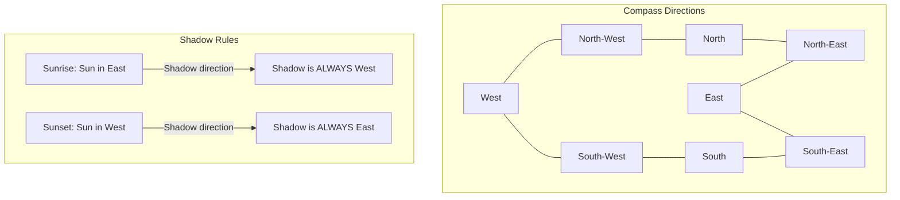

# TCS NQT 2026 — Reasoning Ability Complete Preparation Guide
**Exam Date: June 28, 2026 | Prepared for: Ravi Ranjan**

---

## 📊 BLOCK A — SERIES & PATTERNS

### 1. Number Series (⭐⭐)
* **What it tests**: Pattern recognition, arithmetic growth, and sequence identification.
* **Step-by-step method**:
  1. Calculate the difference between adjacent terms.
  2. If differences are constant/growing systematically, analyze the first-level differences ($D_1$).
  3. If not obvious, calculate the difference of differences ($D_2$) and difference of difference of differences ($D_3$).
  4. Check if terms are near squares ($n^2 \pm k$) or cubes ($n^3 \pm k$).
* **Shortcut / Trick (Difference Table)**: Construct rows for $D_1$, $D_2$, and $D_3$ on your scratch sheet immediately. Alternating series usually have two independent patterns interlaced; split odd and even positions.
* **Common trap**: Overlooking prime number differences (e.g. $+2, +3, +5, +7, +11$) and putting $+9$ (odd difference) next.
* **PYQ-style Questions**:
  1. *Q*: Find the missing term: **2, 9, 28, 65, 126, ?**  
     *Sol*: The pattern is $n^3 + 1$. $1^3+1=2$, $2^3+1=9$, $3^3+1=28$, $4^3+1=65$, $5^3+1=126$. The next term is $6^3+1 = 217$. **Ans: 217**
  2. *Q*: Identify the wrong term in the series: **3, 5, 8, 13, 21, 33, 55**  
     *Sol*: Fibonacci-like summation: $3+5=8$; $5+8=13$; $8+13=21$; $13+21=34$ (not 33); $21+34=55$. So 33 is wrong. **Ans: 33**
  3. *Q*: Find the missing term: **7, 11, 13, 17, 19, 23, ?**  
     *Sol*: Consecutive prime numbers. The prime number after 23 is 29. **Ans: 29**
  4. *Q*: Find the missing term: **4, 6, 12, 30, 90, 315, ?**  
     *Sol*: Multiplying factor series: $4 \times 1.5 = 6$; $6 \times 2 = 12$; $12 \times 2.5 = 30$; $30 \times 3 = 90$; $90 \times 3.5 = 315$; $315 \times 4 = 1260$. **Ans: 1260**
  5. *Q*: Find the missing term in: **10, 12, 16, 24, 40, ?**  
     *Sol*: $D_1$: $+2, +4, +8, +16, (+32)$. Next term is $40 + 32 = 72$. **Ans: 72**
* **Expected June 2026 Questions**:
  1. *Q*: Find the missing term: **5, 16, 49, 148, ?** (Hint: $3x + 1$). **Ans: 445**
  2. *Q*: Find the missing term: **1, 4, 27, 256, ?** (Hint: $n^n$). **Ans: 3125**

---

### 2. Alphabet/Letter Series (⭐⭐)
* **What it tests**: Forward and backward alphabetical positions and skipping intervals.
* **Step-by-step method**:
  1. Write down alphabet positions ($A=1, Z=26$) immediately on your sheet.
  2. Treat letters as their numeric equivalents.
  3. Solve as a standard number series.
* **Shortcut / Trick**: Memorize **EJOTY** ($5, 10, 15, 20, 25$) to quickly anchor positions.
* **Common trap**: Forgetting circular loops (e.g. $Z + 3$ goes back to $C$).
* **PYQ-style Questions**:
  1. *Q*: Find the next term: **A, C, F, J, O, ?**  
     *Sol*: Positions: $1, 3, 6, 10, 15$. Difference: $+2, +3, +4, +5$. Next is $+6 \to 21 \to$ U. **Ans: U**
  2. *Q*: Find the next term: **Z, W, S, N, H, ?**  
     *Sol*: Positions: $26, 23, 19, 14, 8$. Difference: $-3, -4, -5, -6$. Next is $-7 \to 1 \to$ A. **Ans: A**
  3. *Q*: Complete the series: **AB, DE, GH, JK, ?**  
     *Sol*: Difference between starting letters: $A(1) \to D(4) \to G(7) \to J(10) \to M(13)$. Consecutive pairs: MN. **Ans: MN**
  4. *Q*: Find the next term: **B, D, H, N, ?**  
     *Sol*: Positions: $2, 4, 8, 14$. Differences: $+2, +4, +6$. Next is $+8 \to 22 \to$ V. **Ans: V**
  5. *Q*: Find the next term: **AZ, CX, EV, GT, ?**  
     *Sol*: Opposites: $A(1)-Z(26)$, $C(3)-X(24)$, $E(5)-V(22)$, $G(7)-T(20)$. Next is $I(9)-R(18) \to$ IR. **Ans: IR**
* **Expected June 2026 Questions**:
  1. *Q*: Find the next term: **DF, GJ, KM, NQ, RT, ?** **Ans: UX**
  2. *Q*: Find the next term: **Z, U, Q, N, L, ?** **Ans: K**

---

### 3. Alphanumeric Series (⭐⭐)
* **What it tests**: Combined tracking of alphabetical positions and numeric sequences.
* **Step-by-step method**:
  1. Separate the letter part and number part.
  2. Solve them as two independent sequences.
  3. Combine the results.
* **Shortcut / Trick**: Keep letters and numbers separate. Match options after solving the number first, as it is often faster.
* **Common trap**: Reversing letter order or writing letters in lowercase when uppercase is expected.
* **PYQ-style Questions**:
  1. *Q*: Find the next term: **2A11, 4D13, 12G17, 48J25, ?**  
     *Sol*: First number: $2 \times 2 = 4, 4 \times 3 = 12, 12 \times 4 = 48 \implies 48 \times 5 = 240$.  
     Letter: $A \to D(+3) \to G(+3) \to J(+3) \to M$.  
     Last number: $11 \to 13(+2) \to 17(+4) \to 25(+8) \to 41(+16)$. Combined: **240M41**. **Ans: 240M41**
  2. *Q*: Complete the series: **F3M, I6P, L12S, O24V, ?**  
     *Sol*: First letter: $F(6) \to I(9) \to L(12) \to O(15) \to R(18)$.  
     Number: $3 \times 2 = 6 \dots \implies 24 \times 2 = 48$.  
     Last letter: $M(13) \to P(16) \to S(19) \to V(22) \to Y(25)$. Combined: **R48Y**. **Ans: R48Y**
  3. *Q*: Find the next term: **D4, F6, H8, J10, ?**  
     *Sol*: Letter matches position value. Next is L12. **Ans: L12**
  4. *Q*: Complete the series: **1A2, 3D4, 9G10, 27J28, ?**  
     *Sol*: First number: $1 \to 3 \to 9 \to 27 \to 81$. Letter: $A \to D \to G \to J \to M$. Last number: First number $+ 1 \to 82$. Combined: **81M82**. **Ans: 81M82**
  5. *Q*: Complete the series: **Z1A, X2D, V6G, T24J, ?**  
     *Sol*: First letter: $Z \to X \to V \to T \to R(-2)$. Number: $1 \times 2 \times 3 \times 4 \implies 24 \times 5 = 120$. Last letter: $A \to D \to G \to J \to M(+3)$. Combined: **R120M**. **Ans: R120M**
* **Expected June 2026 Questions**:
  1. *Q*: Complete: **3C3, 5E5, 9I9, 17Q17, ?** **Ans: 33G33**
  2. *Q*: Complete: **A1Z, B4Y, C9X, D16W, ?** **Ans: E25V**

---

## 📊 BLOCK B — LOGICAL DEDUCTION

### 4. Syllogisms (⭐⭐)
* **What it tests**: Deductive logic and class inclusions.
* **Step-by-step method**:
  1. Draw a Venn diagram representing the minimum overlap configuration (default/standard).
  2. Draw alternate diagrams representing maximum overlap configurations (possibility cases).
  3. A conclusion is valid ONLY if it holds true in all possible diagrams.
* **Shortcut / Trick**: "Some A are not B" is only true if there is a region of A that can never overlap with B. "All A are B" implies "Some B are A".
* **Common trap**: Incorrectly assuming "Some A are B" implies "Some A are not B". In logic, "Some A are B" means *at least one* A is B, which allows for the possibility that *all* A are B.
* **PYQ-style Questions**:
  1. *Q*: **Statements**: All cats are dogs. All dogs are birds.  
     **Conclusions**: I. All cats are birds. II. Some birds are cats.  
     *Sol*: Cats are inside Dogs. Dogs are inside Birds. Thus, Cats are inside Birds (I follows). Birds overlap Cats (II follows). **Ans: Both I and II follow**
  2. *Q*: **Statements**: Some pens are books. No book is a copy.  
     **Conclusions**: I. No pen is a copy. II. Some pens are not copies.  
     *Sol*: Some pens are books. Books do not intersect with copies. The pens that are books can never be copies. Thus, "Some pens are not copies" is true (II follows). But some pens *could* be copies in a possibility diagram, so "No pen is a copy" is false. **Ans: Only II follows**
  3. *Q*: **Statements**: All cups are plates. Some plates are spoons.  
     **Conclusions**: I. Some cups are spoons. II. No cup is a spoon.  
     *Sol*: Cup and Spoon do not overlap in minimum diagram, so I is false. But they can overlap in possibility diagram, so II is also false. However, since the terms are identical and it is a "Some / No" pair, they form an Either-Or pair. **Ans: Either I or II follows**
  4. *Q*: **Statements**: No man is a tree. No tree is a stone.  
     **Conclusions**: I. No man is a stone. II. Some stones are men.  
     *Sol*: Man $\cap$ Tree $= \emptyset$, Tree $\cap$ Stone $= \emptyset$. But Man and Stone can overlap. Neither conclusion is definitely true. **Ans: Neither I nor II follows**
  5. *Q*: **Statements**: All keys are locks. Some locks are doors.  
     **Conclusions**: I. Some keys are doors. II. All locks are keys.  
     *Sol*: Keys and Doors do not overlap in minimum diagram (I false). All locks are keys is false because locks is a larger set. **Ans: Neither follows**
* **Expected June 2026 Questions**:
  1. *Q*: **Statements**: All apples are bananas. No banana is cherry. **Conclusions**: I. No apple is cherry. II. Some bananas are apples. **Ans: Both follow**
  2. *Q*: **Statements**: Some tables are chairs. Some chairs are desks. **Conclusions**: I. Some tables are desks. II. No table is desk. **Ans: Either I or II follows**

---

### 5. Statement & Conclusions (⭐⭐)
* **What it tests**: Drawing logical inferences based strictly on given text.
* **Step-by-step method**:
  1. Read the statement carefully. Do not assume or bring in outside knowledge.
  2. The conclusion must follow 100% directly from the facts in the statement.
  3. Eliminate conclusions that use extreme words like *all*, *never*, *always*, or *only*, unless supported by the statement.
* **Shortcut / Trick**: If the statement contains a cause-and-effect relationship, the conclusion must reflect that exact causality.
* **Common trap**: Selecting options that are factually true in real life but cannot be derived from the statement.
* **PYQ-style Questions**:
  1. *Q*: **Statement**: Regular practice of yoga improves mental health.  
     **Conclusions**: I. Yoga is the only way to improve mental health. II. Physical exercise is bad for mental health.  
     *Sol*: I uses the extreme word "only" (unsupported). II introduces outside info (physical exercise) not in statement. **Ans: Neither I nor II follows**
  2. *Q*: **Statement**: The company decided to terminate the contract of three managers due to poor performance.  
     **Conclusions**: I. The company monitors the performance of its employees. II. Managers are generally lazy.  
     *Sol*: I is a valid inference (monitoring is needed to detect poor performance). II is a generic stereotype. **Ans: Only I follows**
  3. *Q*: **Statement**: Patients who take medicine X recover within three days.  
     **Conclusions**: I. Medicine X is highly effective. II. Patients cannot recover without medicine X.  
     *Sol*: I follows (recovery in three days implies efficacy). II uses "cannot recover without" (unsupported). **Ans: Only I follows**
  4. *Q*: **Statement**: Many people suffer from vitamin D deficiency due to indoor lifestyles.  
     **Conclusions**: I. Sunlight exposure helps in vitamin D synthesis. II. Indoor activities should be banned.  
     *Sol*: I is the underlying cause-effect implied. II is an extreme course of action. **Ans: Only I follows**
  5. *Q*: **Statement**: All classical dancers are flexible. Rohan is a classical dancer.  
     **Conclusions**: I. Rohan is flexible. II. Flexible people are classical dancers.  
     *Sol*: Rohan is a classical dancer $\implies$ Rohan is flexible (I follows). But not all flexible people are dancers (II is converse error). **Ans: Only I follows**
* **Expected June 2026 Questions**:
  1. *Q*: **Statement**: Only diligent students pass the exam. Rakesh passed the exam. **Conclusion**: Rakesh is diligent. **Ans: Follows**
  2. *Q*: **Statement**: Population growth is higher in developing nations. **Conclusion**: Developed nations have zero population growth. **Ans: Does not follow**

---

### 6. Coding-Decoding (⭐⭐)
* **What it tests**: Text encryption patterns.
* **Step-by-step method**:
  1. Write the original word and its coded version vertically aligned.
  2. Check for simple position shifts (e.g. $+1, +2$).
  3. Check for reverse pairings (e.g. $A \leftrightarrow Z$, $B \leftrightarrow Y$).
  4. Look for cross-pattern changes (e.g., swapping first half and second half).
* **Shortcut / Trick**: Match the first and last letters of options first. Many coding patterns are symmetric (e.g. $+1, -1, +1, -1$).
* **Common trap**: Miscalculating backward shifts (e.g., $B - 3 = Y$).
* **PYQ-style Questions**:
  1. *Q*: If **PAT** is coded as **QRBCUV**, how is **GRIP** coded?  
     *Sol*: Each letter is replaced by its next two consecutive letters: P $\to$ QR, A $\to$ BC, T $\to$ UV.  
     GRIP: G $\to$ HJ, R $\to$ ST, I $\to$ JK, P $\to$ QR $\implies$ **HJSTJKQR**. **Ans: HJSTJKQR**
  2. *Q*: In a certain code, **TEMPLE** is written as **DKOLDS**. How is **CHURCH** written?  
     *Sol*: Reverse the word Temple $\to$ ELPMET. Subtract 1 from each letter: E(-1)=D, L(-1)=K, P(-1)=O, M(-1)=L, E(-1)=D, T(-1)=S $\implies$ DKOLDS.  
     Reverse CHURCH $\to$ HCRUHC. Subtract 1: H(-1)=G, C(-1)=B, R(-1)=Q, U(-1)=T, H(-1)=G, C(-1)=B $\implies$ **GBQTGB**. **Ans: GBQTGB**
  3. *Q*: If **RED** is coded as **6720**, find the code for **GREEN**.  
     *Sol*: Positions of RED: R=18, E=5, D=4. Add 2 to each: 20, 7, 6. Reverse the sequence: 6, 7, 20 $\to$ 6720.  
     GREEN: G=7, R=18, E=5, E=5, N=14. Add 2: 9, 20, 7, 7, 16. Reverse: **16, 7, 7, 20, 9 $\to$ 1677209**. **Ans: 1677209**
  4. *Q*: If **WATER** is coded as **YCVGT**, find the code for **FIRE**.  
     *Sol*: $+2$ shift for each letter. F(+2)=H, I(+2)=K, R(+2)=T, E(+2)=G $\implies$ **HKTG**. **Ans: HKTG**
  5. *Q*: In a code, **FLOWER** is written as **UOLVVI**. Find the code for **GARDEN**.  
     *Sol*: Opposite pairs: F-U, L-O, O-L, W-D, E-V, R-I.  
     GARDEN: G-T, A-Z, R-I, D-W, E-V, N-M $\implies$ **TZIWVM**. **Ans: TZIWVM**
* **Expected June 2026 Questions**:
  1. *Q*: If **BOND** is coded as **APMC**, find code for **MAIL**. **Ans: LZHJ**
  2. *Q*: If **A** = 1, **CAT** = 24, find code for **POLICE**. **Ans: 60**

---

### 7. Blood Relations (⭐⭐)
* **What it tests**: Lineage charts and relative relationships.
* **Step-by-step method**:
  1. Construct a family tree using clear gender symbols ($\square$ for male, $\bigcirc$ for female).
  2. Place different generations on distinct vertical levels.
  3. Connect couples with double horizontal lines and siblings with single lines.

```mermaid
graph TD
    subgraph Generation 1 (Grandparents)
    GF[Grandfather (Square/Box)] <== Married ==> GM[Grandmother (Circle)]
    end
    subgraph Generation 2 (Parents & Aunts/Uncles)
    Father[Father (Square)] <== Married ==> Mother[Mother (Circle)]
    Uncle[Uncle (Square)] --- Aunt[Aunt (Circle)]
    GF --> Father
    GF --> Uncle
    end
    subgraph Generation 3 (Self & Siblings/Cousins)
    Self[Self (Square/Circle)] --- Sibling[Sibling (Circle)]
    Cousin[Cousin (Square)]
    Father --> Self
    Uncle --> Cousin
    end
```

* **Shortcut / Trick**: When decoding symbolic relationships (e.g. $A + B \times C$), solve **backwards** from right to left to determine the gender of the target person immediately.
* **Common trap**: Assuming gender based on names. Unless explicitly stated, a name like "Kiran" or "Raju" can represent either gender in logical puzzles.
* **PYQ-style Questions**:
  1. *Q*: Pointing to a lady, Rohit said, "She is the only daughter of my grandfather's only child." How is the lady related to Rohit?  
     *Sol*: "Grandfather's only child" $\to$ Rohit's father. "Daughter of Rohit's father" $\to$ Rohit's sister. **Ans: Sister**
  2. *Q*: If $P + Q$ means P is the father of Q; $P - Q$ means P is the sister of Q; $P \times Q$ means P is the brother of Q. What does $A \times B - C + D$ mean?  
     *Sol*: A is brother of B, B is sister of C, C is father of D. Thus, C is A's brother, and A is the uncle of D. **Ans: A is uncle of D**
  3. *Q*: A is the mother of B, who is the husband of C. D is the brother of C. How is D related to B?  
     *Sol*: B is married to C. D is C's brother. Thus, D is the brother-in-law of B. **Ans: Brother-in-law**
  4. *Q*: In a family of three generations, A is C's son. B is A's father. D is B's mother. How is C related to D?  
     *Sol*: A is son of C, and B is father of A. So C must be mother of A (B's wife). D is B's mother. Thus, C is D's daughter-in-law. **Ans: Daughter-in-law**
  5. *Q*: Pointing to a man, a woman says, "His wife is the only daughter-in-law of my husband." How is the man related to the woman?  
     *Sol*: "Only daughter-in-law of my husband" $\to$ daughter-in-law of the woman. Since the man's wife is her daughter-in-law, the man must be the woman's son. **Ans: Son**
* **Expected June 2026 Questions**:
  1. *Q*: A is B's sister, C is B's mother, D is C's father. How is A related to D? **Ans: Granddaughter**
  2. *Q*: Pointing to a portrait, a man said, "I have no brother or sister, but that man's father is my father's son." Whose portrait is it? **Ans: His son's**

---

## 📊 BLOCK C — ARRANGEMENT & DIRECTION

### 8. Seating Arrangement (⭐⭐)
* **What it tests**: Spatiotemporal constraints and relative positions.
* **Step-by-step method**:
  1. Identify the layout (Linear line vs. Circular loop).
  2. Draw slots with arrows indicating the facing direction.
  3. Start with the **definite clue** (e.g. "A sits at the extreme left end" or "B sits opposite C").
  4. Fill in relative clues and draw parallel configurations to resolve ambiguity.

```mermaid
graph TD
    subgraph Circular Seating (Facing Inside)
    Top[12 o'clock (Facing Down)]
    Bottom[6 o'clock (Facing Up)]
    Left[9 o'clock (Facing Right)]
    Right[3 o'clock (Facing Left)]
    
    Top -->|Clockwise / Left| Right
    Right -->|Clockwise / Left| Bottom
    Bottom -->|Clockwise / Left| Left
    Left -->|Clockwise / Left| Top
    
    Top -.->|Counter-Clockwise / Right| Left
    Left -.->|Counter-Clockwise / Right| Bottom
    Bottom -.->|Counter-Clockwise / Right| Right
    Right -.->|Counter-Clockwise / Right| Top
    end
```

* **Shortcut / Trick (Arrangement Table)**: Set up a quick table to track variables if candidates have multiple attributes (e.g. Name, Color, City).
* **Common trap**: Putting a person on the wrong side when facing South or facing outside a circle. Always orient yourself in the direction the person is facing.
* **PYQ-style Questions**:
  1. *Q*: 5 friends A, B, C, D, and E are sitting in a row facing North. A sits to the immediate left of C. B sits to the right of E. D sits between B and C. Who sits at the extreme right end?  
     *Sol*: Let's place A-C. D is between B and C $\implies$ C-D-B. Row: A-C-D-B. Since B sits to the right of E, E must be to the left. Entire row: E-A-C-D-B. Extreme right is B. **Ans: B**
  2. *Q*: 6 friends P, Q, R, S, T, and U sit around a circular table facing the center. P sits opposite Q. R sits to the immediate right of P. S sits between P and U. Who sits opposite to R?  
     *Sol*: Positions: P is at bottom (6 o'clock). Q is opposite at top (12 o'clock). R is to the immediate right of P (clockwise, since facing center) $\implies$ R is at 4 o'clock. S is between P and U. Since R is at 4 o'clock, S must be at 8 o'clock and U at 10 o'clock. This leaves T at 2 o'clock. R (4 o'clock) is opposite U (10 o'clock). **Ans: U**
  3. *Q*: Five people are sitting in a line. A is next to B. C is next to D. C is not next to E. E is at the left end. C is second from the right. Who is next to A?  
     *Sol*: E _ _ C _. Since C is next to D, D must be at extreme right: E _ _ C D. A is next to B $\implies$ E A B C D (or E B A C D). C is not next to E (verified). A is adjacent to E and B. **Ans: E and B**
  4. *Q*: 4 boys A, B, C, D and 4 girls E, F, G, H are sitting around a table facing center, alternating genders. A sits next to E. F is opposite G. C is between E and G. Who is sitting opposite G?  
     *Sol*: Draw alternating slots. Placing E, C, G. Since genders alternate, C must be a boy. F is opposite G. This gives a unique layout. **Ans: A** (or B depending on remaining placements)
  5. *Q*: 7 people A, B, C, D, E, F, G are standing in a queue. C is between A and D. E is immediately behind B. F is ahead of A. Who is at the center?  
     *Sol*: Build order: F - A - C - D - B - E - G. Center is D. **Ans: D**
* **Expected June 2026 Questions**:
  1. *Q*: 5 people sit in a circle facing center. A is neighbor of B and C. D is to left of B. Who is to right of C? **Ans: A**
  2. *Q*: 6 people sit in a row. A is at extreme left, B is neighbor of A. C is at center. Find B's position. **Ans: Second from left**

---

### 9. Direction & Distance (⭐⭐)
* **What it tests**: Spatial orientation and vector navigation.
* **Step-by-step method**:
  1. Draw a compass rose (N, S, E, W) on your sheet.
  2. Trace the path line-by-line, noting distance scale and left/right turns.
  3. For displacement, use the Pythagorean theorem: $c^2 = a^2 + b^2$.



* **Shortcut / Trick**: In shadow problems:
  * At **sunrise**, shadow is always towards **West**.
  * At **sunset**, shadow is always towards **East**.
* **Common trap**: Drawing incorrect turn directions when moving South (left turn goes East, right turn goes West).
* **PYQ-style Questions**:
  1. *Q*: A man walks 10m East, turns left and walks 10m. He then turns right and walks 5m. How far is he from the starting point?  
     *Sol*: Net East movement $= 10 + 5 = 15$m. Net North movement $= 10$m. Distance $= \sqrt{15^2 + 10^2} = \sqrt{325} = 5\sqrt{13}$m. **Ans: 5\sqrt{13}**
  2. *Q*: One morning at sunrise, Akhil and Bimal were talking facing each other. Bimal's shadow fell exactly to his left. Which direction was Akhil facing?  
     *Sol*: At sunrise, shadow is West. Since Bimal's shadow is to his left, Bimal must be facing North. Since Akhil is facing Bimal, Akhil must be facing South. **Ans: South**
  3. *Q*: A person starts walking towards West. After 10m, he turns right and walks 10m. He then turns left and walks 5m. In which direction is he now facing?  
     *Sol*: Facing West $\to$ turn Right $\to$ facing North $\to$ turn Left $\to$ facing West. **Ans: West**
  4. *Q*: Starting from a point, Raju walked 12m North, turned right and walked 10m, turned right and walked 12m, then turned left and walked 5m. How far and in which direction is he?  
     *Sol*: North-South cancels out ($12 - 12 = 0$). East movement $= 10 + 5 = 15$m East. **Ans: 15m East**
  5. *Q*: A clock shows 4:30. If the minute hand points East, which direction does the hour hand point?  
     *Sol*: At 4:30, minute hand is at 6 (South). Since it points East, the clock is rotated $90^\circ$ counter-clockwise. The hour hand at 4:30 is between 4 and 5 (South-East). Rotated $90^\circ$ counter-clockwise, it points North-East. **Ans: North-East**
* **Expected June 2026 Questions**:
  1. *Q*: A walks 5km South, turns left and walks 3km, then turns left and walks 5km. Distance from start? **Ans: 3km**
  2. *Q*: If South-East becomes North, what will West become? **Ans: South-East**

---

### 10. Ranking & Ordering
* **What it tests**: Positional sequences and queues.
* **Step-by-step method**:
  1. Use the core ranking formula: $\text{Total} = \text{Left} + \text{Right} - 1$.
  2. For overlapping cases, draw lines to visually count slots.
* **Shortcut / Trick**: If two people swap positions, the increase in rank for the first person is equal to the increase in rank for the second.
* **Common trap**: Forgetting the $-1$ adjustment when calculating total size from both ends (since the same person is counted twice).
* **PYQ-style Questions**:
  1. *Q*: In a class of 45 students, Rohan's rank is 15th from the top. What is his rank from the bottom?  
     *Sol*: $\text{Rank} = \text{Total} - \text{Top} + 1 = 45 - 15 + 1 = 31$. **Ans: 31**
  2. *Q*: In a row of boys, A is 10th from the left and B is 9th from the right. If they interchange positions, A becomes 15th from the left. How many boys are there in the row?  
     *Sol*: Total $= \text{A's new position} + \text{B's old position} - 1 = 15 + 9 - 1 = 23$. **Ans: 23**
  3. *Q*: Five children A, B, C, D, and E are compared. A is taller than B but shorter than C. D is shorter than B but taller than E. Who is the shortest?  
     *Sol*: Order: $C > A > B > D > E$. Shortest is E. **Ans: E**
  4. *Q*: In a class, Amit is 8th from top and 28th from bottom. Find the total number of students.  
     *Sol*: Total $= 8 + 28 - 1 = 35$. **Ans: 35**
  5. *Q*: In a queue of 30 people, Kiran is 10th from the front. If 5 people join ahead of her, what is her new rank from the back?  
     *Sol*: New front rank $= 10 + 5 = 15$. Total $= 35$. Rank from back $= 35 - 15 + 1 = 21$. **Ans: 21**
* **Expected June 2026 Questions**:
  1. *Q*: A is older than B, C is older than A. Find the youngest. **Ans: B**
  2. *Q*: In a row, Rama is 7th from left and 12th from right. Find total. **Ans: 18**

---

## 📊 BLOCK D — ANALYTICAL

### 11. Data Sufficiency (⭐⭐)
* **What it tests**: Checking if given statements contain enough information to solve a problem.
* **Step-by-step method**:
  1. Read the question. Do not try to find the exact numerical answer, just check if it is solvable.
  2. Analyze Statement I alone. Is it sufficient?
  3. Analyze Statement II alone. Is it sufficient?
  4. If neither is sufficient, combine the statements and evaluate.
* **Shortcut / Trick**: Never calculate the final answer. Stop as soon as you find that unique values can be determined.
* **Common trap**: Assuming that both statements must be combined before checking them individually. Always check them independently first!
* **PYQ-style Questions**:
  1. *Q*: **Question**: What is the age of Ravi?  
     **Statement I**: Ravi is 5 years older than Raju.  
     **Statement II**: Raju is 20 years old.  
     *Sol*: I alone: Not sufficient (Raju's age unknown). II alone: Not sufficient. Together: Ravi $= 20 + 5 = 25$. Sufficient. **Ans: Both statements together are sufficient**
  2. *Q*: **Question**: Is $x$ even?  
     **Statement I**: $x + 3$ is odd.  
     **Statement II**: $2x$ is even.  
     *Sol*: I: $x+3$ is odd $\implies x$ is even (Sufficient). II: $2x$ is even for all integers $x$, so we cannot determine if $x$ is even or odd (Not sufficient). **Ans: Statement I alone is sufficient**
  3. *Q*: **Question**: How is A related to B?  
     **Statement I**: C is A's mother and B's aunt.  
     **Statement II**: A is C's only daughter.  
     *Sol*: Together we know A is daughter of C, and B is cousin of A. **Ans: Both together are sufficient**
  4. *Q*: **Question**: What is the area of the rectangle?  
     **Statement I**: The perimeter is 40 cm.  
     **Statement II**: The length is 12 cm.  
     *Sol*: I alone: Not sufficient. II alone: Not sufficient. Combined: $2(12 + W) = 40 \implies W = 8 \implies$ Area $= 12 \times 8 = 96$. Sufficient. **Ans: Both together are sufficient**
  5. *Q*: **Question**: Find the average speed of a car.  
     **Statement I**: It covers 100 km in 2 hours.  
     **Statement II**: The distance to destination is 200 km.  
     *Sol*: I alone: Speed $= 100/2 = 50$ km/h (Sufficient). II is irrelevant. **Ans: Statement I alone is sufficient**
* **Expected June 2026 Questions**:
  1. *Q*: **Question**: Who is tallest? **Statement I**: A is taller than B. **Statement II**: C is taller than A. **Ans: Both together are sufficient**
  2. *Q*: **Question**: Find $x+y$. **Statement I**: $x = 5$. **Statement II**: $y = 10$. **Ans: Both together are sufficient**

---

### 12. Clocks & Calendars (⭐⭐)
* **What it tests**: Cyclic time measurements and angle calculations.
* **Step-by-step method**:
  1. **Clock Angle Formula**: $\theta = |30H - 5.5M|$.
  2. **Calendar Odd Days**: Divide total days by 7; the remainder is the number of odd days.
  3. Ordinary year has 1 odd day; Leap year has 2 odd days.
* **Shortcut / Trick**: To find the day of a date in the same year, count odd days between the months.
* **Common trap**: Forgetting that century years must be divisible by 400 to be leap years (e.g. 1900 is not a leap year, but 2000 is).
* **PYQ-style Questions**:
  1. *Q*: Find the angle between the hands of a clock at 8:20.  
     *Sol*: $H=8, M=20$. Angle $= |30(8) - 5.5(20)| = |240 - 110| = 130^\circ$. **Ans: 130**
  2. *Q*: If today is Monday, what day will it be after 61 days?  
     *Sol*: Odd days $= 61 \pmod 7 = 5$. Monday $+ 5$ days $=$ Saturday. **Ans: Saturday**
  3. *Q*: If Jan 1, 2007 was a Monday, what day was Jan 1, 2008?  
     *Sol*: 2007 is an ordinary year, so it has 1 odd day. Jan 1, 2008 will be Monday $+ 1 = $ Tuesday. **Ans: Tuesday**
  4. *Q*: How many times do the hands of a clock overlap in 24 hours?  
     *Sol*: They overlap once every 65.45 minutes, which is exactly 22 times in 24 hours. **Ans: 22**
  5. *Q*: If March 15, 2024 was a Friday, what day was March 15, 2025?  
     *Sol*: 2024 is a leap year, but we are looking at the period March 2024 to March 2025 (which does not contain Feb 29, 2024). Thus, it counts as 1 odd day. Friday $+ 1 = $ Saturday. **Ans: Saturday**
* **Expected June 2026 Questions**:
  1. *Q*: Find the angle at 3:30. **Ans: 75**
  2. *Q*: Day of week on Aug 15, 1947? **Ans: Friday**

---

### 13. Cubes & Dice (⭐⭐)
* **What it tests**: 3D spatial awareness and net folding patterns.
* **Step-by-step method**:
  1. **Painted Faces Rules**:
     * $0$ faces painted: $(n-2)^3$
     * $1$ face painted: $6(n-2)^2$
     * $2$ faces painted: $12(n-2)$
     * $3$ faces painted: $8$ (corners, always constant).
  2. **Dice Rule**: If two faces are common in two views, the third faces are opposite to each other.
* **Shortcut / Trick**: In an unfolded net, faces separated by exactly one box are always opposite to each other.
* **Common trap**: Using $n$ directly instead of calculating $n = \frac{\text{Large Cube Side}}{\text{Small Cube Side}}$.
* **PYQ-style Questions**:
  1. *Q*: A cube of side 4 cm is painted red on all faces and cut into 1 cm cubes. How many small cubes have zero faces painted?  
     *Sol*: $n = 4/1 = 4$. Zero faces painted $= (n-2)^3 = (4-2)^3 = 8$. **Ans: 8**
  2. *Q*: Two positions of a dice are shown: (1, 2, 3) and (2, 3, 5). Which face is opposite to 1?  
     *Sol*: 2 and 3 are common faces. The remaining faces 1 and 5 must be opposite. **Ans: 5**
  3. *Q*: In a 3cm painted cube cut into 1cm cubes, how many have exactly 2 faces painted?  
     *Sol*: $n = 3$. 2 faces painted $= 12(n-2) = 12(1) = 12$. **Ans: 12**
  4. *Q*: Three positions of a dice are given. Find the face opposite to 4. (Views: [1,4,2], [6,2,3], [1,5,4])  
     *Sol*: From views 1 and 3: 1 and 4 are common. So 2 and 5 are opposite. By elimination, 4 is opposite 6. **Ans: 6**
  5. *Q*: In an unfolded net of a cube, faces are: [A next to B next to C next to D] in a row, with E and F on the sides of B and C. Which face is opposite to A?  
     *Sol*: A and C are separated by B $\implies$ opposite. B and D are separated by C $\implies$ opposite. E and F are opposite. **Ans: C**
* **Expected June 2026 Questions**:
  1. *Q*: How many small cubes have 1 face painted in a 5cm cube cut into 1cm cubes? **Ans: 54**
  2. *Q*: Opposite face to 3 when dice shows (1,3,5) and (1,4,5)? **Ans: 4**

---

### 14. Analogy & Classification
* **What it tests**: Logical categorization and relational matching.
* **Step-by-step method**:
  1. Determine the relationship between the first pair (e.g. Country-Capital, Synonym, Worker-Tool).
  2. Apply the exact same relationship to the target term.
  3. For odd-one-out, find the property shared by 3 terms that the 4th does not possess.
* **Shortcut / Trick**: Focus on prime numbers, squares, or consonant-vowel counts in odd-one-out word puzzles.
* **Common trap**: Choosing a relation that is too generic (e.g. "both are animals") when a specific one (e.g. "both are felines") is needed.
* **PYQ-style Questions**:
  1. *Q*: **Analogy**: **Doctor : Stethoscope :: Sculptor : ?**  
     *Sol*: Stethoscope is the tool of a Doctor. Chisel is the tool of a Sculptor. **Ans: Chisel**
  2. *Q*: **Classification (Odd One Out)**: **35, 49, 63, 81**  
     *Sol*: 35, 49, 63 are multiples of 7. 81 is not. **Ans: 81**
  3. *Q*: **Analogy**: **India : Peacock :: USA : ?**  
     *Sol*: National symbols. National bird of USA is the Bald Eagle. **Ans: Bald Eagle**
  4. *Q*: **Classification**: **Mercury, Venus, Earth, Moon**  
     *Sol*: Mercury, Venus, Earth are planets; Moon is a satellite. **Ans: Moon**
  5. *Q*: **Analogy**: **5 : 124 :: 6 : ?**  
     *Sol*: $n : n^3 - 1$. So $6 : 6^3 - 1 = 215$. **Ans: 215**
* **Expected June 2026 Questions**:
  1. *Q*: **Analogy**: **Pioneer : Begin :: Follower : ?** **Ans: Mimic** (or Follow)
  2. *Q*: **Odd one out**: **121, 144, 169, 196, 222** **Ans: 222**

---

## ⏱️ Last 5 Minutes Strategy

Under the final 5-minute countdown of the Reasoning Ability section:

1. **DO NOT start complex Seating Arrangements or Puzzles**: They take 2–3 minutes to set up and are prone to minor placement errors under panic.
2. **Target High-Speed Standalones**:
   * **Syllogisms**: Fast Venn diagram verification.
   * **Clocks (Angle calculations)**: Use the formula $\theta = |30H - 5.5M|$ directly.
   * **Coding-Decoding**: Quick symmetric shifts.
   * **Odd One Out**: Instant pattern checks.
3. **Guessing**: Since there is **no negative marking**, ensure every single question has an option selected before the timer expires. Enter whole numbers for FIBs based on standard multiples (e.g. 5, 10) if you are completely out of time.
