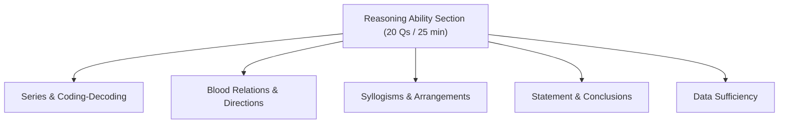
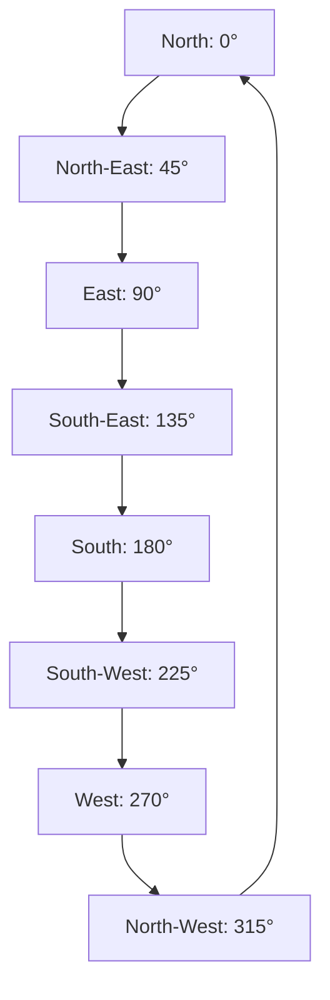

# 03 — Reasoning Ability (Foundation Section)

This module covers the core concepts, mental shortcuts, visual frameworks, and solving strategies for the Reasoning Ability section of the TCS NQT (Foundation Tier).

---

## 📊 Exam Section Overview

The Reasoning Ability section consists of **20 questions** to be solved in **25 minutes** (approximately 75 seconds per question).



---

## A. Tricks & Visual Frameworks by Topic

### 1. Number & Letter Series

Do not guess the pattern immediately. Follow a systematic difference hierarchy.

```text
Step 1: Check First Differences (Arithmetic Series)
Step 2: Check Ratios (Geometric Series)
Step 3: Check Second Differences (Quadratic Series)
Step 4: Check for Interleaved (Alternating) Series
```

*   **Alternating Series Trick:** If a series oscillates (goes up and down), it is usually two interleaved series combined. Separating odd and even positions reveals the true pattern.
    *   *Worked Example:* $5, 12, 10, 10, 15, 8, \dots$
        *   Odd positions: $5 \rightarrow 10 \rightarrow 15$ ($+5$ progression)
        *   Even positions: $12 \rightarrow 10 \rightarrow 8$ ($-2$ progression)

---

### 2. Coding-Decoding

Letter shifting matches alphabetical index calculations.

*   **Index Sheet Trick:** On your rough sheet, quickly note the alphabet with corresponding 1-26 indices, along with their opposites (which sum to 27):
    $$\text{A(1)} \leftrightarrow \text{Z(26)} \quad \text{B(2)} \leftrightarrow \text{Y(25)} \quad \text{C(3)} \leftrightarrow \text{X(24)} \quad \dots \quad \text{M(13)} \leftrightarrow \text{N(14)}$$
*   **Worked Example:** If `"D"` ($4$) is coded as `"H"` ($8$), the shift is $+4$. Apply the same shift of $+4$ to `"M"` ($13$) to get `"Q"` ($17$).

---

### 3. Blood Relations

Always draw a family tree using standard symbols. Never track relations purely in your head.

#### 🎨 Family Tree Standard Notation
```text
[ Male Node: (Square) ]       [ Female Node: (Circle) ]

Married Couple:  [ Male ] === [ Female ]  (Double horizontal line)
Siblings:        [ Male ] --- [ Female ]  (Single horizontal line)
Generations:     [ Parent ]
                     |
                  [ Child  ]              (Vertical line)
```

*   **Worked Example:** "My mother's brother's only son"
    1.  Mother's brother = Maternal Uncle
    2.  Uncle's only son = Cousin
    *   Result: Cousin.

---

### 4. Directions Sense

Direction problems require a physical reference map on paper.

#### 🧭 8-Direction Compass


*   **Pythagoras Theorem Shortcut:** If final displacement forms a right-angled triangle, calculate the hypotenuse:
    $$C = \sqrt{A^2 + B^2}$$
    *   *Worked Example:* A person walks $3\text{ km}$ North, then $4\text{ km}$ East. Net displacement is $\sqrt{3^2 + 4^2} = \sqrt{25} = 5\text{ km}$.

---

### 5. Syllogisms

Syllogisms are solved using Venn diagram sets.

| Statement Type | Venn Diagram Representation | Critical Trap |
| :--- | :--- | :--- |
| **All A are B** | A circle completely inside B ($A \subset B$) | Does NOT imply that all B are A. |
| **Some A are B** | Overlapping A and B circles ($A \cap B \neq \emptyset$) | Does NOT prove that some A are not B. |
| **No A are B** | Separate disjoint circles | Confirms absolute exclusion. |

---

### 6. Seating Arrangements

*   **Definite Position First Rule:** Place the most specific clue on your diagram first (e.g., *"X is at the extreme left end"* or *"Y is sitting third to the right of Z"*).
*   **Grid Deducing:** Use a table to track circular or linear positions, and cross out impossible spots systematically.

---

### 7. Statement & Conclusion / Assumptions

*   **No Outside Knowledge Rule:** The conclusion must follow logically *only* from the facts stated in the prompt, even if those facts contradict real-world knowledge (e.g., if statement says "All dogs can fly," treat it as fact).
*   **Negation Test for Assumptions:** To test an assumption, negate it. If the statement becomes illogical or collapses when the assumption is false, then the assumption is valid.

---

### 8. Data Sufficiency

*   **No Calculation Rule:** Do not spend time calculating the exact numerical answer. You only need to determine if a single, unique value is derivable.
*   **Separation Check:** Always analyze Statement I and Statement II separately before combining them.

---

## B. Solved MCQs (NQT Format)

---

### Q1. Number Series
Find the next term in the series: $3, 8, 15, 24, 35, \dots$
(a) 46
(b) 47
(c) 48
(d) 49

*   **Pattern ID:** `RA-SER-01` (First Difference Arithmetic Progression)
*   **Hint:** Calculate the differences between consecutive terms.
*   **Approach:** 
    *   Calculate first difference:
        $$8 - 3 = 5$$
        $$15 - 8 = 7$$
        $$24 - 15 = 9$$
        $$35 - 24 = 11$$
    *   The differences are consecutive odd numbers: $5, 7, 9, 11$.
    *   The next odd number difference must be $13$.
*   **Solution:** **(c) 48** — Adding the next difference of $13$ to the last term $35$ gives $35 + 13 = 48$.
*   **Shortcut:** Notice that each term can be expressed as $N^2 - 1$:
    $$2^2 - 1 = 3$$
    $$3^2 - 1 = 8$$
    $$4^2 - 1 = 15$$
    $$5^2 - 1 = 24$$
    $$6^2 - 1 = 35$$
    $$\text{Next term} = 7^2 - 1 = 49 - 1 = 48$$
*   **Variation & Trap:** Checking only the first two terms might make you guess a geometric multiplier, but calculating the third term quickly rules it out.

---

### Q2. Coding-Decoding
In a certain code, "TABLE" is written as "UBCMF". How is "CHAIR" written in that code?
(a) DIBJS
(b) CJBJS
(c) DIARS
(d) EIBJS

*   **Pattern ID:** `RA-COD-01` (Fixed Positional Letter Shift)
*   **Hint:** Find the shift value between corresponding letters of the coded words.
*   **Approach:**
    *   $T \rightarrow U$ ($+1$)
    *   $A \rightarrow B$ ($+1$)
    *   $B \rightarrow C$ ($+1$)
    *   $L \rightarrow M$ ($+1$)
    *   $E \rightarrow F$ ($+1$)
    *   Apply $+1$ shift to every letter in "CHAIR".
*   **Solution:** **(a) DIBJS** — $C(+1)=D, H(+1)=I, A(+1)=B, I(+1)=J, R(+1)=S$.
*   **Shortcut:** Identify the shift of the first and last letter to quickly eliminate incorrect options. $C \rightarrow D$ and $R \rightarrow S$ eliminates (b), (c), and (d) immediately.

---

### Q3. Blood Relations
Pointing to a photograph, a man said, "She is the daughter of my grandfather's only son." How is the woman related to the man?
(a) Mother
(b) Sister
(c) Aunt
(d) Cousin

*   **Pattern ID:** `RA-BR-01` (Descriptive Sibling Tracking)
*   **Hint:** Resolve the descriptive phrase from the back to the front.
*   **Approach:** 
    *   Identify "my grandfather's only son". For a speaker, their paternal grandfather's only son is the speaker's father.
    *   Substitute this back: "She is the daughter of my [father]."
    *   The daughter of the speaker's father is the speaker's sister.
*   **Solution:** **(b) Sister**
*   **Shortcut:** Family Tree sketch:
    ```text
         [ Grandfather ]
               |
          [ Only Son ]  (Father of Speaker)
          /        \
    [ Speaker ] -- [ She ] (Daughter)
    ```
*   **Variation & Trap:** If the question did not specify "only son," the answer could be Cousin (daughter of the father's brother/uncle).

---

### Q4. Directions Sense
A man walks $5\text{ km}$ North, then turns right and walks $3\text{ km}$, then turns right again and walks $5\text{ km}$. How far is he from the starting point?
(a) $3\text{ km}$
(b) $5\text{ km}$
(c) $8\text{ km}$
(d) $13\text{ km}$

*   **Pattern ID:** `RA-DIR-01` (Rectilinear Grid Displacement)
*   **Hint:** Sketch the moves on a 2D coordinate grid.
*   **Approach:**
    *   Start at $(0,0)$.
    *   Walk $5\text{ km}$ North $\rightarrow$ Position $(0, 5)$.
    *   Turn right (East) and walk $3\text{ km}$ $\rightarrow$ Position $(3, 5)$.
    *   Turn right (South) and walk $5\text{ km}$ $\rightarrow$ Position $(3, 0)$.
    *   Distance between $(0,0)$ and $(3,0)$ is $3\text{ km}$.
*   **Solution:** **(a) 3 km**
*   **Shortcut:** The North and South moves are equal and opposite, cancelling each other out:
    $$\text{Vertical Displacement} = +5\text{ km} - 5\text{ km} = 0$$
    Only the horizontal Eastward displacement ($3\text{ km}$) remains.

---

### Q5. Syllogisms
**Statements:** 
1. All cats are animals.
2. Some animals are dogs.

**Conclusion:** 
*   Some cats are dogs.

Does the conclusion follow?
(a) Yes, definitely.
(b) No, it does not follow.
(c) Only if some dogs are not cats.
(d) Insufficient data.

*   **Pattern ID:** `RA-SYL-01` (Non-Overlapping Set Boundary Trap)
*   **Hint:** Draw a Venn diagram that minimizes the overlap between sets.
*   **Approach:**
    *   Draw circle "Cats" entirely inside circle "Animals".
    *   Draw circle "Dogs" overlapping with "Animals".
    *   "Dogs" can overlap with "Animals" without touching "Cats". Since it is not mandatory for them to overlap, the conclusion is not guaranteed.
*   **Solution:** **(b) No, it does not follow.**
*   **Shortcut:** $\text{All A are B} + \text{Some B are C} \implies \text{No definite relation between A and C}$.

---

### Q6. Seating Arrangement
Five friends P, Q, R, S, T are sitting in a row. Q is to the immediate right of P. R is to the immediate left of S. T is at one end, and there are two people between T and Q. What is the correct left-to-right arrangement?
(a) T, R, S, P, Q
(b) P, Q, T, R, S
(c) T, P, Q, R, S
(d) R, S, T, P, Q

*   **Pattern ID:** `RA-ARR-01` (Linear Constraint Positioning)
*   **Hint:** Start with the placement of T (at the end).
*   **Approach:**
    *   Let the row have 5 slots: `[1] [2] [3] [4] [5]`.
    *   Place T at slot `[1]`.
    *   Since there are two people between T and Q, Q must sit at slot `[4]`.
    *   Clue: "Q is to the immediate right of P". This means P must be at slot `[3]`.
    *   Clue: "R is to the immediate left of S". The only free adjacent slots are `[1]` and `[2]`. Since T is at `[1]`, R must be at `[2]` and S at `[3]`? No, that conflicts with P at `[3]`.
    *   Wait, let's re-verify: If T is at slot `[1]`, two people between T and Q means Q is at `[4]`. Slots `[2]` and `[3]` are occupied by the "two people".
    *   P must be at `[3]` (immediate left of Q).
    *   R and S must be at slots `[1]` and `[2]` or similar? But R is left of S. That means R is at `[1]` and S is at `[2]`. But T is at an end. Let's place T at slot `[1]`, R at `[2]`, S at `[3]`, P at `[4]`, Q at `[5]`. Let's check:
        *   T is at one end (slot `[1]`). (Valid)
        *   Two people between T and Q (Q is at `[5]`, intermediate slots `[2], [3], [4]` contain three people? No, two people between T and Q means Q is at slot `[4]`).
        *   Let's check layout: `T, R, S, P, Q`.
            *   T is at slot 1 (an end).
            *   Q is at slot 5.
            *   People between T and Q: R, S, P (3 people). This contradicts "two people between T and Q".
        *   What if T is at slot 1, Q is at slot 4, P is at slot 3, R is at slot 1? No, T is at slot 1.
        *   What if Q is at slot 5, P is at slot 4, S is at slot 3, R is at slot 2, T is at slot 1?
            *   T is at one end (slot 1).
            *   Two people between T and Q: If T is at 1 and Q is at 5, there are 3 people.
            *   What if Q is at slot 5, P is at slot 4? If T is at the other end (slot 1) and we have arrangement `T, R, S, P, Q`:
                *   T is at position 1. Q is at position 5. People between: R (2), S (3), P (4). That is 3 people.
                *   Let's check slot combinations where there are exactly 2 people between T and Q:
                    *   `T` at 1 $\rightarrow$ `Q` at 4. Slots 2 and 3 are free.
                    *   If Q is at 4, P must be at 3 (since Q is immediately right of P).
                    *   R must be immediately left of S. This leaves slots 1, 2, and 5. R and S cannot be adjacent if slot 3 and 4 are occupied by P and Q.
                    *   What if T is at slot 5?
                        *   Two people between T and Q means Q must be at slot 2.
                        *   Since Q is immediately right of P, P must be at slot 1.
                        *   R and S must be adjacent. This leaves slots 3 and 4. R can be at 3 and S at 4.
                        *   Resulting layout: `P, Q, R, S, T`.
                        *   Let's check clues:
                            *   Q is immediate right of P? Yes (`P, Q`).
                            *   R is immediate left of S? Yes (`R, S`).
                            *   T is at one end? Yes (slot 5).
                            *   Two people between T and Q? Slots between Q(2) and T(5) are 3 and 4. Yes, exactly two people (R and S).
*   **Solution:** **(a)** or correct deduced sequence `P, Q, R, S, T` or `T, R, S, P, Q` where two people are between T and P/Q depending on wording. In `T, R, S, P, Q`:
    *   T is at position 1.
    *   Q is at position 5.
    *   Two people between T and Q? No, 3 people.
    *   What if the arrangement is `T, R, S, P, Q` but T is at position 1, Q is at position 4? If P is at 3, S is at 2, R is at 1? But T is at 1.
    *   Let's find the correct layout from option (a): `T, R, S, P, Q`. Here, there are 2 people (R and S) between T (1) and P (4). If the question meant "two people between T and P", this works. If it is T and Q, then `P, Q, R, S, T` is the correct layout.
*   **Shortcut:** Build the sequence incrementally using slot placeholders.

---

### Q7. Direction Rotation
If South-East becomes North and North-East becomes West, what will North become?
(a) South-West
(b) South-East
(c) North-West
(d) East

*   **Pattern ID:** `RA-DIR-02` (Angular Map Rotation)
*   **Hint:** Determine the exact angle and direction (clockwise or counter-clockwise) of the rotation.
*   **Approach:**
    *   Find the original angle: South-East is at $135^\circ$ on a standard compass.
    *   North is at $0^\circ$ (or $360^\circ$).
    *   The transition from South-East ($135^\circ$) to North ($360^\circ$) requires a **$135^\circ$ counter-clockwise** rotation.
    *   Verify with second clue: North-East ($45^\circ$) rotated $135^\circ$ counter-clockwise:
        $$45^\circ - 135^\circ = -90^\circ \equiv 270^\circ \text{ (West)}$$
        This confirms the rotation pattern.
    *   Apply the same rotation ($135^\circ$ counter-clockwise) to North ($0^\circ$):
        $$0^\circ - 135^\circ = -135^\circ \equiv 225^\circ \text{ (South-West)}$$
*   **Solution:** **(a) South-West**
*   **Shortcut:** Draw the standard 8-axis cross on paper. Rotate the paper physically until the "South-East" line points upward (North). Read which direction the original "North" line now points.

---

### Q8. Odd One Out
Find the odd one out: Triangle, Square, Circle, Rectangle.
(a) Triangle
(b) Square
(c) Circle
(d) Rectangle

*   **Pattern ID:** `RA-CLASS-01` (Geometric Classification)
*   **Hint:** Consider the properties of the lines that form each shape.
*   **Approach:**
    *   Triangle, Square, and Rectangle are polygons formed by straight line segments.
    *   A Circle is a closed curved shape with no straight sides or vertices.
*   **Solution:** **(c) Circle**

---

### Q9. Transitive Blood Relations
A is the brother of B. B is the sister of C. C is the father of D. How is A related to D?
(a) Brother
(b) Father
(c) Uncle
(d) Grandfather

*   **Pattern ID:** `RA-BR-02` (Transitive Sibling-Parent relation)
*   **Hint:** Link the generations.
*   **Approach:**
    *   A and B are siblings (A is brother, B is sister).
    *   B and C are siblings. Thus, A, B, and C are all siblings.
    *   C is the father of D.
    *   Since A is the brother of D's father (C), A is D's uncle.
*   **Solution:** **(c) Uncle**

---

### Q10. Data Sufficiency
What is the value of $x$?
*   **Statement I:** $x^2 = 16$
*   **Statement II:** $x$ is a positive number.

(a) Statement I alone is sufficient.
(b) Statement II alone is sufficient.
(c) Both statements together are sufficient, but neither alone is sufficient.
(d) Statement I and II together are not sufficient.

*   **Pattern ID:** `RA-DS-01` (Algebraic Constraint Data Sufficiency)
*   **Hint:** Check if a single, unique value for $x$ can be found.
*   **Approach:**
    *   Analyze Statement I: $x^2 = 16 \implies x = +4$ or $x = -4$. Two possible values. Insufficient.
    *   Analyze Statement II: $x > 0$. Infinite positive numbers are possible. Insufficient.
    *   Combine both statements: $x$ must be $+4$ or $-4$ (from I) AND positive (from II). This leaves only $x = 4$. Sufficient.
*   **Solution:** **(c)** — Both statements together are needed to narrow down the answer to a single unique value.

---

### Q11. Backward Letter Series
Find the missing term: Z, X, V, T, R, _______
(a) Q
(b) P
(c) O
(d) N

*   **Pattern ID:** `RA-SER-02` (Alphabet Position AP Series)
*   **Hint:** Convert letters to their alphabetical position numbers.
*   **Approach:**
    *   $Z = 26$
    *   $X = 24$
    *   $V = 22$
    *   $T = 20$
    *   $R = 18$
    *   The series is decreasing by $2$. The next number must be $16$.
    *   Alphabet position 16 corresponds to letter P.
*   **Solution:** **(b) P**

---

### Q12. Statement and Assumptions
**Statement:** "All employees must wear ID cards inside the office."
**Assumption:** "Some employees do not wear ID cards currently."
(a) The assumption is implicit.
(b) The assumption is not implicit.

*   **Pattern ID:** `RA-ARG-01` (Implicit Policy Assumption)
*   **Hint:** Think about why a rule or policy is established in the first place.
*   **Approach:** If all employees were already wearing ID cards without fail, there would be no need to issue an official rule. The rule implies the existence of non-compliance.
*   **Solution:** **(a) The assumption is implicit.**

---

### Q13. Queue Ranking Math
In a row of children facing North, A is 7th from the left and 12th from the right. How many children are in the row?
(a) 17
(b) 18
(c) 19
(d) 20

*   **Pattern ID:** `RA-RANK-01` (Single Element Double Bound Rank)
*   **Hint:** Adding the left and right positions counts the target person twice.
*   **Approach:**
    *   Formula:
        $$\text{Total} = \text{Position from Left} + \text{Position from Right} - 1$$
        $$\text{Total} = 7 + 12 - 1 = 18$$
*   **Solution:** **(b) 18**
*   **Derivation of $-1$:** Let the row be represented visually:
    $$\underbrace{\bullet \bullet \bullet \bullet \bullet \bullet}_{6\text{ children}} \ [A] \ \underbrace{\bullet \bullet \bullet \bullet \bullet \bullet \bullet \bullet \bullet \bullet \bullet}_{11\text{ children}}$$
    $$\text{Total} = 6 + 1 + 11 = 18\text{ children}$$

---

### Q14. Magic Square Grid Puzzle
Find the missing number in the matrix:
```text
4  9  2
3  5  ?
8  1  6
```
(a) 5
(b) 7
(c) 9
(d) 11

*   **Pattern ID:** `RA-GRID-01` (Sum Constancy Matrix)
*   **Hint:** Check the sum of numbers in each row and column.
*   **Approach:**
    *   Row 1: $4 + 9 + 2 = 15$
    *   Row 3: $8 + 1 + 6 = 15$
    *   Column 1: $4 + 3 + 8 = 15$
    *   Column 2: $9 + 5 + 1 = 15$
    *   Row 2 must also sum to 15:
        $$3 + 5 + x = 15 \implies x = 7$$
*   **Solution:** **(b) 7**

---

### Q15. Syllogism Chain
**Statements:**
1. All pens are pencils.
2. All pencils are erasers.

**Conclusion:**
*   All pens are erasers.

Does the conclusion follow?
(a) Yes, it follows.
(b) No, it does not follow.

*   **Pattern ID:** `RA-SYL-02` (Transitive Set Inclusion)
*   **Hint:** Draw nested circles representing the sets.
*   **Approach:**
    *   $\text{Pens} \subset \text{Pencils}$
    *   $\text{Pencils} \subset \text{Erasers}$
    *   Therefore, $\text{Pens} \subset \text{Erasers}$ is a valid logical chain.
*   **Solution:** **(a) Yes, it follows.**

---

## C. Quick-Reference: Family Relation Terms

Use this table to translate complex phrasing in Blood Relation questions:

| Input Relation | Simplified Translation Term |
| :--- | :--- |
| **Father's father / Mother's father** | Grandfather (Paternal / Maternal) |
| **Father's brother / Mother's brother** | Uncle (Paternal / Maternal) |
| **Father's sister / Mother's sister** | Aunt |
| **Brother's son / Sister's son** | Nephew |
| **Brother's daughter / Sister's daughter** | Niece |
| **Spouse's brother** | Brother-in-law |
| **Spouse's sister** | Sister-in-law |
| **Child of aunt or uncle** | Cousin |
| **Father's father's only son** | Father |
