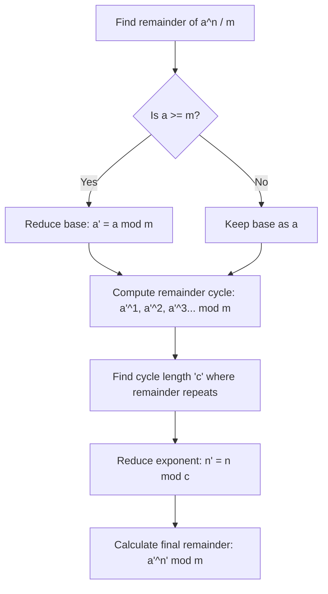

# 04 — Advanced Quantitative + Advanced Reasoning (Prime Cutoff Section)

This section separates **Digital and Prime** tier candidates from Ninja tier candidates. It typically consists of **~15 questions** shared between Advanced Quantitative and Advanced Reasoning, to be completed in a combined **25 minutes**. 

> [!NOTE]
> Achieving a **60% accuracy rate** in this section is usually sufficient to cross the Prime/Digital cutoff. Prioritize accuracy over rushing.

---

## A. Advanced Quantitative — Key Areas

### 1. Data Interpretation (DI)
*   **Format:** Appears as sets of 3–4 questions based on a single Bar Graph, Pie Chart, Table, or Line Graph.
*   **⚡ Approximation Trick:** Do not calculate exact values for "highest growth rate" or "lowest ratio" questions. Use fractional estimation (e.g., $182/403 \approx 180/400 = 45\%$) to eliminate options.
*   **⚡ Pie Chart Multiplier:** If percentages are given for categories, multiply the total budget/value *once* to get the baseline value per $1\%$, and then write down the value of each sector on your rough sheet before starting the sub-questions.

---

### 2. Higher Number Systems

#### ⚡ Remainder Cyclicity Algorithm
To find the remainder of $\frac{a^n}{m}$:



*   **Worked Example:** Find the remainder of $7^{100} \bmod 5$.
    1.  Reduce base: $7 \equiv 2 \pmod 5$.
    2.  Find cycle for powers of 2 mod 5:
        *   $2^1 \equiv 2 \pmod 5$
        *   $2^2 \equiv 4 \pmod 5$
        *   $2^3 \equiv 3 \pmod 5$
        *   $2^4 \equiv 1 \pmod 5$ (Cycle length $c = 4$, since power of $2^4$ gives remainder $1$).
    3.  Reduce exponent: $100 \bmod 4 = 0 \implies$ use $2^4$.
    4.  Result: $2^4 \equiv 1 \pmod 5$. The remainder is $1$.

---

#### ⚡ Trailing Zeros in Factorials
*   **Formula (Legendre's Formula):**
    $$\text{Trailing Zeros in } n! = \sum_{i=1}^{\infty} \left\lfloor \frac{n}{5^i} \right\rfloor = \left\lfloor \frac{n}{5} \right\rfloor + \left\lfloor \frac{n}{25} \right\rfloor + \left\lfloor \frac{n}{125} \right\rfloor + \dots$$
*   **Derivation:** A trailing zero is created by a factor of $10$, which is formed by the product of prime factors $2$ and $5$. In any factorial $n!$, the count of prime factor $2$ is always greater than or equal to the count of $5$. Therefore, the number of trailing zeros is determined by the total number of prime factors of $5$ in $n!$.
    *   $\lfloor n/5 \rfloor$ represents numbers in $[1, n]$ contributing at least one factor of $5$.
    *   $\lfloor n/25 \rfloor$ represents numbers contributing a second factor of $5$.
    *   $\lfloor n/125 \rfloor$ represents numbers contributing a third factor of $5$, and so on.
*   **Worked Example:** Find the number of trailing zeros in $100!$.
    $$\text{Trailing Zeros} = \left\lfloor \frac{100}{5} \right\rfloor + \left\lfloor \frac{100}{25} \right\rfloor + \left\lfloor \frac{100}{125} \right\rfloor = 20 + 4 + 0 = 24$$

---

### 3. Algebra & Equations

*   **Quadratic Roots Relation:** For any quadratic equation $ax^2 + bx + c = 0$:
    $$\text{Sum of Roots } (\alpha + \beta) = -\frac{b}{a} \quad \text{and} \quad \text{Product of Roots } (\alpha\beta) = \frac{c}{a}$$
*   **Derivation:** Dividing the quadratic $ax^2 + bx + c = 0$ by $a$ gives $x^2 + \frac{b}{a}x + \frac{c}{a} = 0$. Since $\alpha$ and $\beta$ are the roots, the equation can also be written as:
    $$(x - \alpha)(x - \beta) = 0 \implies x^2 - (\alpha + \beta)x + \alpha\beta = 0$$
    Equating coefficients of $x$ and the constant terms gives $\alpha + \beta = -b/a$ and $\alpha\beta = c/a$.
*   **Relative Speed of Two Moving Bodies:** When two bodies move in opposite directions, their relative speed is $S_{\text{rel}} = S_1 + S_2$. When moving in the same direction, $S_{\text{rel}} = |S_1 - S_2|$. Always convert speed units to match distance units (usually $\text{km/hr} \times \frac{5}{18} = \text{m/s}$).

---

### 4. Probability & Permutations

*   **Conditional Probability:** The probability of event $A$ occurring given that event $B$ has already occurred:
    $$P(A \mid B) = \frac{P(A \cap B)}{P(B)}$$
*   **Vowel Restriction Trick (Gap Method):** To arrange letters such that vowels are never together:
    1.  Arrange the $C$ consonants first in $C!$ ways.
    2.  This creates $C+1$ gaps around the consonants.
    3.  Choose gaps and arrange the $V$ vowels in those gaps in $^{C+1}P_V$ ways.
    $$\text{Total Ways} = C! \times {}^{C+1}P_V$$

---

## B. Advanced Quant — Solved MCQs (NQT Format)

---

### Q1. Remainder Theorem
Find the remainder when $7^{45}$ is divided by $6$.
(a) 1
(b) 2
(c) 3
(d) 5

*   **Pattern ID:** `AQ-NUM-01` (Remainder Base Congruence)
*   **Hint:** Find the remainder of the base $7$ divided by $6$ first.
*   **Approach:**
    *   Rewrite $7$ as $6 + 1$.
    *   Using congruence arithmetic:
        $$7 \equiv 1 \pmod 6$$
        $$7^{45} \equiv 1^{45} \pmod 6$$
*   **Solution:** **(a) 1** — Since $1$ raised to any power is $1$, $7^{45} \bmod 6 = 1$.
*   **Shortcut:** If base $a = m + 1$, then $a^n \bmod m = 1$ for all integers $n$.
*   **Variation & Trap:** If the question asked for $5^{45} \bmod 6$, the base would be congruent to $-1$. Then, $(-1)^{45} \equiv -1 \equiv 5 \pmod 6$. Keep track of whether the exponent is odd or even when dealing with negative bases.

---

### Q2. Pie Chart Combined Operations
A pie chart shows a company's expenses: Salary $40\%$, Rent $20\%$, Marketing $15\%$, Utilities $10\%$, and Misc $15\%$. If the total expense is ₹$50,00,000$, find the amount spent on Marketing + Utilities.
(a) ₹$10,50,000$
(b) ₹$12,50,000$
(c) ₹$15,00,000$
(d) ₹$17,50,000$

*   **Pattern ID:** `AQ-DI-01` (Combined Sector Evaluation)
*   **Hint:** Add the percentages of the requested categories together before multiplying by the total.
*   **Approach:**
    *   $\text{Marketing \%} = 15\%$
    *   $\text{Utilities \%} = 10\%$
    *   $\text{Combined \%} = 15\% + 10\% = 25\%$
    *   Calculate $25\%$ of the total expense:
        $$\text{Value} = 0.25 \times 50,00,000 = 12,50,000$$
*   **Solution:** **(b) ₹12,50,000**
*   **Shortcut:** Do not calculate ₹$50,00,000 \times 0.15$ and ₹$50,00,000 \times 0.10$ separately. Combining the percentages first reduces two multiplications to one.

---

### Q3. Trailing Zeros Calculation
How many trailing zeros are in $100!$?
(a) 20
(b) 22
(c) 24
(d) 26

*   **Pattern ID:** `AQ-NUM-02` (Legendre's Factorial Zeros)
*   **Hint:** Apply Legendre's formula using divisions by powers of $5$.
*   **Approach:**
    *   Compute $\lfloor 100/5 \rfloor = 20$.
    *   Compute $\lfloor 100/25 \rfloor = 4$.
    *   Compute $\lfloor 100/125 \rfloor = 0$.
    *   Sum the results: $20 + 4 = 24$.
*   **Solution:** **(c) 24**
*   **Shortcut:** Divide the number by $5$, then divide the quotient by $5$ recursively, ignoring remainders, until the quotient is less than $5$. Add up the quotients:
    $$100 / 5 = 20 \quad \rightarrow \quad 20 / 5 = 4 \quad \rightarrow \quad \text{Stop} \quad \rightarrow \quad 20 + 4 = 24$$

---

### Q4. Roots of Quadratic Equations
The sum of the roots of the equation $x^2 - 7x + 12 = 0$ is:
(a) -7
(b) 7
(c) 12
(d) -12

*   **Pattern ID:** `AQ-ALG-01` (Quadratic Root Coefficients)
*   **Hint:** Use the coefficient relation for sum of roots directly without factoring.
*   **Approach:**
    *   For $x^2 - 7x + 12 = 0$, the coefficients are $a = 1$, $b = -7$, and $c = 12$.
    *   $$\text{Sum of Roots} = -\frac{b}{a} = -\frac{-7}{1} = 7$$
*   **Solution:** **(b) 7**
*   **Shortcut:** In a monic quadratic equation ($a=1$), the sum of roots is simply the negative of the $x$-coefficient. Negative of $-7$ is $7$.
*   **Variation & Trap:** Do not waste time factoring the equation into $(x-3)(x-4)=0$ to find the roots $3$ and $4$ first.

---

### Q5. Permutations with Block Constraints
In how many ways can the letters of the word "MACHINE" be arranged so that the vowels always come together?
(a) 120
(b) 360
(c) 720
(d) 5040

*   **Pattern ID:** `AQ-PERM-01` (Grouping Permutations)
*   **Hint:** Group the vowels together into a single "block" or "meta-character".
*   **Approach:**
    *   Identify vowels: A, I, E (3 vowels).
    *   Identify consonants: M, C, H, N (4 consonants).
    *   Treat the 3 vowels as 1 single block unit.
    *   Total units to arrange = 4 consonants + 1 vowel block = 5 units.
    *   Arrange the 5 units: $5! = 120$ ways.
    *   Arrange the 3 vowels internally inside the block: $3! = 6$ ways.
    *   Total arrangements:
        $$\text{Total} = 5! \times 3! = 120 \times 6 = 720\text{ ways}$$
*   **Solution:** **(c) 720**
*   **Shortcut:** $\text{Arrangement} = (\text{Consonants} + 1)! \times (\text{Vowels})!$ (assuming no letters are repeated).

---

### Q6. Growth Rate from Line Graph
A line graph shows website traffic over 5 months: Jan-1000, Feb-1500, Mar-1200, Apr-1800, May-2000. Find the percentage growth in traffic from January to May.
(a) $50\%$
(b) $75\%$
(c) $100\%$
(d) $150\%$

*   **Pattern ID:** `AQ-DI-02` (Percentage Growth Calculation)
*   **Hint:** Formula for growth percentage:
    $$\text{Growth \%} = \frac{\text{Final Value} - \text{Initial Value}}{\text{Initial Value}} \times 100$$
*   **Approach:**
    *   $\text{Initial Value (Jan)} = 1000$
    *   $\text{Final Value (May)} = 2000$
    *   $$\text{Growth \%} = \frac{2000 - 1000}{1000} \times 100 = \frac{1000}{1000} \times 100 = 100\%$$
*   **Solution:** **(c) 100%**
*   **Trap:** Do not divide by the final value ($2000$) or average values. Always use the initial value as the denominator.

---

### Q7. Two Moving Bodies crossing in opposite directions
Two trains $120\text{ m}$ and $180\text{ m}$ long run in opposite directions at $54\text{ km/hr}$ and $36\text{ km/hr}$. Find the time taken to cross each other.
(a) $10\text{ seconds}$
(b) $12\text{ seconds}$
(c) $15\text{ seconds}$
(d) $20\text{ seconds}$

*   **Pattern ID:** `AQ-SPD-01` (Relative Speed train crossing)
*   **Hint:** Add speeds because they travel in opposite directions, and convert speeds to meters per second ($\text{m/s}$).
*   **Approach:**
    *   Total distance to cover = sum of train lengths = $120\text{ m} + 180\text{ m} = 300\text{ m}$.
    *   Relative speed = $54 + 36 = 90\text{ km/hr}$.
    *   Convert relative speed to $\text{m/s}$:
        $$90 \times \frac{5}{18} = 25\text{ m/s}$$
    *   Calculate time:
        $$\text{Time} = \frac{\text{Distance}}{\text{Speed}} = \frac{300}{25} = 12\text{ seconds}$$
*   **Solution:** **(b) 12 seconds**

---

## C. Advanced Reasoning — Key Areas

### 1. Complex Multi-Variable Puzzles
*   **Strategy:** When clues contain multiple attributes (e.g., *Name + Color + City + Profession*), use a grid layout with attributes as columns. Do not write circular diagrams unless circular sitting is explicitly stated.
*   **Solving Sequence:**
    1.  Scan all clues to find a definite match (e.g., *"A lives in Delhi"*).
    2.  Fill negative constraints (e.g., *"B does not wear Blue"* represented as $\text{Blue} \times$ under B's column).
    3.  Match leftovers using process of elimination.

---

### 2. Input-Output / Machine Coding
*   **Pattern:** A compiler modifies a sequence of words and numbers step by step.
*   **⚡ Step 1 Extraction rule:** Compare the raw input string directly with Step 1's output. Identify if numbers are sorted (ascending/descending) and if words are ordered alphabetically or by character length.
*   **Worked Example:**
    *   Input: `24 cat 18 dog 9 elephant`
    *   Step 1: `9 cat 18 dog 24 elephant`
    *   Rule: The smallest number ($9$) and the largest number ($24$) swapped positions. The words remained in place.

---

### 3. Critical Reasoning (Strengthen vs. Weaken Arguments)
*   **Strengthen Argument:** Provide evidence supporting the validity of the premise or link connecting the premise to the conclusion.
*   **Weaken Argument:** Introduce alternative explanations or evidence showing that the conclusion does not necessarily follow from the premise.
*   **⚡ Irrelevant Option Filter:** Eliminate options containing general truths or statistics that do not directly address the specific causal claim of the argument.

---

## D. Advanced Reasoning — Solved MCQs (NQT Format)

---

### Q1. Variable Inequality Ranking
Five people A, B, C, D, and E have different ages. A is older than B but younger than C. D is the oldest. E is younger than B. Who is the second oldest?
(a) A
(b) B
(c) C
(d) E

*   **Pattern ID:** `AR-INEQ-01` (Transitive inequality chains)
*   **Hint:** Construct a chain of inequality symbols ($>$ or $<$).
*   **Approach:**
    *   Clue 1: A is older than B but younger than C $\implies C > A > B$.
    *   Clue 2: D is the oldest $\implies D > \text{everyone else}$.
    *   Clue 3: E is younger than B $\implies B > E$.
    *   Combine the constraints into a single chain:
        $$D > C > A > B > E$$
*   **Solution:** **(c) C** — The second oldest person is C.

---

### Q2. Weaken Argument Analysis
**Statement:** "The government should make wearing helmets mandatory for all two-wheeler riders to reduce road fatalities." 

Which of the following statements most weakens this argument?
(a) Helmets reduce head injury risk by $40\%$ in accidents.
(b) Most two-wheeler fatalities in the city occur due to high-impact trunk trauma and poor road conditions, not head injuries.
(c) Helmets are uncomfortable to wear in hot, humid weather.
(d) Many countries have successfully implemented mandatory helmet laws.

*   **Pattern ID:** `AR-CRIT-01` (Causal Link Weakener)
*   **Hint:** Find the option that shows helmets do not address the primary cause of fatalities.
*   **Approach:**
    *   The argument assumes: mandatory helmets $\rightarrow$ reduction in fatalities.
    *   Option (b) shows that the fatalities are caused by trunk trauma and road conditions, meaning helmets will not solve the main problem. This breaks the link.
*   **Solution:** **(b)**
*   **Trap:** Option (c) mentions a negative aspect (uncomfortable), but discomfort does not challenge the argument's claim that helmets reduce fatalities.

---

### Q3. Scheduling Constraint Puzzle
In a 5-day work week (Monday to Friday), five managers P, Q, R, S, and T present their project updates on different days.
*   P presents before Q.
*   R presents on Wednesday.
*   S presents the day after R.
*   T presents on the first day.

What is the presentation order from Monday to Friday?
(a) T, P, R, S, Q
(b) T, Q, R, S, P
(c) P, T, R, S, Q
(d) T, R, S, P, Q

*   **Pattern ID:** `AR-SCHED-01` (Chronological Slot Placement)
*   **Hint:** Set up the 5 slots (Mon-Fri) and place the definite entries first.
*   **Approach:**
    *   Create slots: `[Mon] [Tue] [Wed] [Thu] [Fri]`.
    *   Place T: "T presents on the first day" $\implies \text{Monday} = T$.
    *   Place R: "R presents on Wednesday" $\implies \text{Wednesday} = R$.
    *   Place S: "S presents the day after R" $\implies \text{Thursday} = S$.
    *   Remaining slots are Tuesday and Friday for P and Q.
    *   Constraint: "P presents before Q" $\implies \text{Tuesday} = P$ and $\text{Friday} = Q$.
    *   Resulting order: $T \text{ (Mon)}, P \text{ (Tue)}, R \text{ (Wed)}, S \text{ (Thu)}, Q \text{ (Fri)}$.
*   **Solution:** **(a) T, P, R, S, Q**

---

### Q4. Machine Coding Step Prediction
A coding machine accepts a word-number string and rearranges it step-by-step:
*   **Input:** `24 cat 18 dog 9 elephant`
*   **Step 1:** `9 cat 18 dog 24 elephant`
*   **Step 2:** `9 cat 18 elephant 24 dog`

What is the logical rule applied in Step 2?
(a) Numbers are sorted descending; words remain unchanged.
(b) Numbers are sorted ascending (completed in Step 1); words are sorted alphabetically in descending order.
(c) Numbers are sorted ascending; words are sorted alphabetically in ascending order.
(d) Words are sorted by character count.

*   **Pattern ID:** `AR-MC-01` (Multi-Criteria Sorting Rule)
*   **Hint:** Look at how the words "cat", "dog", and "elephant" were rearranged in Step 2.
*   **Approach:**
    *   In Step 1, numbers $9$ and $24$ were sorted (ascending order: $9$ first, $24$ last).
    *   In Step 2, the positions of "dog" and "elephant" were swapped, resulting in: `cat`, `elephant`, `dog`.
    *   Alphabetical order of the words: `cat` (C), `dog` (D), `elephant` (E).
    *   The resulting word sequence `cat` (C), `elephant` (E), `dog` (D) shows that "elephant" and "dog" are sorted alphabetically in *descending* order (E before D).
*   **Solution:** **(b)** — Numbers are sorted ascending (completed first), then words are sorted alphabetically in descending order.

---

## E. Time-Management Tip for the Advanced Section

Because Advanced Aptitude shares a **single 25-minute time pool** for both Quant and Reasoning, use a two-pass scanning method:

```text
Pass 1 (First 5 Minutes):
Scan and answer single-variable questions instantly (Remainder cyclicity, series, basic inequalities). 
Avoid starting long DI sets or multi-variable grid puzzles.

Pass 2 (Remaining 20 Minutes):
Solve the multi-step puzzles and DI sets. 
If a DI set has 4 questions, spend 2 minutes understanding the graph; it will let you answer all 4 sub-questions in 1 minute.
```
