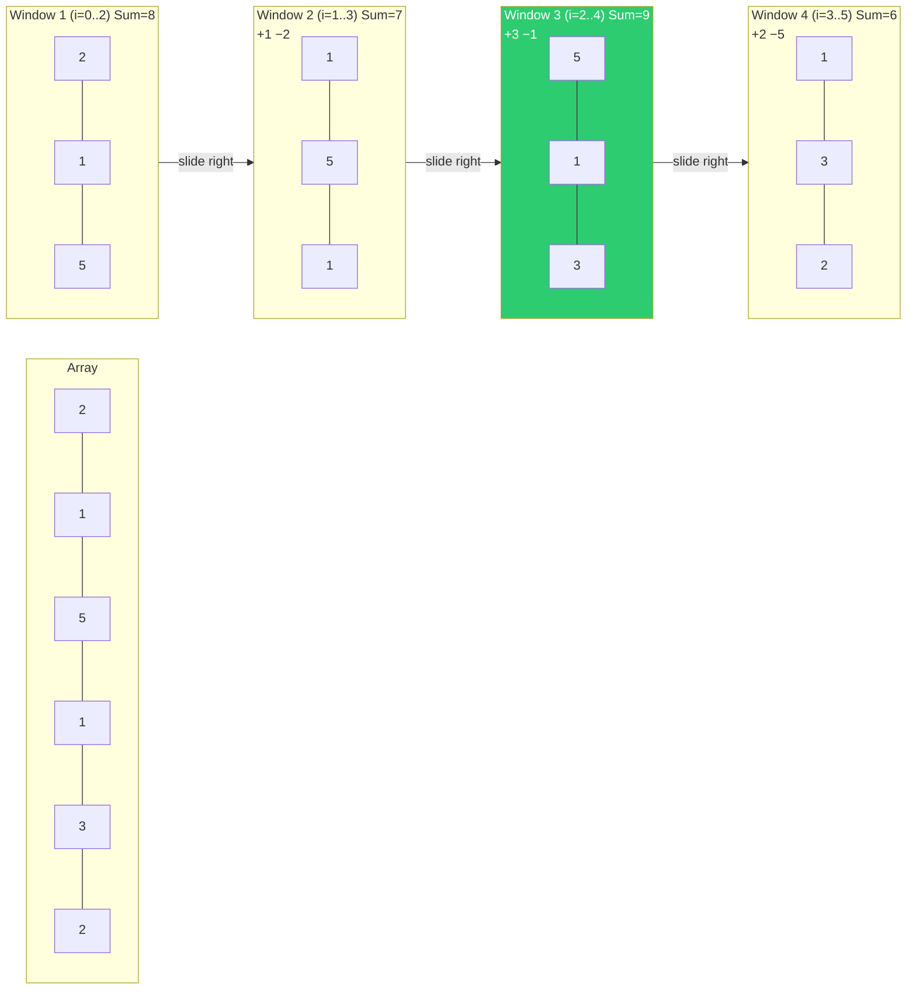
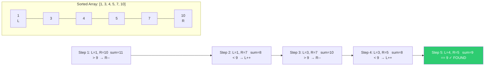
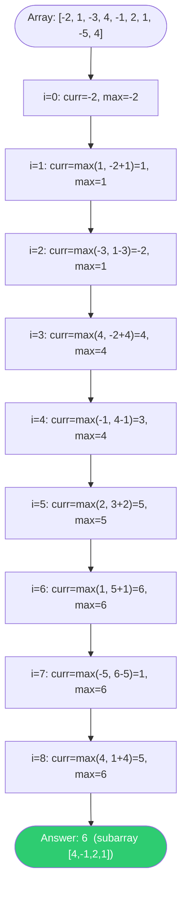
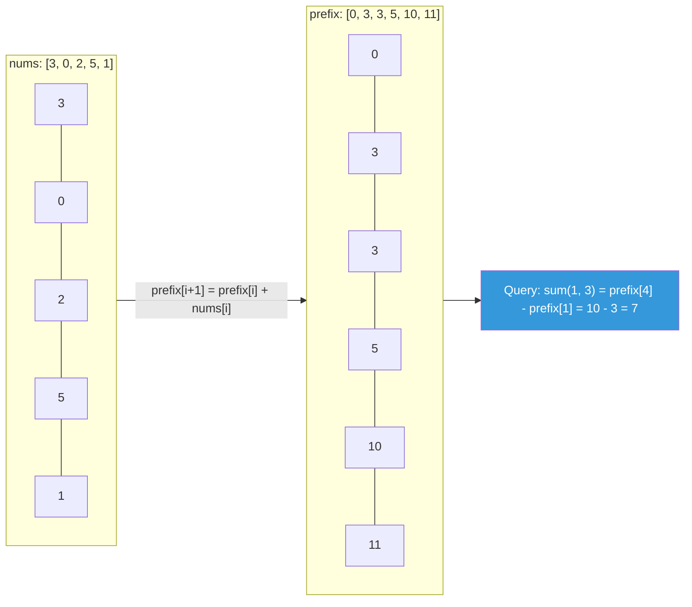
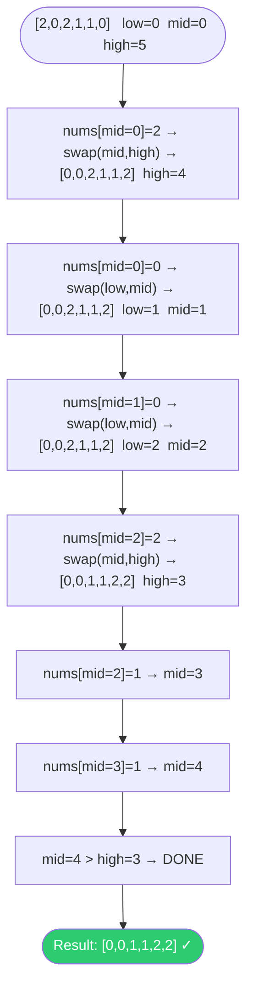

# Arrays — Visualization

## Diagram 1 — Sliding Window (Fixed Size k=3)

**Answer: Maximum window sum = 9 (window 3)**

---

## Diagram 2 — Two Pointer (Find Pair with Sum = 9 in Sorted Array)

---

## Diagram 3 — Kadane's Algorithm Trace

---

## Diagram 4 — Prefix Sum Array Build and Query

---

## Diagram 5 — Dutch National Flag (Sort Colors)

