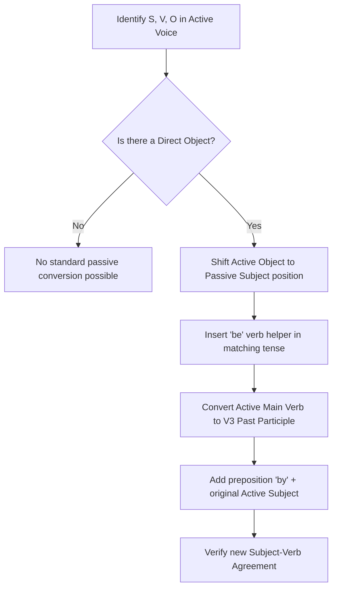
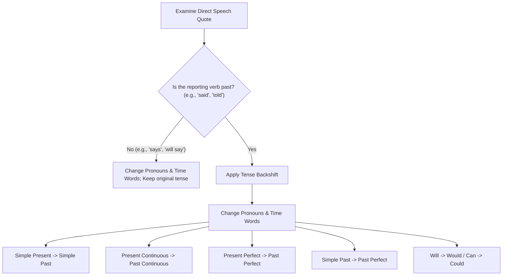

# English Grammar Rules for TCS NQT

This guide covers the core English grammar rules, structures, and common traps tested in the TCS NQT Verbal Ability section. It is designed to be fully self-contained and structured to prevent common test-taking errors.

---

## 1. Subject-Verb Agreement (8 Key Rules)

A verb must agree in number (singular or plural) with its true grammatical subject, regardless of intervening phrases or words.

```
                  ┌──────────────────────────────────────────────┐
                  │          Subject-Verb Agreement Sorter       │
                  └──────────────────────┬───────────────────────┘
                                         │
                 Is the subject joined by "and" or "or/nor"?
                 ┌───────────────────────┴───────────────────────┐
         Joined by "and"                                 Joined by "or/nor"
         ┌───────┴───────┐                               ┌───────┴───────┐
  Plural Verb (usually)                    Verb agrees with closest subject
  e.g., Lead and dev work.                  e.g., Neither lead nor devs work.
```

### Rule 1: Collective Nouns
*   **Concept:** Singular when the group acts as a single, cohesive unit; plural when the individual members of the group act separately or are in disagreement.
*   **Structure:**
    *   $\text{Group Noun (Cohesive Unit)} \rightarrow \text{Singular Verb}$
    *   $\text{Group Noun (Individual Actions/Conflict)} \rightarrow \text{Plural Verb}$
*   **TCS Trap:** TCS often tests collective nouns like *committee, audience, jury, staff, team* in contexts where they disagree, hoping you will automatically use a singular verb.
*   **Worked Examples:**
    *   ❌ *Incorrect:* The jury **are** announcing its final verdict.
    *   ✔️ *Correct:* The jury **is** announcing its final verdict. (The jury acts as a single unit).
    *   ❌ *Incorrect:* The committee **is** arguing about their office cubicles.
    *   ✔️ *Correct:* The committee **are** arguing about their office cubicles. (The members are acting individually and in disagreement, indicated by the pronoun "their").

### Rule 2: Either/Or & Neither/Nor
*   **Concept:** When subjects are joined by *either...or* or *neither...nor*, the verb agrees in number with the subject closest to it.
*   **Structure:**
    *   $\text{Either } S_1 \text{ or } S_2 (\text{Singular}) \rightarrow \text{Singular Verb}$
    *   $\text{Neither } S_1 \text{ nor } S_2 (\text{Plural}) \rightarrow \text{Plural Verb}$
*   **Worked Examples:**
    *   ❌ *Incorrect:* Neither the manager nor the **interns is** present in the server room.
    *   ✔️ *Correct:* Neither the manager nor the **interns are** present in the server room. (Closest subject "interns" is plural).
    *   ❌ *Incorrect:* Either the developers or the **project manager write** the status report.
    *   ✔️ *Correct:* Either the developers or the **project manager writes** the status report. (Closest subject "project manager" is singular).

### Rule 3: Intervening Phrases
*   **Concept:** Words or phrases that come between the subject and the verb (such as *along with, as well as, together with, in addition to, accompanied by*) do not alter the number of the true subject.
*   **Structure:**
    *   $S_1 (\text{Singular}) + \text{ as well as } S_2 (\text{Plural}) \rightarrow \text{Singular Verb}$
*   **Worked Examples:**
    *   ❌ *Incorrect:* The lead developer, as well as all his team members, **were** praised for the successful migration.
    *   ✔️ *Correct:* The lead developer, as well as all his team members, **was** praised for the successful migration. (True subject is "The lead developer", which is singular).
    *   ❌ *Incorrect:* The backup files, along with the main database server, **was** corrupted.
    *   ✔️ *Correct:* The backup files, along with the main database server, **were** corrupted. (True subject is "The backup files", which is plural).

### Rule 4: Plural-Form Singular Nouns
*   **Concept:** Certain nouns end in *-s* but are singular in meaning (such as *Mathematics, Physics, News, Statistics, Economics, Athletics, Billiards*) and require a singular verb.
*   **Structure:**
    *   $\text{Noun ending in -s (field/news)} \rightarrow \text{Singular Verb}$
*   **TCS Trap:** "Statistics" and "Economics" can take plural verbs if they refer to raw data or financial details rather than the subject fields.
*   **Worked Examples:**
    *   ❌ *Incorrect:* The latest news from the IT department **are** that the servers will be down tonight.
    *   ✔️ *Correct:* The latest news from the IT department **is** that the servers will be down tonight.
    *   ❌ *Incorrect:* Statistics **is** indicating that our user retention is dropping.
    *   ✔️ *Correct:* Statistics **are** indicating that our user retention is dropping. (Here, statistics refers to data points, not the study of statistics).

### Rule 5: Quantities, Time, Money, and Distance
*   **Concept:** When a phrase representing a specific quantity, sum of money, period of time, or distance is treated as a single, collective unit, it takes a singular verb.
*   **Structure:**
    *   $\text{Quantity Expression (Unified Measurement)} \rightarrow \text{Singular Verb}$
*   **Worked Examples:**
    *   ❌ *Incorrect:* Ten kilometers **are** the distance between our primary and backup data centers.
    *   ✔️ *Correct:* Ten kilometers **is** the distance between our primary and backup data centers. (Treated as a single measure).
    *   ❌ *Incorrect:* Fifty dollars **were** credited back to the customer's account.
    *   ✔️ *Correct:* Fifty dollars **was** credited back to the customer's account. (Treated as a single sum).

### Rule 6: Indefinite Pronouns
*   **Concept:** Singular indefinite pronouns (*each, everyone, someone, nobody, anyone, either, neither*) take singular verbs. Plural indefinite pronouns (*both, few, many, several*) take plural verbs. Variable indefinite pronouns (*some, any, all, most, none*) take singular or plural verbs depending on the noun they modify.
*   **Structure:**
    *   $\text{Each / Everyone / Neither} + \text{of the } N (\text{Plural}) \rightarrow \text{Singular Verb}$
*   **Worked Examples:**
    *   ❌ *Incorrect:* Each of the software licenses **have** expired.
    *   ✔️ *Correct:* Each of the software licenses **has** expired. (True subject is the singular "Each").
    *   ❌ *Incorrect:* Most of the database table **were** corrupted during the query.
    *   ✔️ *Correct:* Most of the database table **was** corrupted during the query. (Modified noun "table" is singular).
    *   ❌ *Incorrect:* Most of the database tables **was** corrupted.
    *   ✔️ *Correct:* Most of the database tables **were** corrupted. (Modified noun "tables" is plural).

### Rule 7: Fractional and Percentage Subjects
*   **Concept:** When fractions or percentages are used, the verb agrees with the noun in the succeeding prepositional phrase ("of" phrase).
*   **Structure:**
    *   $\text{Fraction/Percent} + \text{of } N (\text{Singular}) \rightarrow \text{Singular Verb}$
    *   $\text{Fraction/Percent} + \text{of } N (\text{Plural}) \rightarrow \text{Plural Verb}$
*   **Worked Examples:**
    *   ❌ *Incorrect:* Two-thirds of the source code **have** been refactored.
    *   ✔️ *Correct:* Two-thirds of the source code **has** been refactored. ("source code" is uncountable/singular).
    *   ❌ *Incorrect:* Three-quarters of the test files **has** passed.
    *   ✔️ *Correct:* Three-quarters of the test files **were** passed. / **have** passed. ("test files" is plural).

### Rule 8: "Many a" and "More than one"
*   **Concept:** The expressions *many a* and *more than one* are grammatically singular and must be followed by a singular noun and a singular verb.
*   **Structure:**
    *   $\text{Many a } + N (\text{Singular}) \rightarrow \text{Singular Verb}$
    *   $\text{More than one } + N (\text{Singular}) \rightarrow \text{Singular Verb}$
*   **Worked Examples:**
    *   ❌ *Incorrect:* Many a candidate **have** struggled with the NQT quantitative section.
    *   ✔️ *Correct:* Many a candidate **has** struggled with the NQT quantitative section.
    *   ❌ *Incorrect:* More than one system administrator **were** involved in the security breach.
    *   ✔️ *Correct:* More than one system administrator **was** involved in the security breach.

---

## 2. The 12 Tenses Reference Table

Each tense possesses a unique grammatical structure. Understanding the logical derivation of these structures prevents tense mismatch errors.

| Tense Name | Formula | Structural Derivation | Example Sentence | TCS NQT Trap |
| :--- | :--- | :--- | :--- | :--- |
| **Simple Present** | $S + V_1 \text{ (s/es)}$ | $V_1$ (root verb) denotes timeless/habitual actions. $+s/es$ marks 3rd person singular. | The compiler translates code to machine language. | **Temporary Action Trap:** Using Simple Present for actions happening right now. <br>❌ *The server runs slowly at this moment.* <br>✔️ *The server is running slowly...* |
| **Present Continuous** | $S + \text{is/am/are} + V_{ing}$ | $\text{is/am/are}$ (present state of 'be') + $V_{ing}$ (present participle showing progress). | She is debugging the memory leak. | **State Verb Trap:** Using continuous tense with non-action state verbs. <br>❌ *I am knowing the correct API.* <br>✔️ *I know the correct API.* |
| **Present Perfect** | $S + \text{has/have} + V_3$ | $\text{has/have}$ (present possession of state) + $V_3$ (past participle indicating completion). | They have deployed the update. | **Past Time Marker Trap:** Mixing present perfect with specific past dates. <br>❌ *We have released the patch yesterday.* <br>✔️ *We released the patch yesterday.* |
| **Present Perf. Cont.** | $S + \text{has/have} + \text{been} + V_{ing}$ | $\text{has/have been}$ (duration started in past) + $V_{ing}$ (ongoing progressive action). | We have been testing the software since 9 AM. | **Since vs. For Trap:** Using "since" for duration and "for" for point in time. <br>❌ *She is coded for 9 AM.* / *has been coding since 5 hours.* <br>✔️ *...for 5 hours.* |
| **Simple Past** | $S + V_2$ | $V_2$ (past verb form) indicates an action that was completed in the past. | The architect designed the schema in 2024. | **Present Perfect Replacement Trap:** Confusing it with Present Perfect. <br>❌ *I have graduated in 2023.* <br>✔️ *I graduated in 2023.* |
| **Past Continuous** | $S + \text{was/were} + V_{ing}$ | $\text{was/were}$ (past state of 'be') + $V_{ing}$ (progressive action ongoing in past). | He was writing unit tests when the power went out. | **Interrupted Action Trap:** Failing to use Simple Past for the interrupting event. <br>❌ *While I was coding, the compiler is crashing.* <br>✔️ *...the compiler crashed.* |
| **Past Perfect** | $S + \text{had} + V_3$ | $\text{had}$ (past possession) + $V_3$ (past action completed before another past event). | The system had crashed before we saved the file. | **Double Past Trap:** Using Simple Past for both past events when sequence is vital. <br>❌ *The server crashed before we saved.* <br>✔️ *The server had crashed before we saved.* |
| **Past Perf. Cont.** | $S + \text{had} + \text{been} + V_{ing}$ | $\text{had been}$ (past duration) + $V_{ing}$ (progressive action prior to past point). | The team had been debugging for hours before finding the bug. | **Tense Shift Trap:** Changing back to present continuous in the same sequence. <br>❌ *They had been debugging when he suddenly says it works.* <br>✔️ *...when he suddenly said it worked.* |
| **Simple Future** | $S + \text{will/shall} + V_1$ | $\text{will/shall}$ (modal of future intent) + $V_1$ (base action verb). | The QA team will verify the build tomorrow. | **Conditional Double Future Trap:** Using will in the conditional clause. <br>❌ *If she will finish the task, we will release it.* <br>✔️ *If she finishes the task, we will release it.* |
| **Future Continuous** | $S + \text{will be} + V_{ing}$ | $\text{will be}$ (future state of 'be') + $V_{ing}$ (ongoing progressive future action). | I will be running the test suite at noon tomorrow. | **Time Anchor Trap:** Using future continuous without a specific time anchor. <br>❌ *I will be running tests.* <br>✔️ *I will run tests.* / *I will be running tests at 3 PM.* |
| **Future Perfect** | $S + \text{will have} + V_3$ | $\text{will}$ (future) + $\text{have } V_3$ (completed state by a future deadline). | By next Friday, they will have integrated the API. | **By the Time Clause Trap:** Using will inside the "by the time" time clause. <br>❌ *By the time he will arrive, we will have finished.* <br>✔️ *By the time he arrives, we will have finished.* |
| **Future Perf. Cont.** | $S + \text{will have} + \text{been} + V_{ing}$ | $\text{will have been}$ (completed past-to-future duration) + $V_{ing}$ (ongoing future action). | In October, I will have been working here for a year. | **Duration Lack Trap:** Using this complex tense without an explicit duration expression. <br>❌ *I will have been coding when they arrive.* <br>✔️ *I will be coding when they arrive.* |

---

## 3. Articles (a/an/the) — 6 Rules & Memory Tricks

Articles frame nouns. Follow these 6 rules and associated memory tricks to ensure correct usage.

### Rule 1: Sound Over Letter (a vs. an)
*   **Concept:** Use "an" before vowel sounds (e.g., /æ/, /i:/, /aɪ/, /oʊ/); use "a" before consonant sounds (e.g., /j/, /w/, /b/, /k/).
*   **Memory Trick: "The Throat Test"**
    *   Place two fingers on your throat. Pronounce the word. If your throat passes air freely without your tongue, teeth, or lips stopping it (vowel block), the word starts with a vowel sound $\rightarrow$ use **an**. If your lips, teeth, or tongue interact to block the air, it's a consonant sound $\rightarrow$ use **a**.
*   **Worked Examples:**
    *   *An hour* ("h" is silent; throat starts open $\rightarrow$ /aʊər/).
    *   *A university* (starts with /y/ consonant sound, lips/tongue shape the sound $\rightarrow$ /ju:nɪvɜ:rsɪti/).
    *   *An MLA* (starts with vowel sound /ɛm/).
    *   *A one-way street* (starts with consonant sound /w/).

### Rule 2: Singular Countable vs. Plural/Uncountable
*   **Concept:** "A" and "An" mean "one" and can only modify singular countable nouns. Never use them with plural or uncountable nouns.
*   **Memory Trick: "The Finger Counting Test"**
    *   Ask yourself: "Can I count this on my fingers?" (e.g., "three apples" $\rightarrow$ Yes. "three informations" $\rightarrow$ No). If No, do not use *a* or *an*.
*   **Worked Examples:**
    *   ❌ *Incorrect:* The support team gave me **an advice** regarding the bug.
    *   ✔️ *Correct:* The support team gave me **advice** (or **a piece of advice**) regarding the bug.
    *   ❌ *Incorrect:* I need **a database backups**.
    *   ✔️ *Correct:* I need **a database backup** (singular countable).

### Rule 3: The Pointing Finger (Definite vs. Indefinite)
*   **Concept:** Use "a/an" for non-specific, general nouns; use "the" for specific nouns that are unique or have already been mentioned.
*   **Memory Trick: "The Laser Pointer"**
    *   If you can point a laser pointer directly at the exact, specific object in the room, use **the**. If you are pointing at any random object of that category, use **a/an**.
*   **Worked Examples:**
    *   *I need to hire **a developer**.* (Any developer; indefinite).
    *   *We hired **the developer** who wrote the security patch.* (Specific developer; definite).

### Rule 4: Geographical Naming Conventions
*   **Concept:** Use "the" with names of oceans, seas, rivers, mountain ranges, groups of islands, and countries containing "Republic", "Kingdom", or "States". Do not use "the" for single mountains, single islands, lakes, or individual countries.
*   **Memory Trick: "Group vs. Solo Rule"**
    *   If it is a collective group of elements (islands, states, peaks), use **the** (e.g., *The Maldives*, *The Himalayas*, *The USA*). If it is a solo natural entity, do not use an article (e.g., *Mount Everest*, *Sri Lanka*, *Lake Victoria*).
*   **Worked Examples:**
    *   ❌ *Incorrect:* We are planning a network hub in **the Sri Lanka**.
    *   ✔️ *Correct:* We are planning a network hub in **Sri Lanka**.
    *   ❌ *Incorrect:* Our data packets are routed through a cable under **Atlantic Ocean**.
    *   ✔️ *Correct:* Our data packets are routed through a cable under **the Atlantic Ocean**.

### Rule 5: Superlatives & Ordinals
*   **Concept:** Superlative adjectives (e.g., *best, fastest, worst*) and ordinal numbers (e.g., *first, second, third*) indicate unique ranks and require the definite article "the".
*   **Memory Trick: "The Top Spot Rule"**
    *   There is only one "top spot" or "first place". Because it is unique, it always demands the unique article: **the**.
*   **Worked Examples:**
    *   ❌ *Incorrect:* This is **fastest** algorithm we have compiled.
    *   ✔️ *Correct:* This is **the fastest** algorithm we have compiled.
    *   ❌ *Incorrect:* He failed to solve **first** question in the coding test.
    *   ✔️ *Correct:* He failed to solve **the first** question in the coding test.

### Rule 6: Zero Article (Omission)
*   **Concept:** Omit articles before names of languages, academic subjects, sports, meals, and abstract nouns used in a general sense.
*   **Memory Trick: "Natural State Rule"**
    *   Abstract subjects and activities exist naturally without borders; leave them in their natural state without articles.
*   **Worked Examples:**
    *   ❌ *Incorrect:* I am learning **the Python language**.
    *   ✔️ *Correct:* I am learning **Python** (or **the Python language**).
    *   ❌ *Incorrect:* **The honesty** is vital in teamwork.
    *   ✔️ *Correct:* **Honesty** is vital in teamwork (abstract noun).

---

## 4. Prepositions: "at / in / on" (Time & Place Rules)

The prepositions "at", "in", and "on" shift meanings depending on whether they denote Time or Place.

```text
      ┌─────────────────────────────────────────────────────────┐
      │                      PREPOSITION PYRAMID                │
      │                                                         │
      │        ▲                at (Precise Point / Time)       │
      │       ▲▲▲               e.g., at 9:00 AM / at the desk  │
      │      ▲▲▲▲▲              on (Surfaces / Days & Dates)    │
      │     ▲▲▲▲▲▲▲             e.g., on Monday / on the desk   │
      │    ▲▲▲▲▲▲▲▲▲            in (Enclosed / Years & Cities)  │
      │   ▲▲▲▲▲▲▲▲▲▲▲           e.g., in 2026 / in Mumbai / in  │
      └─────────────────────────────────────────────────────────┘
```

### Time vs. Place Reference Matrix

| Preposition | Time Domain Rules | Time Worked Examples | Place Domain Rules | Place Worked Examples |
| :--- | :--- | :--- | :--- | :--- |
| **at** | Specific, precise points in time; holiday periods. | • at 10:30 AM<br>• at midnight<br>• at the weekend<br>• at Christmas | Specific addresses; coordinates; exact points in space. | • at 45 MG Road<br>• at the entrance<br>• at the top of the page<br>• at my desk |
| **on** | Specific days of the week; calendar dates; special days. | • on Monday<br>• on August 15<br>• on New Year's Day<br>• on Friday morning | Surfaces; paths; streets; levels of a building. | • on the table<br>• on the server rack<br>• on MG Road<br>• on the first floor |
| **in** | Unspecific times; months; years; seasons; centuries; long durations. | • in August<br>• in 2026<br>• in the winter<br>• in the 21st century<br>• in three hours | Enclosed spaces; cities; countries; geographic regions; volumes. | • in a room<br>• in the database cabinet<br>• in Chennai<br>• in India<br>• in the ocean |

---

## 5. Active ↔ Passive Voice Conversion

Voice conversion changes the focus of the sentence from the performer of the action (Active) to the recipient of the action (Passive).

### Conversion Algorithm (5-Step Checklist)



### Tense Transformation Table

| Active Tense | Active Structure | Passive Structure | Worked Example (Active ↔ Passive) |
| :--- | :--- | :--- | :--- |
| **Simple Present** | $S + V_1\text{ (s/es)} + O$ | $S' + \text{is/am/are} + V_3 + \text{by } O'$ | **A:** She writes the script.<br>**P:** The script **is written** by her. |
| **Present Continuous** | $S + \text{is/am/are} + V_{ing} + O$ | $S' + \text{is/am/are} + \text{being} + V_3 + \text{by } O'$ | **A:** She is writing the script.<br>**P:** The script **is being written** by her. |
| **Present Perfect** | $S + \text{has/have} + V_3 + O$ | $S' + \text{has/have} + \text{been} + V_3 + \text{by } O'$ | **A:** She has written the script.<br>**P:** The script **has been written** by her. |
| **Simple Past** | $S + V_2 + O$ | $S' + \text{was/were} + V_3 + \text{by } O'$ | **A:** She wrote the script.<br>**P:** The script **was written** by her. |
| **Past Continuous** | $S + \text{was/were} + V_{ing} + O$ | $S' + \text{was/were} + \text{being} + V_3 + \text{by } O'$ | **A:** She was writing the script.<br>**P:** The script **was being written** by her. |
| **Past Perfect** | $S + \text{had} + V_3 + O$ | $S' + \text{had} + \text{been} + V_3 + \text{by } O'$ | **A:** She had written the script.<br>**P:** The script **had been written** by her. |
| **Simple Future** | $S + \text{will} + V_1 + O$ | $S' + \text{will be} + V_3 + \text{by } O'$ | **A:** She will write the script.<br>**P:** The script **will be written** by her. |
| **Future Perfect** | $S + \text{will have} + V_3 + O$ | $S' + \text{will have been} + V_3 + \text{by } O'$ | **A:** She will have written the script.<br>**P:** The script **will have been written** by her. |

> [!NOTE]
> Present Perfect Continuous, Past Perfect Continuous, Future Continuous, and Future Perfect Continuous tenses do not convert into standard passive voice forms because they result in awkward double "be" structures (e.g., *will be being written*).

---

## 6. Direct ↔ Indirect Speech Conversion

Converting direct quotes to reported speech requires shifting pronouns, modifying reporting verbs, and backshifting tenses if the reporting verb is in the past tense.



### Rule 1: Reporting Verb Adjustments
*   `said` $\rightarrow$ remains `said` in indirect speech (followed by optional conjunction `that`).
*   `said to` $\rightarrow$ changes to `told` (requires a direct personal object, e.g., *"He told me..."*).
*   `says` / `will say` $\rightarrow$ remain unchanged (no tense backshifting occurs in the reported speech because the reporting action is not in the past).

### Rule 2: Tense Backshift Table (Only when Reporting Verb is PAST)

| Direct Speech Tense | Example (Direct Speech) | Indirect Speech Tense | Example (Indirect/Reported) |
| :--- | :--- | :--- | :--- |
| **Simple Present** | He said, "I **write** code." | **Simple Past** | He said that he **wrote** code. |
| **Present Continuous** | He said, "I **am writing** code." | **Past Continuous** | He said that he **was writing** code. |
| **Present Perfect** | He said, "I **have written** code." | **Past Perfect** | He said that he **had written** code. |
| **Simple Past** | He said, "I **wrote** code." | **Past Perfect** | He said that he **had written** code. |
| **Past Continuous** | He said, "I **was writing** code." | **Past Perfect Continuous** | He said that he **had been writing** code. |
| **Simple Future** | He said, "I **will write** code." | **Conditional (Would)** | He said that he **would write** code. |
| **Imperative (Request/Order)**| He said, "**Write** the code." | **Infinitive Clause** | He ordered me **to write** the code. |

### Rule 3: Pronoun and Time/Place Shifts

If the reporting verb is past, shift temporal and spatial references to reflect the reporting perspective:

*   `this` $\rightarrow$ `that`
*   `these` $\rightarrow$ `those`
*   `here` $\rightarrow$ `there`
*   `now` $\rightarrow$ `then`
*   `today` $\rightarrow$ `that day`
*   `yesterday` $\rightarrow$ `the day before` / `the previous day`
*   `tomorrow` $\rightarrow$ `the next day` / `the following day`

---

## 7. Common TCS Error Detection Traps (10 Key Rules)

Here are the top 10 error detection traps tested in NQT, with errors highlighted and corrected.

### Trap 1: Incorrect Verb with Intervening Phrases
*   ❌ *Incorrect:* The file, along with several backup drives, **were** deleted from the repository.
*   ✔️ *Correct:* The file, along with several backup drives, **was** deleted from the repository.
*   *Trap Mechanism:* The examiners place a plural noun (*drives*) immediately before the verb to trick you into matching it. Ignore the parenthetical phrase introduced by *along with* and match the singular subject *The file*.

### Trap 2: Incorrect Relative Pronoun for Inanimate Objects
*   ❌ *Incorrect:* This is the compiler **who** flags syntax errors in our scripts.
*   ✔️ *Correct:* This is the compiler **that** (or **which**) flags syntax errors in our scripts.
*   *Trap Mechanism:* Using *who* for machines, algorithms, or systems. Use *who* exclusively for people; use *that* or *which* for objects.

### Trap 3: Dangling/Unattached Participles
*   ❌ *Incorrect:* Walking into the server room, the temperature was freezing.
*   ✔️ *Correct:* Walking into the server room, **the technician felt** the temperature was freezing.
*   *Trap Mechanism:* The participial phrase *Walking into the server room* is left hanging because the subject that follows is *the temperature* (the temperature cannot walk). Introduce the true agent (*the technician*) immediately after the comma.

### Trap 4: Scarcely / Hardly Correlative Pair Error
*   ❌ *Incorrect:* Scarcely had the update finished **than** the server crashed.
*   ✔️ *Correct:* Scarcely had the update finished **when** the server crashed.
*   *Trap Mechanism:* The correlative conjunctions *Hardly* and *Scarcely* must be paired with *when*. Only *No sooner* is paired with *than*.

### Trap 5: Double Comparatives
*   ❌ *Incorrect:* Our updated sorting algorithm is **more faster** than the legacy version.
*   ✔️ *Correct:* Our updated sorting algorithm is **faster** than the legacy version.
*   *Trap Mechanism:* Combining the modifier *more* with an adjective that already has the comparative suffix *-er*. Choose one or the other, never both.

### Trap 6: Subjective Pronoun Case after Prepositions
*   ❌ *Incorrect:* The team leader divided the database tasks between he and **I**.
*   ✔️ *Correct:* The team leader divided the database tasks between him and **me**.
*   *Trap Mechanism:* Prepositions (such as *between*, *among*, *for*) require objective case pronouns (*him, me, them, us*), not subjective case pronouns (*he, I, they, we*).

### Trap 7: Incorrect Tense with "Since" Time Markers
*   ❌ *Incorrect:* We **are working** on this network security problem since last Monday.
*   ✔️ *Correct:* We **have been working** on this network security problem since last Monday.
*   *Trap Mechanism:* Using the Present Continuous (*are working*) for an action that started in the past and is still ongoing. You must use the Present Perfect Continuous (*have been working*) when a *since* or *for* time limit is stated.

### Trap 8: Adjective vs. Adverb Placement
*   ❌ *Incorrect:* She completed the system migration **easy**.
*   ✔️ *Correct:* She completed the system migration **easily**.
*   *Trap Mechanism:* Using an adjective (*easy*) to modify a verb (*completed*). Verbs must be modified by adverbs (*easily*).

### Trap 9: "One of the" Plural Noun Trap
*   ❌ *Incorrect:* He is one of the most skilled **developer** on our team.
*   ✔️ *Correct:* He is one of the most skilled **programmers** (or **developers**) on our team.
*   *Trap Mechanism:* Using a singular noun after the phrase *one of the*. The structure *one of the* implies selecting a single entity out of a plural group; therefore, the noun must be plural.

### Trap 10: Subjunctive Mood for Hypothetical Situations
*   ❌ *Incorrect:* If I **was** the team lead, I would refactor the codebase.
*   ✔️ *Correct:* If I **were** the team lead, I would refactor the codebase.
*   *Trap Mechanism:* Using the past indicative *was* for unreal, hypothetical, or contrary-to-fact conditions. The subjunctive *were* must be used for all subjects in hypothetical *if* clauses.
