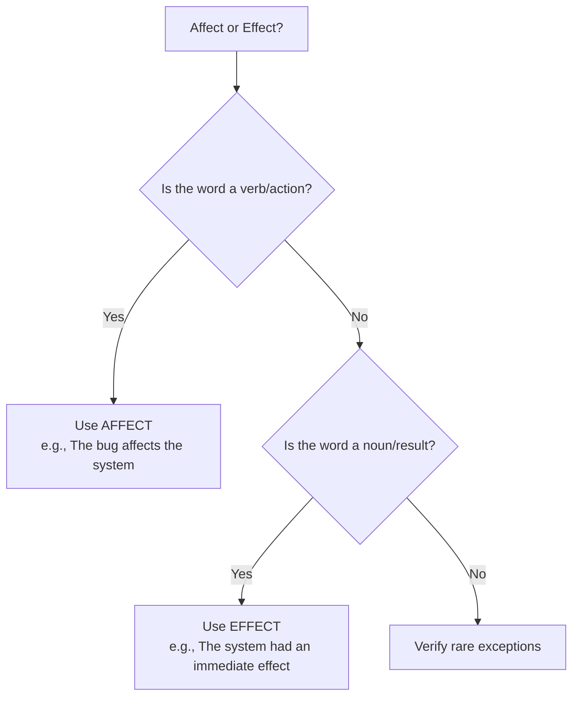
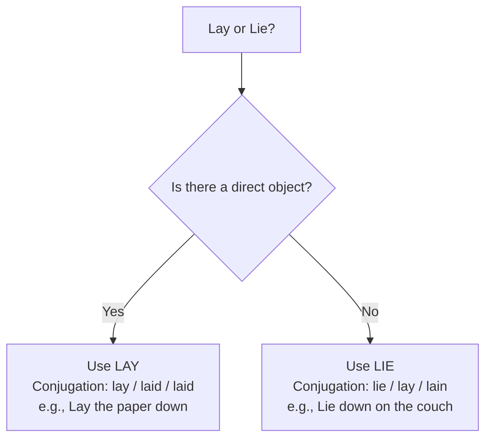

# Vocabulary, Idioms & Confusable Pairs for TCS NQT

This guide provides a comprehensive resource for the vocabulary, idioms, and word usage concepts tested in the TCS NQT Verbal Ability section. It is designed to build high retention and prevent common context-based errors.

---

## 1. 100 High-Frequency TCS NQT Words

The following table lists 100 high-frequency words, their meanings, antonyms, and usage in sentences.

| # | Word | Meaning | Antonym | Example Sentence |
| :--- | :--- | :--- | :--- | :--- |
| 1 | **Abate** | To decrease in force or intensity | Increase / Amplify | The storm began to abate in the morning, letting us travel. |
| 2 | **Aberration** | A departure from what is normal or expected | Conformity / Normality | The system failure was a temporary aberration; it works fine now. |
| 3 | **Abhor** | To regard with disgust and hatred | Adore / Admire | I abhor dishonesty in any professional relationship. |
| 4 | **Acumen** | The ability to make good judgments | Ignorance / Obtuseness | Her business acumen helped the company double its revenue. |
| 5 | **Adulation** | Excessive admiration or praise | Criticism / Derision | The movie star enjoyed the adulation of her fans worldwide. |
| 6 | **Alacrity** | Brisk and cheerful readiness | Reluctance / Apathy | He accepted the job offer from TCS with alacrity. |
| 7 | **Alleviate** | To make suffering less severe | Aggravate / Exacerbate | The medicine helped to alleviate his severe headache. |
| 8 | **Altruistic** | Unselfishly concerned for others | Egoistic / Selfish | Her altruistic nature led her to donate most of her earnings. |
| 9 | **Ameliorate** | To make something bad better | Worsen / Deteriorate | The new infrastructure will ameliorate traffic congestion. |
| 10 | **Anachronism** | Belonging to a different chronological period | Synchronism / Modernity | Using a typewriter today is an absolute anachronism. |
| 11 | **Antagonism** | Active hostility or opposition | Synergy / Friendship | The antagonism between the two competitive teams was clear. |
| 12 | **Apathy** | Lack of interest, enthusiasm, or concern | Passion / Enthusiasm | Student apathy is a major hurdle for online educators. |
| 13 | **Assiduous** | Showing great care and perseverance | Lazy / Negligent | The developers were assiduous in fixing the security flaws. |
| 14 | **Audacious** | Showing willingness to take bold risks | Cowardly / Timid | Starting a new startup in a crowded market is an audacious move. |
| 15 | **Austere** | Severe or strict in manner or appearance | Luxurious / Indulgent | The monk lived an austere life in the remote monastery. |
| 16 | **Banal** | So lacking in originality as to be boring | Original / Innovative | The speaker's presentation was filled with banal remarks. |
| 17 | **Belligerent** | Hostile and aggressive | Peaceful / Amicable | His belligerent attitude got him into trouble at the office. |
| 18 | **Benevolent** | Well-meaning and kindly | Malevolent / Cruel | The benevolent donor funded the entire university library. |
| 19 | **Cacophony** | A harsh, discordant mixture of sounds | Harmony / Euphony | The cacophony of city traffic horns was completely deafening. |
| 20 | **Candor** | The quality of being open and honest | Deceit / Insincerity | I appreciate the candor of your feedback during the review. |
| 21 | **Capricious** | Given to sudden changes of mood or behavior | Stable / Consistent | The weather in the mountains is notoriously capricious. |
| 22 | **Castigate** | To reprimand someone severely | Praise / Commend | The manager castigated the team for missing the final deadline. |
| 23 | **Chicanery** | Use of trickery to achieve a purpose | Honesty / Truthfulness | The politician used chicanery to win the local election. |
| 24 | **Cogent** | Clear, logical, and convincing | Weak / Unconvincing | The attorney presented a cogent argument to the jury. |
| 25 | **Complacent** | Showing smug, uncritical self-satisfaction | Humble / Anxious | We cannot afford to be complacent about server security updates. |
| 26 | **Condone** | To accept and allow behavior that is wrong | Condemn / Punish | The university does not condone cheating under any circumstances. |
| 27 | **Conundrum** | A confusing and difficult problem | Solution / Resolution | Finding a vaccine in record time was a major medical conundrum. |
| 28 | **Copious** | Abundant in supply or quantity | Scarce / Meager | She took copious notes during the system design lecture. |
| 29 | **Corroborate** | To confirm or give support to | Contradict / Refute | The witness corroborated the suspect's alibi with details. |
| 30 | **Credulous** | Having too great a readiness to believe things | Skeptical / Astute | Credulous people are easily fooled by online scams. |
| 31 | **Dearth** | A scarcity or lack of something | Abundance / Surplus | There is a dearth of skilled software developers in the area. |
| 32 | **Deference** | Humble submission and respect | Contempt / Disrespect | He addressed the senior judge with utmost deference. |
| 33 | **Delineate** | To describe or portray something precisely | Confuse / Distort | The blueprint delineates the layout of the server farm. |
| 34 | **Deride** | To express contempt for; ridicule | Respect / Praise | Critics derided the director's latest low-budget film. |
| 35 | **Despot** | A ruler who holds absolute power cruelly | Democrat / Liberator | The country was ruled by a ruthless despot for decades. |
| 36 | **Deterrent** | A thing that discourages action | Incentive / Catalyst | High fines act as a deterrent to speeding on highways. |
| 37 | **Diatribe** | A forceful and bitter verbal attack | Praise / Panegyric | The politician launched into a diatribe against his opponent. |
| 38 | **Didactic** | Intended to teach moral instructions | Uninformative | The fable was highly didactic, teaching kids honesty. |
| 39 | **Diffident** | Modest or shy due to lack of confidence | Confident / Bold | The diffident student sat quietly at the back of the classroom. |
| 40 | **Disparate** | Essentially different; incomparable | Similar / Homogeneous | The system connects disparate database types seamlessly. |
| 41 | **Disseminate** | To spread or disperse widely | Gather / Suppress | The internet allows us to disseminate information instantly. |
| 42 | **Dogmatic** | Laying down principles as absolute truth | Flexible / Skeptical | He is too dogmatic to change his mind on coding practices. |
| 43 | **Duplicity** | Deceitfulness; double-dealing | Honesty / Integrity | The detective exposed the corporate duplicity of the executives. |
| 44 | **Ebullient** | Cheerful and full of energy | Depressed / Lethargic | She was ebullient after receiving the TCS job offer. |
| 45 | **Eclectic** | Deriving style/ideas from a broad range | Narrow / Uniform | The decorator had an eclectic taste in art and furniture. |
| 46 | **Efficacy** | The ability to produce a desired result | Ineffectiveness | The vaccine demonstrated high clinical efficacy in trials. |
| 47 | **Egregious** | Outstandingly bad; shocking | Outstanding / Exemplary | The compiler failed due to an egregious syntax error. |
| 48 | **Elusive** | Difficult to find, catch, or achieve | Accessible / Direct | The definition of true happiness remains elusive to many. |
| 49 | **Embellish** | To make attractive by adding details | Simplify / Strip | The author embellished the story with fictional details. |
| 50 | **Enervate** | To cause to feel drained of energy | Energize / Invigorate | The hot sun began to enervate the marathon runners. |
| 51 | **Engender** | To cause or give rise to a feeling | Prevent / Suppress | Trust engenders collaboration in a cross-functional team. |
| 52 | **Ephemeral** | Lasting for a very short time | Eternal / Permanent | The beauty of cherry blossoms in spring is ephemeral. |
| 53 | **Equivocal** | Open to more than one interpretation | Clear / Unambiguous | The politician gave an equivocal answer to the press. |
| 54 | **Erudite** | Having or showing great learning | Ignorant / Uneducated | The professor gave an erudite lecture on global philosophy. |
| 55 | **Esoteric** | Intended for or understood by only a few | Common / Public | Quantum mechanics is an esoteric subject for many. |
| 56 | **Exacerbate** | To make a problem or situation worse | Ameliorate / Soothe | His rude remarks served only to exacerbate the tension. |
| 57 | **Exexemplary** | Serving as a desirable model; best | Deplorable / Poor | Her performance during the project was exemplary. |
| 58 | **Exonerate** | To absolve someone from blame | Convict / Blame | The DNA evidence served to exonerate the suspect. |
| 59 | **Fastidious** | Very attentive to accuracy and detail | Careless / Sloppy | She is fastidious about maintaining clean and commented code. |
| 60 | **Foment** | To instigate or stir up trouble | Pacify / Quell | The union leaders tried to foment a strike over wages. |
| 61 | **Frugal** | Sparing or economical with money | Extravagant / Wasteful | His frugal lifestyle allowed him to save for retirement early. |
| 62 | **Garrulous** | Excessively talkative on trivial matters | Taciturn / Quiet | The garrulous passenger kept talking throughout the flight. |
| 63 | **Gregarious** | Fond of company; highly sociable | Introverted / Solitary | Dolphins are gregarious animals that live and hunt in pods. |
| 64 | **Guile** | Sly or cunning intelligence | Honesty / Sincerity | The con artist used guile to swindle his victims of cash. |
| 65 | **Hackneyed** | Lacking significance through overuse | Original / Fresh | "Out of the box" has become a hackneyed corporate phrase. |
| 66 | **Harangue** | A lengthy and aggressive speech | Eulogy / Whisper | The boss delivered a long harangue about project delivery. |
| 67 | **Homogeneous** | Of the same kind; alike | Heterogeneous / Diverse | The class was homogeneous in terms of background skill levels. |
| 68 | **Iconoclast** | A person who attacks cherished beliefs | Conformist | Steve Jobs was considered a true iconoclast in computing. |
| 69 | **Immutable** | Unchanging over time; unalterable | Mutable / Flexible | The laws of physics are immutable throughout the universe. |
| 70 | **Impede** | To delay or prevent by obstruction | Assist / Facilitate | The heavy snowstorm will impede our travel journey. |
| 71 | **Implacable** | Unable to be appeased or placated | Merciful / Appeasable | The enemy remained implacable despite peace negotiations. |
| 72 | **Inchoate** | Just begun; not fully formed | Mature / Complete | The startup's plans are still in an inchoate stage. |
| 73 | **Indolent** | Wanting to avoid exertion; lazy | Diligent / Active | The indolent student failed to submit the final homework. |
| 74 | **Inimical** | Tending to obstruct or harm | Friendly / Beneficial | High interest rates are inimical to small business growth. |
| 75 | **Innocuous** | Not harmful or offensive | Harmful / Toxic | The snake's bite was painful but ultimately innocuous. |
| 76 | **Inscrutable** | Impossible to understand or interpret | Clear / Comprehensible | The system's binary logs were completely inscrutable. |
| 77 | **Insipid** | Lacking flavor or vigor; boring | Flavorful / Exciting | The tea tasted weak and insipid without sugar. |
| 78 | **Intractable** | Hard to control or deal with | Manageable / Compliant | The memory leak proved to be an intractable bug. |
| 79 | **Intrepid** | Fearless and adventurous | Cowardly / Timid | The intrepid explorer ventured into the uncharted forest. |
| 80 | **Inundate** | To overwhelm with things to deal with | Drain / Starve | Customers inundated the help desk with ticket queries. |
| 81 | **Juxtapose** | To place close together for contrast | Separate / Disconnect | The exhibition juxtaposed modern and classical art pieces. |
| 82 | **Laconic** | Using very few words | Verbose / Wordy | His laconic reply to the invitation was simply "No". |
| 83 | **Loquacious** | Tending to talk a great deal | Silent / Taciturn | The loquacious host kept the dinner guests entertained. |
| 84 | **Lucid** | Expressed clearly; easy to follow | Ambiguous / Obscure | The documentation was lucid and easy to read. |
| 85 | **Magnanimous** | Generous or forgiving to a rival | Malevolent / Mean | The winner was magnanimous in victory, praising his opponent. |
| 86 | **Malevolent** | Having or showing a wish to do evil | Benevolent / Kind | The malevolent hacker cast a malicious virus onto the grid. |
| 87 | **Meticulous** | Showing great attention to detail | Careless / Sloppy | She did a meticulous job auditing the financial records. |
| 88 | **Mitigate** | To make less severe or serious | Aggravate / Exacerbate | Planting grass helps to mitigate soil erosion. |
| 89 | **Morose** | Sullen and ill-tempered | Cheerful / Jovial | He became morose after losing his final match. |
| 90 | **Nefarious** | Wicked, impious, or criminal | Noble / Righteous | The hacker carried out a nefarious bank transaction scheme. |
| 91 | **Obdurate** | Stubbornly refusing to change opinion | Compliant / Flexible | The company board remained obdurate during union talks. |
| 92 | **Obfuscate** | To render obscure or unintelligible | Clarify / Elucidate | The technical jargon served to obfuscate the core issues. |
| 93 | **Obsequious** | Obedient or attentive to a servile degree | Assertive | The obsequious assistant agreed with everything she said. |
| 94 | **Onerous** | Involving oppressively burdensome effort | Easy / Light | The tax declaration filing has become onerous. |
| 95 | **Ostentatious** | Pretentious and vulgar display | Modest / Restrained | He wore an ostentatious watch to show off his wealth. |
| 96 | **Paragon** | A model of excellence or perfection | Flawed / Failure | She is considered a true paragon of professional virtue. |
| 97 | **Parsimony** | Extreme unwillingness to spend money | Extravagance | The business owner's parsimony saved the company. |
| 98 | **Pedantic** | Excessively concerned with minor details | Unconcerned | The editor was pedantic about punctuation conventions. |
| 99 | **Penury** | Extreme poverty; destitution | Wealth / Affluence | The family was reduced to penury after the bank crash. |
| 100 | **Perfunctory** | Action done with minimum effort | Thorough / Diligent | He gave the code a perfunctory review before merging. |

---

## 2. 20 Most-Tested Idioms & Phrases

Idioms must be understood conceptually, as their literal meanings do not align with their figurative usage.

1.  **Bite the bullet**: Face a difficult situation with courage and stoicism.
    *   *Usage:* I had to bite the bullet and inform the director that we had lost the database servers.
2.  **Break a leg**: A theatrical idiom meaning "good luck" (wished to performers).
    *   *Usage:* You have prepared well for your TCS NQT interview; go out there and break a leg!
3.  **Burn the midnight oil**: To work or study late into the night.
    *   *Usage:* He burned the midnight oil for three weeks to clear the advanced coding round.
4.  **Call it a day**: Stop working on a task or project for the rest of the day.
    *   *Usage:* We have resolved the major memory leak, so let's call it a day and resume tomorrow.
5.  **Cry over spilled milk**: To express regret about something that has already happened and cannot be undone.
    *   *Usage:* We lost some records during the migration, but there is no use crying over spilled milk; let's rebuild.
6.  **Cut corners**: Do something in the easiest, cheapest, or fastest way, often compromising quality.
    *   *Usage:* Never cut corners when designing security algorithms; it compromises user safety.
7.  **Devil's advocate**: To argue against an idea or plan for the sake of exploring all angles and risks.
    *   *Usage:* Allow me to play devil's advocate: what happens if our backup servers fail simultaneously?
8.  **Hit the nail on the head**: To describe exactly what is causing a situation or state.
    *   *Usage:* The analyst hit the nail on the head when he blamed the performance drop on network congestion.
9.  **In the loop**: Fully informed and kept up to date about project developments.
    *   *Usage:* Please keep the tech lead in the loop regarding the client database requirements.
10. **Let the cat out of the bag**: To reveal a secret or confidential plan, often accidentally.
    *   *Usage:* The intern let the cat out of the bag about the upcoming office relocation plans.
11. **Miss the boat**: To lose an opportunity by being slow to act.
    *   *Usage:* If you do not register for the TCS NQT by Monday, you will miss the boat.
12. **On the ball**: Extremely alert, competent, and quick to respond to developments.
    *   *Usage:* Our QA testers are on the ball; they caught three major errors before deployment.
13. **Once in a blue moon**: An action that occurs very rarely.
    *   *Usage:* We modify this legacy assembly code once in a blue moon.
14. **Pull someone's leg**: To play a good-natured joke or tease someone.
    *   *Usage:* Relax, the team lead was just pulling your leg when he said we had to work on Sunday.
15. **Spill the beans**: To reveal secret or confidential information intentionally.
    *   *Usage:* The product manager accidentally spilled the beans about the new AI features during the press conference.
16. **Take it with a grain of salt**: To listen to a statement with skepticism and not accept it as absolute truth.
    *   *Usage:* Take the developer's timeline estimates with a grain of salt; he is often overly optimistic.
17. **The elephant in the room**: A major, obvious problem or controversial issue that everyone avoids discussing.
    *   *Usage:* The ongoing server lag was the elephant in the room that no one mentioned during the scrum.
18. **The last straw**: The final minor irritation or setback that makes a situation completely intolerable.
    *   *Usage:* The latest compilation crash was the last straw; we decided to rewrite the entire class.
19. **Through the grapevine**: Hearing information or news through informal rumor and gossip channels.
    *   *Usage:* I heard through the grapevine that the management is planning a performance bonus.
20. **Under the weather**: Feeling slightly ill or indisposed.
    *   *Usage:* She decided to work from home today because she was feeling under the weather.

---

## 3. Confusable Pairs Reference Table (15 Key Pairs)

Use the following sorting systems and memory tricks to distinguish between similar-sounding words.

### Word Confusion Resolvers (Flowcharts)

---

### Detailed Confusable Pairs

| Word A | Definition & Example | Word B | Definition & Example | Memory Trick / Solver |
| :--- | :--- | :--- | :--- | :--- |
| **Affect** | *(verb)* To influence or cause a change in something. • *Example:* The latency will **affect** the user experience. | **Effect** | *(noun)* The result or outcome of an influence. • *Example:* The migration had a positive **effect** on response times. | **RAVEN:** **R**emember: **A**ffect = **V**erb, **E**ffect = **N**oun. |
| **Then** | *(adverb)* At that time; next in order or sequence. • *Example:* Parse the logs, **then** write the output. | **Than** | *(conjunction)* Used to introduce a comparison. • *Example:* C++ compiles faster **than** Python. | **Th**e**n** is linked to tim**e** (both have 'e'). Th**a**n is linked to comp**a**rison (both have 'a'). |
| **Lay** | *(verb)* To place or put something down. **Requires a direct object**. • *Example:* Please **lay** the prototype on my desk. | **Lie** | *(verb)* To recline or stay in a horizontal position. **No direct object**. • *Example:* I need to **lie** down after coding. | You **lay** an **o**bject (both have 'o'). You **lie** down yourself (no object). |
| **Advice** | *(noun)* Recommendations or guidance offered. • *Example:* He followed the mentor's **advice**. | **Advise** | *(verb)* To offer suggestions or counsel. • *Example:* We **advise** developers to write unit tests. | Advi**c**e is a noun (like the word 'devi**c**e'). Advi**s**e is a verb (like the word 'revi**s**e'). |
| **Complement** | *(verb/noun)* Something that completes or fits perfectly with another. • *Example:* This class **complements** our framework. | **Compliment** | *(verb/noun)* An expression of praise or admiration. • *Example:* The lead paid him a **compliment**. | Compl**e**ment compl**e**tes (both have 'e'). Compl**i**ment is given by **I** (both have 'i'). |
| **Loose** | *(adjective)* Not firmly fixed in place; slack. • *Example:* The server rack mount is **loose**. | **Lose** | *(verb)* To misplace or be deprived of something. • *Example:* Don't **lose** your encryption keys. | L**oo**se has two 'o's and is roomy/slack. L**o**se has one 'o' and has lost the other. |
| **Principal** | *(noun/adj)* Head of an organization; most important. • *Example:* The **principal** reason was memory depletion. | **Principle** | *(noun)* A fundamental truth, rule, or moral law. • *Example:* Follow the **principles** of dry coding. | The school princi**pal** is your **pal**. A princi**ple** is a ru**le** (both end in 'le'). |
| **Stationary** | *(adjective)* Standing still; not moving. • *Example:* The automated rover is **stationary**. | **Stationery** | *(noun)* Writing materials like pens and paper. • *Example:* The store supplied custom **stationery**. | Station**er**y contains 'er' (like pap**er** and **e**nvelopes). Station**ar**y contains 'ar' (like st**a**nding). |
| **Accept** | *(verb)* To consent to receive or undertake. • *Example:* She decided to **accept** the job offer. | **Except** | *(preposition)* Excluding; not including. • *Example:* All tests passed **except** the compiler test. | **Ex**cept means **ex**cluding (both start with 'ex'). |
| **Elicit** | *(verb)* To draw out or evoke a reaction or response. • *Example:* The query will **elicit** the database configuration. | **Illicit** | *(adjective)* Forbidden by law, rules, or custom. • *Example:* The firewall blocked **illicit** requests. | **Il**licit means **il**legal (both start with 'il'). **E**licit means to **e**xtract (both start with 'e'). |
| **Eminent** | *(adjective)* Famous, respected, or prominent. • *Example:* An **eminent** engineer led the architecture team. | **Imminent** | *(adjective)* About to happen very soon. • *Example:* A compiler crash is **imminent**. | **Im**minent means happening **im**mediately (both start with 'im'). |
| **Ensure** | *(verb)* To make sure or guarantee that a condition is met. • *Example:* **Ensure** that all unit tests pass. | **Assure** | *(verb)* To state positively to remove doubt (takes a person as object). • *Example:* I **assure** you the code is clean. | You **a**ssure **a** person (both start with 'a'). You **e**nsure an **e**vent or outcome (both start with 'e'). |
| **Allude** | *(verb)* To refer to indirectly or hint at. • *Example:* He **alluded** to the legacy bug in his comments. | **Elude** | *(verb)* To escape or evade detection or capture. • *Example:* The root cause **eludes** the developers. | **E**lude means to **e**scape (both start with 'e'). |
| **Complacent** | *(adjective)* Smug, uncritical, or self-satisfied. • *Example:* Do not be **complacent** with passing test cases. | **Complaisant** | *(adjective)* Eager to please others; obliging. • *Example:* A **complaisant** assistant followed all orders. | Compla**is**ant has an 's' representing **s**ervile or **s**ubmissive. |
| **Discrete** | *(adjective)* Individually separate and distinct. • *Example:* The program is split into **discrete** steps. | **Discreet** | *(adjective)* Careful, cautious, or keeping secrets. • *Example:* The manager made a **discreet** inquiry. | Disc**e**r**e**te has 'e's separated by 'r' (discrete). Discr**ee**t keeps its 'e's together secretly (discreet). |
