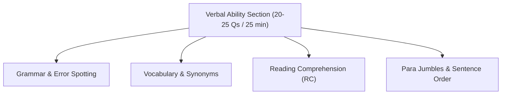
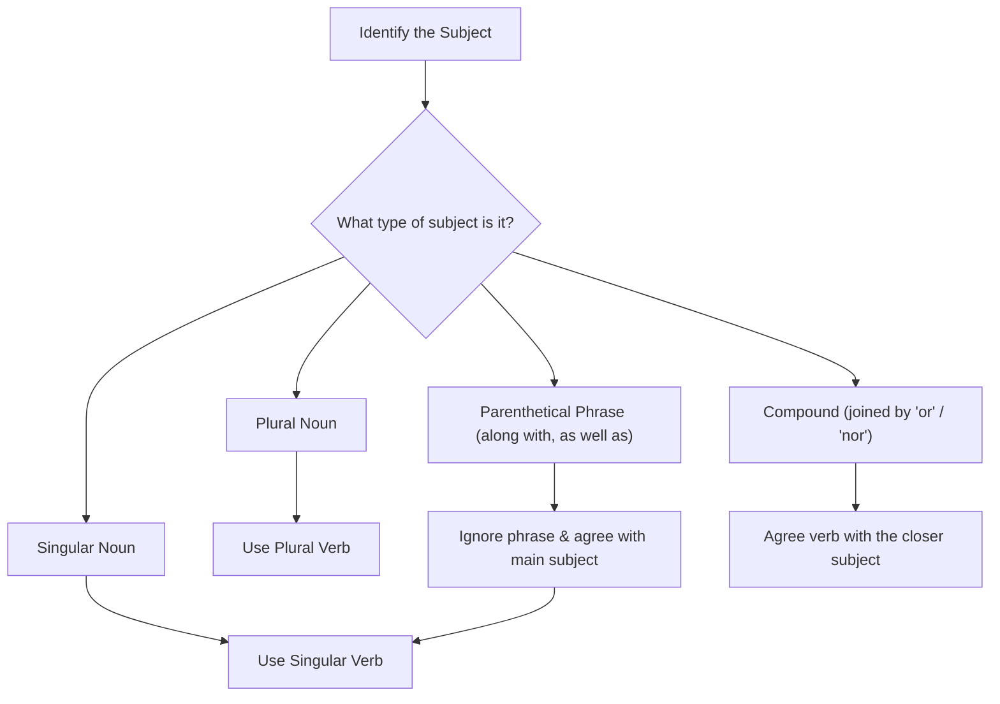
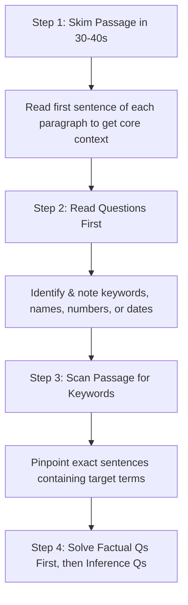

# 02 — Verbal Ability (Foundation Section)

This module covers the core concepts, grammar rules, high-frequency vocabulary, and solving strategies for the Verbal Ability section of the TCS NQT (Foundation Tier).

---

## 📊 Exam Section Overview

The Verbal Ability section typically consists of **20–25 questions** to be solved in **25 minutes** (approximately 60–75 seconds per question).

---

## A. Grammar Rules + Tricks

### 1. Subject-Verb Agreement

A singular subject requires a singular verb, and a plural subject requires a plural verb. 

#### ⚡ Proximity & Parenthetical Phrases Trick
*   **Rule:** Words between the subject and verb (such as *along with, together with, as well as, accompanied by, in addition to*) do not change the number of the subject.
*   **Worked Example:** 
    *   *Incorrect:* The manager, along with his team, are attending the meeting.
    *   *Correct:* The manager, along with his team, **is** attending the meeting. (The subject is singular: "The manager").
*   **Rule (Or/Nor):** When two subjects are joined by *or, nor, either... or, neither... nor*, the verb agrees with the subject closest to it.
    *   *Worked Example:* Neither the manager nor the employees **are** present. (Verb agrees with plural "employees").

---

### 2. Tenses

Tenses must reflect the time of the action and coordinate correctly within the sentence.

#### ⚡ Tense Error-Spotting Trick
*   **Rule:** When a sentence indicates a duration of time (using *since* or *for*), you must use the **Present Perfect** or **Present Perfect Continuous** tense, not the simple past or simple present.
*   **Worked Example:**
    *   *Incorrect:* He works here since 2018.
    *   *Correct:* He **has been working** here since 2018.

---

### 3. Articles (a/an/the)

Articles are selected based on the pronunciation sound of the following word, not spelling.

#### ⚡ Consonant vs. Vowel Sound Trick
*   **Rule:** Use `an` before words beginning with a vowel *sound*, and `a` before words beginning with a consonant *sound*.
*   **Worked Examples:**
    *   *An hour* (Silent 'h' $\rightarrow$ Vowel sound "/aʊər/").
    *   *A university* (Consonant sound "/jʊːnɪvɜːsɪti/" starting with 'y').
*   **Rule (The):** Use `the` before superlatives (e.g., *the best*), unique objects (e.g., *the sun*), and ordinals (e.g., *the first*).

---

### 4. Preposition Pairings

Certain verbs and adjectives are bound to specific prepositions. Memory recall of these pairs is critical for fill-in-the-blanks.

| Incorrect Pairing | Correct Pairing | Worked Example |
| :--- | :--- | :--- |
| Married with | **Married to** | *She is married to a doctor.* |
| Depend of | **Depend on** | *We depend on your help.* |
| Different than | **Different from** | *His style is different from mine.* |
| Angry at (a person) | **Angry with** (a person) | *She was angry with him.* |
| Angry with (a situation) | **Angry at** (a situation) | *He was angry at the delay.* |

---

### 5. Common Error-Spotting Traps

*   **Countable vs. Uncountable (Fewer vs. Less):** Use *fewer* for items you can count (e.g., *fewer mistakes*). Use *less* for singular mass/uncountable nouns (e.g., *less time*).
*   **Double Negatives:** Avoid combining two negative words in one clause.
    *   *Incorrect:* I don't have no money.
    *   *Correct:* I don't have any money.

---

### 6. Para Jumbles — Quick Strategy

1.  **Identify the Opening Sentence:** Look for a sentence that introduces the topic or subject independently. It should not start with pronouns referencing prior text (e.g., *he, she, they, this, these*) or transition words (e.g., *however, therefore, consequently*).
2.  **Locate Mandatory Pairs:** Look for logical connections. If sentence A mentions "a new technology" and sentence B says "this technology," then A must precede B.
3.  **Use Chronological or Cause-Effect Links:** Match actions in time order, or chain cause-and-effect clauses.
4.  **Eliminate Options:** Use the options to verify order. If an option places a transition sentence first, eliminate it.

---

## B. Vocabulary — High-Frequency Words

Many TCS vocabulary MCQs present the word in context. Guess the tone of the sentence (positive or negative) to eliminate choices.

| Word | Meaning | Synonym | Antonym | Worked Context Example |
| :--- | :--- | :--- | :--- | :--- |
| **Ephemeral** | Short-lived | Transient | Permanent | *The joy of winning was ephemeral, lasting only a night.* |
| **Candid** | Honest and frank | Forthright | Deceptive | *She gave a candid assessment of the project's failures.* |
| **Meticulous** | Very careful, precise | Fastidious | Careless | *He was meticulous about keeping his code clean.* |
| **Ambiguous** | Open to multiple meanings | Vague | Clear | *The requirements document was ambiguous.* |
| **Benevolent** | Well-meaning and kindly | Generous | Malevolent | *The benevolent donor funded the new library.* |
| **Resilient** | Able to recover quickly | Tough | Fragile | *The economy proved resilient in the face of crisis.* |
| **Frugal** | Spare and economical | Thrifty | Extravagant | *Living a frugal life allowed them to save money.* |
| **Pragmatic** | Dealing with things practically | Sensible | Idealistic | *We need a pragmatic solution to this layout bug.* |
| **Eloquent** | Fluent or persuasive speaking | Articulate | Inarticulate | *She gave an eloquent speech on child education.* |
| **Obsolete** | No longer produced or used | Archaic | Modern | *Floppy disks became obsolete in the late 90s.* |
| **Verbose** | Using more words than needed | Wordy | Concise | *The verbose report could be cut down to one page.* |
| **Austere** | Strict, plain, or unadorned | Severe | Luxurious | *Monks live an austere life in the mountains.* |
| **Diligent** | Showing care in one's work | Industrious | Lazy | *Diligent students always review their errors.* |
| **Lucid** | Easy to understand, clear | Transparent | Confusing | *Her explanation of the KMP algorithm was lucid.* |
| **Tenacious** | Clinging or adhering closely | Determined | Yielding | *The defense attorney was tenacious in court.* |

---

## C. Solved MCQs (NQT Format)

---

### Q1. Sentence Correction
Choose the grammatically correct sentence.
(a) Each of the students have submitted their assignment.
(b) Each of the students has submitted his/her assignment.
(c) Each of the student has submit assignment.
(d) Each of students has submitted assignment.

*   **Pattern ID:** `VA-SVA-02` (Subject-Verb Agreement with distributive pronouns)
*   **Hint:** The distributive pronoun "Each" is singular and requires singular verbs and singular possessive pronouns.
*   **Approach:** 
    *   Find the verb following "Each of the students". Since "Each" is the subject, the verb must be singular ("has", not "have"). Eliminate (a).
    *   "Each of" must be followed by a plural noun ("students", not "student") and singular pronouns ("his/her", not "their"). Eliminate (c) and (d).
*   **Solution:** **(b)** — "Each" acts as a singular distributive pronoun. The plural prepositional phrase "of the students" does not alter the singular nature of the subject. Thus, the singular verb "has" and possessive pronoun "his/her" are correct.
*   **Shortcut:** $\text{Each / Every / Neither / Either} \implies \text{Singular Verb + Singular Pronoun}$.
*   **Variation & Trap:** Do not be confused by the plural noun "students" immediately preceding the verb. The subject is "Each", not "students".

---

### Q2. Fill in the Blank
Fill in the blank: She has been working here _______ 2018.
(a) for
(b) since
(c) from
(d) during

*   **Pattern ID:** `VA-PREP-01` (Time Prepositions with Perfect Tense)
*   **Hint:** Decide whether 2018 is a specific point in time or a length of duration.
*   **Approach:** 
    *   Use "since" for a specific starting point in time.
    *   Use "for" for a duration of time (e.g., *for 5 years*).
*   **Solution:** **(b) since** — 2018 is a specific year (a point in time).
*   **Shortcut:** 
    *   $\text{Point in Time (e.g. Monday, 2018, 5 PM)} \implies \text{since}$
    *   $\text{Duration of Time (e.g. 5 hours, 3 years)} \implies \text{for}$
*   **Variation & Trap:** Choosing "from" is a common trap. While "from" denotes a starting point, it is not used with the Present Perfect Continuous tense unless paired with "to" or "until".

---

### Q3. Spotting Errors
Identify the error in the sentence: "Neither of the two answers were correct."
(a) Neither of
(b) the two answers
(c) were
(d) correct

*   **Pattern ID:** `VA-SVA-03` (Neither/Either Agreement)
*   **Hint:** The word "Neither" refers to "not one nor the other of two" and is treated as singular.
*   **Approach:** Locate the verb "were". Determine if it matches the singular subject "Neither".
*   **Solution:** **(c) were** — The plural verb "were" should be replaced by the singular verb "was" because the subject "Neither" is singular.
*   **Shortcut:** $\text{Neither of [Plural Noun]} \implies \text{Singular Verb}$.
*   **Variation & Trap:** Writers often use "were" because of the plural noun "answers" that sits right next to the verb.

---

### Q4. Synonym Selection
Choose the synonym of "Meticulous":
(a) Careless
(b) Precise
(c) Quick
(d) Lazy

*   **Pattern ID:** `VA-VOC-01` (Direct Synonym)
*   **Hint:** "Meticulous" means showing great attention to detail.
*   **Approach:** Eliminate negative options. "Careless" and "Lazy" are negative, whereas "Meticulous" has a positive connotation.
*   **Solution:** **(b) Precise** — Meticulous actions are done with extreme accuracy and precision.
*   **Shortcut:** Tone analysis. "Meticulous" ($+$) matches "Precise" ($+$).

---

### Q5. Antonym Selection
Choose the antonym of "Benevolent":
(a) Kind
(b) Generous
(c) Malevolent
(d) Honest

*   **Pattern ID:** `VA-VOC-02` (Direct Antonym)
*   **Hint:** The prefix "Bene-" means good/well. The prefix "Male-" means bad/evil.
*   **Approach:** Since "Benevolent" has a positive prefix, its antonym must have a negative prefix or connotation.
*   **Solution:** **(c) Malevolent** — "Malevolent" means wishing evil or harm to others, which is the direct opposite of "Benevolent".
*   **Shortcut:** Look at the prefixes: $\text{Bene- (Good)} \leftrightarrow \text{Male- (Bad)}$.

---

### Q6. Basic Sentence Verification
Identify the grammatically correct sentence:
(a) He don't like coffee.
(b) He doesn't likes coffee.
(c) He doesn't like coffee.
(d) He not like coffee.

*   **Pattern ID:** `VA-TENSE-01` (Negative Third-Person Singular Present)
*   **Hint:** "He" is a third-person singular subject. It requires the auxiliary verb "does", not "do".
*   **Approach:**
    *   Eliminate (a) because "don't" is used for plural subjects or first/second person.
    *   Eliminate (b) because the main verb following "does/doesn't" must be in the base form ("like", not "likes").
*   **Solution:** **(c)** — "He" (singular) matches "does not". The main verb "like" is in the base form.
*   **Trap:** Doubling the singular "s" (using "doesn't likes") is a frequent grammatical slip.

---

### Q7. Subject-Verb Agreement with Collective Nouns
Fill in the blank: The committee _______ divided in their opinion.
(a) is
(b) are
(c) was
(d) has

*   **Pattern ID:** `VA-SVA-04` (Collective Noun Agreement)
*   **Hint:** Pay attention to the possessive pronoun "their" at the end of the sentence.
*   **Approach:** A collective noun (like *committee, team, audience*) takes a singular verb if acting as a single unit, but a plural verb if the members are acting individually. The word "divided" and the pronoun "their" indicate individual action.
*   **Solution:** **(b) are** — Because the committee members are "divided in their opinion," they are acting as individuals, requiring a plural verb.
*   **Shortcut:** $\text{Collective Noun + Individual Action (divided, different, their)} \implies \text{Plural Verb}$.
*   **Variation & Trap:** If the sentence was "The committee **is** unanimous in its decision," the singular verb "is" would be correct because the collective noun acts as a single, unified entity.

---

### Q8. Para Jumbles
Arrange the sentences in the correct order:
*   **P:** This led to widespread adoption of renewable energy.
*   **Q:** Climate change has become a pressing global issue.
*   **R:** Governments worldwide began investing heavily in solar and wind power.
*   **S:** As a result, scientists urged immediate action.

(a) Q-P-R-S
(b) Q-S-R-P
(c) R-P-Q-S
(d) S-Q-R-P

*   **Pattern ID:** `VA-PJ-01` (Cause-and-Effect Ordering)
*   **Hint:** Sentence P starts with "This led to...", which must refer to a direct action mentioned in a previous sentence.
*   **Approach:**
    *   Find the opening sentence. Q introduces the overarching topic ("Climate change") without pronouns or transitions.
    *   Connect Q to its immediate effect: scientists reacting. S starts with "As a result, scientists...", linking Q $\rightarrow$ S.
    *   Identify the next logical step: governments investing (R) as a response to scientists.
    *   P ("This led to...") links back to the investments in R.
*   **Solution:** **(b) Q-S-R-P**
*   **Shortcut:** Eliminate options starting with transition words like "This" (P) or "As a result" (S) as the opening sentence.

---

### Q9. One-word Substitution
Find the single word for: "A person who knows many languages."
(a) Polyglot
(b) Philanthropist
(c) Omniscient
(d) Optimist

*   **Pattern ID:** `VA-SUB-01` (Language Roots)
*   **Hint:** The prefix "Poly-" means many. "Glot" comes from the Greek word for tongue or language.
*   **Approach:** Identify root meanings: "Phil-" (love), "Omni-" (all).
*   **Solution:** **(a) Polyglot**
*   **Shortcut:** $\text{Poly- (Many) + Glot (Languages)} \implies \text{Polyglot}$.

---

### Q10. Spelling Check
Choose the correctly spelled word:
(a) Recieve
(b) Receive
(c) Receeve
(d) Receve

*   **Pattern ID:** `VA-SP-01` (I-E Spelling Rules)
*   **Hint:** Recall the spelling rule: "I before E except after C".
*   **Approach:** Check the letter preceding the vowel pair. It is 'c'. Therefore, 'e' must come before 'i'.
*   **Solution:** **(b) Receive**
*   **Shortcut:** $\text{C + e + i} \implies \text{Receive}$.

---

### Q11. Conditional Sentences
Identify the error in the sentence: "If I would have known, I would have come."
(a) If I
(b) would have known
(c) I would have
(d) come

*   **Pattern ID:** `VA-COND-01` (Third Conditional Structure)
*   **Hint:** In a conditional clause introducing a hypothetical past, do not use "would have" in the "if" clause.
*   **Approach:**
    *   Check conditional structures:
        *   Type 3: $\text{If + Past Perfect (had + V3), would have + Past Participle (V3)}$.
*   **Solution:** **(b) would have known** — Replace "would have known" with "had known". The correct sentence is: "If I **had** known, I would have come."
*   **Trap:** Avoid doubling "would have" in both clauses of a conditional statement.

---

### Q12. Antonym Selection
Choose the word opposite in meaning to "Verbose":
(a) Talkative
(b) Concise
(c) Lengthy
(d) Detailed

*   **Pattern ID:** `VA-VOC-03` (Conciseness Vocabulary)
*   **Hint:** "Verbose" means using an excessive number of words.
*   **Approach:** Eliminate synonyms like "Lengthy" and "Detailed". Pick the word that implies briefness.
*   **Solution:** **(b) Concise** — "Concise" means giving a lot of information clearly and in few words.
*   **Shortcut:** $\text{Verbose (Wordy) } \leftrightarrow \text{ Concise (Brief)}$.

---

### Q13. Reading Comprehension Tone Identification
When asked: "The author's tone in the passage is best described as...", what is the quickest way to find the answer?
(a) Re-read the entire passage slowly.
(b) Read only the first and last paragraph.
(c) Scan for adjectives and adverbs that express value judgments.
(d) Focus on nouns and dates.

*   **Pattern ID:** `VA-RC-01` (Tone Detection Strategy)
*   **Hint:** Tone is revealed through the author's choice of descriptors, not factual names or dates.
*   **Approach:** Look for subjective words like *unfortunately, remarkably, alarmingly, or successfully*.
*   **Solution:** **(c)** — Adjectives and adverbs express the author's feelings toward the subject matter, showing if the tone is critical, optimistic, objective, or concerned.

---

### Q14. Fill in the Blank (Prepositions)
Fill in the blanks: He is good _______ mathematics but weak _______ English.
(a) in, at
(b) at, in
(c) with, for
(d) on, by

*   **Pattern ID:** `VA-PREP-02` (Adjective-Preposition Collocation)
*   **Hint:** Test the phrases "good at/in" and "weak at/in" in standard usage.
*   **Approach:**
    *   The correct phrase for skill proficiency is "good at".
    *   The correct phrase for subject weakness is "weak in".
*   **Solution:** **(b) at, in** — "He is good **at** mathematics but weak **in** English."

---

### Q15. Voice Conversion
Choose the correct passive voice of: "She is writing a letter."
(a) A letter is written by her.
(b) A letter was being written by her.
(c) A letter is being written by her.
(d) A letter has been written by her.

*   **Pattern ID:** `VA-VOICE-01` (Continuous Tense Passive Voice)
*   **Hint:** The active sentence is in the Present Continuous tense ("is writing"). The passive form must retain this continuous aspect using "being".
*   **Approach:**
    *   Formula for Present Continuous Passive: $\text{Subject + is/am/are + being + V3 (past participle)}$.
*   **Solution:** **(c) A letter is being written by her.**
*   **Trap:** Do not change the tense from present continuous to past continuous ("was being written") or simple present ("is written").

---

## D. Reading Comprehension — 4-Step Method

To maximize efficiency on the TCS NQT platform, use this systematic scanning process instead of reading the entire passage word-for-word:

### Critical RC Traps to Avoid

1.  **The Absolute Trap:** Options containing absolute qualifiers like *always, never, all, none, must* are almost always incorrect. Authors rarely make absolute statements without qualification.
2.  **External Knowledge Trap:** Do not select an option based on real-world facts if the passage does not mention or support it. The answer must be derived solely from the text.
3.  **The Partial Truth Trap:** An option may contain correct statements from the passage but fail to answer the specific question asked. Always cross-reference the option against the question prompt.
