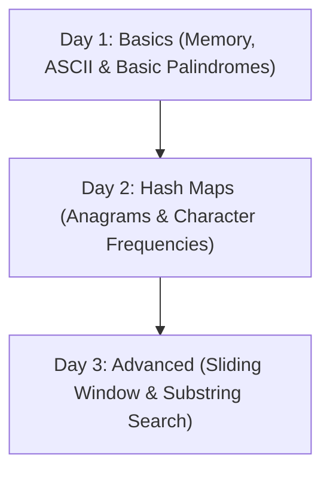

# Additional Resources: Strings

A curated list of external practice problems, tutorial links, and related repository files to help you master string manipulation.

---

## 🗺️ Practice Problem Pattern Map

Use this chart to match specific NQT problem types with online practice links.

| Pattern | Target Problem | Difficulty | Platforms |
| :--- | :--- | :--- | :--- |
| **Two-Pointer Check** | Valid Palindrome | Easy | [LeetCode](https://leetcode.com/problems/valid-palindrome/) \| [GFG](https://www.geeksforgeeks.org/problems/write-a-program-to-reverse-an-array-or-string/0) |
| **Anagram Map** | Valid Anagram | Easy | [LeetCode](https://leetcode.com/problems/valid-anagram/) \| [GFG](https://www.geeksforgeeks.org/problems/anagram-1587115620/1) |
| **Sliding Window** | Longest Substring Without Duplicates | Medium | [LeetCode](https://leetcode.com/problems/longest-substring-without-repeating-characters/) \| [GFG](https://www.geeksforgeeks.org/problems/length-of-the-longest-substring3036/1) |
| **String Conversion** | String to Integer (atoi) | Medium | [LeetCode](https://leetcode.com/problems/string-to-integer-atoi/) \| [GFG](https://www.geeksforgeeks.org/problems/implement-atoi/1) |
| **Advanced Search** | Implement strStr() (KMP Algorithm) | Medium | [LeetCode](https://leetcode.com/problems/find-the-index-of-the-first-occurrence-in-a-string/) \| [GFG](https://www.geeksforgeeks.org/problems/search-pattern-kmp-algorithm-1587115621/1) |

---

## 📂 Related Repository Modules

Build cross-topic connections. These related repository links help you study concepts that overlap with string questions:

1. **[Coding: Arrays](file:///d:/Temp/TCS-NQT/05_Coding/01_Arrays/01_Theory.md)**
   - Many string techniques (like sliding window and frequency sorting) use array backends.
2. **[Numerical: Number System](file:///d:/Temp/TCS-NQT/01_Numerical_Ability/01_Number_System/00_README.md)**
   - Useful for understanding modular arithmetic needed in Rabin-Karp rolling hashes.
3. **[Numerical: Percentage](file:///d:/Temp/TCS-NQT/01_Numerical_Ability/02_Percentage/00_README.md)**
   - Helps with coding problems that ask you to parse percentage data from strings.

---

## 📖 Recommended Study Schedule

A structured study plan to go from zero to proficient in strings in 3 days:

### Day 1: Basics
- Study [01_Theory.md](file:///d:/Temp/TCS-NQT/05_Coding/02_Strings/01_Theory.md) and [02_Visualization.md](file:///d:/Temp/TCS-NQT/05_Coding/02_Strings/02_Visualization.md).
- Complete 3 easy palindrome practice questions from [04_Easy_Problems.md](file:///d:/Temp/TCS-NQT/05_Coding/02_Strings/04_Easy_Problems.md).

### Day 2: Frequency Tables
- Read [03_Patterns.md](file:///d:/Temp/TCS-NQT/05_Coding/02_Strings/03_Patterns.md) on standard hash map array setup.
- Complete anagram questions in [05_Medium_Problems.md](file:///d:/Temp/TCS-NQT/05_Coding/02_Strings/05_Medium_Problems.md).

### Day 3: Advanced
- Work through the KMP and Rabin-Karp derivations in [20_Interview_Questions.md](file:///d:/Temp/TCS-NQT/05_Coding/02_Strings/20_Interview_Questions.md).
- Attempt the hard sliding window challenges in [06_Hard_Problems.md](file:///d:/Temp/TCS-NQT/05_Coding/02_Strings/06_Hard_Problems.md).
