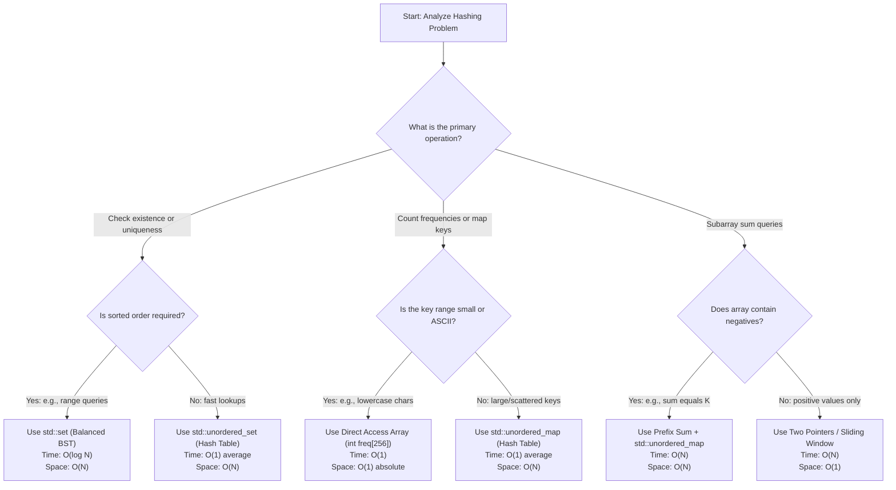

# Hashing Techniques - Visual Guide & Models

Use this visual guide to map out solutions for Hashing-related coding problems under TCS NQT constraints.

## 1. Decision Tree: Choosing the Right Hashing Container

This flowchart directs you to the optimal data structure based on the specific constraints and queries of the problem.



---

## 2. Comparison Table: Hashing Containers

Evaluating the primary containers available in C++17 for hashing problems:

| Container | Underlying Structure | Time Complexity (Avg / Worst) | Space Complexity | Best Used For |
| :--- | :--- | :---: | :---: | :--- |
| **`std::unordered_map<K, V>`** | Hash Table (Chaining) | $O(1)$ / $O(N)$ | $O(N)$ | General frequency counting, index mapping with dynamic keys. |
| **`std::unordered_set<K>`** | Hash Table (Chaining) | $O(1)$ / $O(N)$ | $O(N)$ | Uniqueness checks, tracking visited elements. |
| **`std::map<K, V>`** | Self-Balancing BST (Red-Black) | $O(\log N)$ / $O(\log N)$ | $O(N)$ | Maintaining elements in sorted order; range-based lookups. |
| **`Direct Access Array`** | Plain Contiguous Array | $O(1)$ / $O(1)$ | $O(\text{Range})$ | High-performance char frequency count (e.g., anagrams, ASCII). |

---

## 3. Visualizing Hash Collision Resolution

### Chaining (Open Hashing)
When two keys hash to the same index, they are stored in a linked list at that index.
```text
Index 0: [ Key A | Val ] -> [ Key B | Val ]
Index 1: NULL
Index 2: [ Key C | Val ]
```

### Open Addressing (Linear Probing)
If a collision occurs, search sequentially for the next empty slot.
```text
Hash(Key) = Index 2 (Occupied) -> Try Index 3 (Occupied) -> Try Index 4 (Empty - Store here!)
```
This is critical for understanding the cache performance and worst-case time behaviors discussed in the following sheets.
