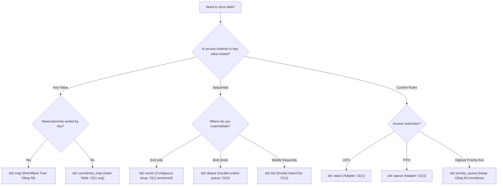

# C++ STL & Data Structures - Concept Guide

## 1. One-Line Intuition
> **C++ STL = a collection of container classes, algorithms, and iterators designed to provide highly optimized, standard data structures and operations in $O(1)$ or $O(\log N)$ average time.**

---

## 2. Visual Decision Tree: Selecting the Right Container



---

## 3. Container Comparison Table

| Container | Internal Structure | Search Time | Insertion Time | Memory Overhead | Use Case |
| :--- | :--- | :---: | :---: | :---: | :--- |
| `std::vector` | Dynamic Array | $O(N)$ (linear) | $O(1)$ amortized | Low (contiguous) | Default choice for linear collections |
| `std::deque` | Array of chunks | $O(N)$ (linear) | $O(1)$ at ends | Medium | Sliding window max/min tracking |
| `std::list` | Doubly Linked List| $O(N)$ | $O(1)$ | High (pointers) | Frequent insertions in middle |
| `std::set` | Red-Black Tree | $O(\log N)$ | $O(\log N)$ | High | Storing unique items in sorted order |
| `std::unordered_set` | Hash Table | $O(1)$ average | $O(1)$ average | High | Instant unique check, frequency map keys |

---

## 4. C++14 Templates

### Template A: Custom Comparators for Sorting (`std::sort`)
```cpp
#include <iostream>
#include <vector>
#include <algorithm>
#include <string>

struct Student {
    std::string name;
    int marks;
    int roll;
};

// Comparator function: Sorts by marks descending, then roll ascending
bool compareStudents(const Student& a, const Student& b) {
    if (a.marks != b.marks) {
        return a.marks > b.marks; // Higher marks first
    }
    return a.roll < b.roll; // Smaller roll number first (tie-breaker)
}

void sortStudents(std::vector<Student>& students) {
    std::sort(students.begin(), students.end(), compareStudents);
}
```

### Template B: Custom Comparators for Priority Queue (`std::priority_queue`)
```cpp
#include <queue>
#include <vector>

struct Item {
    int id;
    int priority_value;
};

// Comparator struct for priority_queue: builds a MIN-HEAP based on priority_value
struct CompareItem {
    bool operator()(const Item& a, const Item& b) {
        return a.priority_value > b.priority_value; // True means 'a' has lower priority than 'b' (Min-Heap)
    }
};

void runPriorityQueue() {
    // Declaring min-heap priority queue
    std::priority_queue<Item, std::vector<Item>, CompareItem> minHeap;
    
    minHeap.push({1, 50});
    minHeap.push({2, 10});
    minHeap.push({3, 30});
    
    // Top element will be Item 2 (priority_value = 10)
    Item top = minHeap.top(); 
}
```

### Template C: Map vs Unordered Map Lookup boundaries
```cpp
#include <iostream>
#include <unordered_map>
#include <map>
#include <string>

void mapLookup() {
    std::unordered_map<std::string, int> freq;
    
    // Safe lookup: avoiding auto-insertion of default values
    std::string key = "target";
    auto it = freq.find(key);
    if (it != freq.end()) {
        std::cout << "Value: " << it->second << std::endl;
    } else {
        std::cout << "Key not found!" << std::endl;
    }
}
```

---

## 5. Common Traps & Edge Cases
*   **Auto-insertion with `[]` operator**: Referencing a key in map using `map[key]` when it does not exist will automatically insert that key with a default value (e.g., `0` for `int`). Always use `map.find(key)` or `map.count(key)` to check existence.
*   **Worst-case complexity of `std::unordered_map`**: On average, lookup is $O(1)$. However, if hash collisions occur frequently (e.g. malicious inputs or bad hash function), it degrades to $O(N)$. Use `std::map` if strict $O(\log N)$ worst-case guarantee is required.
*   **Vector capacity vs size**: `vector.size()` returns the number of active elements, while `vector.capacity()` returns memory allocated. Shrink capacity to match size using `vector.shrink_to_fit()`.
