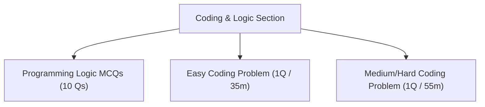
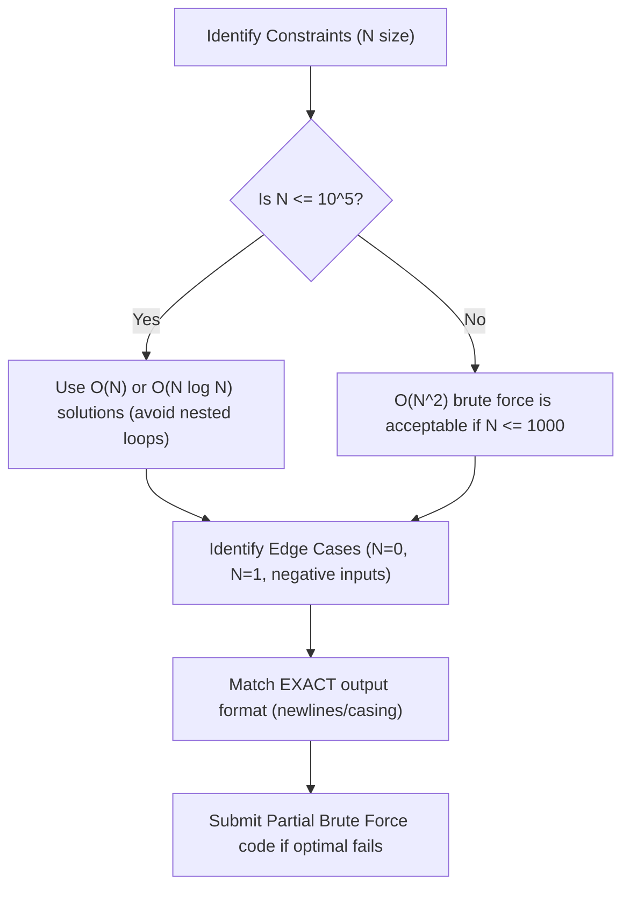

# 05 — Coding & Programming Logic (Advanced Coding Section)

This module covers the core concepts, programming logic, compilable code templates, and execution strategies for the Coding and Programming Logic sections of the TCS NQT (Prime & Digital Tiers).

---

## 📊 Exam Section Overview

The Advanced Coding section consists of **2–3 coding problems** to be solved in **90 minutes** using C, C++, Java, or Python. Additionally, some test cycles feature a **Programming Logic MCQ** section.



---

## A. Programming Logic — Solved MCQs (NQT Format)

---

### Q1. Undefined Behavior in C
What is the output of the following C code snippet?
```c
int x = 5;
printf("%d %d %d", x++, ++x, x);
```
(a) 5 7 7
(b) 6 7 7
(c) 5 6 6
(d) Compiler-dependent / Undefined Behavior

*   **Pattern ID:** `PL-UB-01` (Order of Evaluation)
*   **Hint:** Does the C standard specify the evaluation order of arguments passed to `printf`?
*   **Approach:** Identify if there are multiple modifications to the same variable `x` between sequence points (in this case, within a single function call argument list).
*   **Solution:** **(d) Compiler-dependent / Undefined Behavior** — The C standard does not define the order in which function arguments are evaluated. Different compilers (or different optimization levels) can evaluate the arguments from left-to-right or right-to-left, yielding varying results (like `5 7 7` or `6 7 7`).
*   **Shortcut:** If a single statement modifies the same variable multiple times using increment/decrement operators (`++`/`--`), immediately flag it as **Undefined Behavior**.
*   **Variation & Trap:** Do not attempt to calculate a fixed value. C compilers are free to optimize this in ways that lead to unpredictable outputs.

---

### Q2. Instance Variable Defaults in Java
In Java, what is the default value of an `int` instance variable?
(a) 0
(b) null
(c) garbage value
(d) undefined (triggers compile error)

*   **Pattern ID:** `PL-MEM-01` (Default Variable Initialization)
*   **Hint:** Differentiate between local variables inside methods and instance variables inside classes.
*   **Approach:**
    *   Local variables in Java are *not* initialized by default and cause compile-time errors if read uninitialized.
    *   Instance variables (member fields of a class) are initialized to default values by the JVM.
*   **Solution:** **(a) 0** — The default value for integer types (`byte, short, int, long`) in class scope is `0`.
*   **Shortcut Table:**
    $$\text{boolean} \rightarrow \text{false} \quad | \quad \text{Object References} \rightarrow \text{null} \quad | \quad \text{double/float} \rightarrow 0.0$$

---

### Q3. C++ Vector Reference Mutation
What is the output of the following C++ code snippet?
```cpp
#include <iostream>
#include <vector>

int main() {
    std::vector<int> a = {1, 2, 3};
    std::vector<int>& b = a;
    b.push_back(4);
    std::cout << a.size() << " " << b.size() << std::endl;
    return 0;
}
```
(a) `3 3`
(b) `3 4`
(c) `4 4`
(d) `4 3`

*   **Pattern ID:** `PL-CPP-01` (Reference Mutation)
*   **Hint:** In C++, reference variables act as aliases for the original variables.
*   **Approach:**
    *   `std::vector<int>& b = a;` declares `b` as a reference to `a`. They share the same underlying memory.
    *   Adding `4` to `b` modifies the same container, changing the size of both.
*   **Solution:** **(c) 4 4** — Because `b` is a reference, any operation on `b` directly affects `a`.
*   **Shortcut:** If a variable is declared with `&` (e.g. `Type& b = a;`), it is an alias. To make an independent copy, declare it without `&` (e.g. `Type b = a;`).


---

### Q4. Queue Data Structure
Which data structure utilizes the FIFO (First-In, First-Out) access pattern?
(a) Stack
(b) Queue
(c) Binary Tree
(d) Max-Heap

*   **Pattern ID:** `PL-DS-01` (Abstract Data Types)
*   **Hint:** Think of a queue at a ticket counter.
*   **Approach:**
    *   Stack uses LIFO (Last-In, First-Out).
    *   Queue inserts at rear (enqueue) and removes from front (dequeue) $\rightarrow$ FIFO.
*   **Solution:** **(b) Queue**

---

### Q5. Binary Search Time Complexity
What is the time complexity of performing a binary search on a sorted array of $n$ elements?
(a) $O(n)$
(b) $O(\log n)$
(c) $O(n \log n)$
(d) $O(1)$

*   **Pattern ID:** `PL-COMP-01` (Algorithmic Complexity)
*   **Hint:** How does the search space change at each step of a binary search?
*   **Approach:** Derivation of search space reduction:

```text
Step 1: [----------------------- n -----------------------]
Step 2: [----------- n/2 -----------]  (Discard half)
Step 3: [----- n/4 -----]              (Discard half)
...
Step k: [ 1 ]                          (Target found or empty)
```

$$\text{Search space after } k \text{ steps} = \frac{n}{2^k}$$
$$\text{Terminates when } \frac{n}{2^k} = 1 \implies n = 2^k \implies k = \log_2 n$$
The maximum number of comparisons is $O(\log n)$.
*   **Solution:** **(b) O(log n)**

---

### Q6. Modulo Operator
What is the output of the following C code?
```c
#include <stdio.h>
int main() {
    int a = 10, b = 3;
    printf("%d", a % b);
    return 0;
}
```
(a) 3
(b) 3.33
(c) 1
(d) 0

*   **Pattern ID:** `PL-OPS-01` (Arithmetic Modulo)
*   **Hint:** The modulo operator `%` calculates the integer remainder of a division.
*   **Approach:** Divide $10$ by $3$. The quotient is $3$ ($3 \times 3 = 9$). The remainder is $10 - 9 = 1$.
*   **Solution:** **(c) 1**

---

### Q7. Method Overriding in OOP
In Object-Oriented Programming, which concept allows a child class to provide a specific implementation of a method that is already defined in its parent class?
(a) Method Overloading
(b) Method Overriding
(c) Encapsulation
(d) Abstraction

*   **Pattern ID:** `PL-OOP-01` (Polymorphism)
*   **Hint:** Overriding changes behavior of an inherited method; overloading creates a new version of the method within the same class with different parameters.
*   **Approach:**
    *   Child class redefining parent class method with identical signature = Overriding (Run-time polymorphism).
*   **Solution:** **(b) Method Overriding**

---

### Q8. String Literal Pool in Java
What does the following Java code print?
```java
String a = "hello";
String b = "hello";
System.out.println(a == b);
```
(a) false
(b) true
(c) Compile error
(d) NullPointerException

*   **Pattern ID:** `PL-JV-01` (String Literal Interning)
*   **Hint:** In Java, the `==` operator compares object references (memory addresses), not string contents.
*   **Approach:** String literals in Java are stored in a common "String Pool" to conserve memory. When `b` is assigned `"hello"`, the JVM finds it in the pool and points `b` to the same memory location as `a`.
*   **Solution:** **(b) true** — Both `a` and `b` reference the identical string literal object in the pool.
*   **Variation & Trap:** If the strings were instantiated as `String a = new String("hello");` and `String b = new String("hello");`, `a == b` would evaluate to `false` because `new` forces the allocation of separate objects on the heap. Use `.equals()` to compare string contents.

---

### Q9. Array Default Initialization in C++
What is the output of this C++ code?
```cpp
#include <iostream>
using namespace std;
int main() {
    int arr[5] = {1, 2, 3};
    cout << arr[3];
    return 0;
}
```
(a) Garbage value
(b) 0
(c) Compile error
(d) IndexOutOfBoundsException

*   **Pattern ID:** `PL-CPP-01` (Array Initialization rules)
*   **Hint:** What happens to uninitialized indices when an array initializer list is partially defined?
*   **Approach:** In C and C++, if an array is initialized with an initializer list containing fewer elements than the array's declared size, all remaining uninitialized elements are automatically set to `0`.
*   **Solution:** **(b) 0** — Element at `arr[3]` is initialized to `0`.

---

### Q10. Sorting Algorithm Comparison
Which of the following sorting algorithms has the best average-case time complexity?
(a) Bubble Sort
(b) Selection Sort
(c) Quick Sort
(d) Insertion Sort

*   **Pattern ID:** `PL-SORT-01` (Sorting Efficiencies)
*   **Hint:** Compare $O(n^2)$ algorithms with $O(n \log n)$ algorithms.
*   **Approach:** Compare average-case time complexities:
    *   Bubble, Selection, Insertion Sort: $O(n^2)$
    *   Quick Sort: $O(n \log n)$
*   **Solution:** **(c) Quick Sort — O(n log n)**

---

## B. Solved Coding Problems (C++14 & Python)

---

### Problem 1: Integer Palindrome Check
**Statement:** Read an integer. Print `"YES"` if it is a palindrome, else print `"NO"`.

#### 💻 C++14 Solution
```cpp
#include <iostream>

int main() {
    // Fast I/O
    std::ios_base::sync_with_stdio(false);
    std::cin.tie(NULL);

    long long n;
    if (!(std::cin >> n)) return 0;

    if (n < 0) {
        std::cout << "NO\n";
        return 0;
    }

    long long original = n;
    long long rev = 0;
    while (n > 0) {
        rev = rev * 10 + n % 10;
        n /= 10;
    }

    if (rev == original) {
        std::cout << "YES\n";
    } else {
        std::cout << "NO\n";
    }
    return 0;
}
```

#### 🐍 Python 3 Solution
```python
import sys

def main():
    line = sys.stdin.read().strip()
    if not line:
        return
    n = int(line)
    if n < 0:
        print("NO")
        return
    original = n
    rev = 0
    while n > 0:
        rev = rev * 10 + n % 10
        n //= 10
    print("YES" if rev == original else "NO")

if __name__ == "__main__":
    main()
```

- **Time Complexity:** $O(\log_{10} N)$ — Number of digits in $N$.
- **Space Complexity:** $O(1)$ — Only stores a few integer variables.

---

### Problem 2: Find Second Largest Element in Array
**Statement:** Read $N$ elements and find the second largest value in the array.

#### 💻 C++14 Solution
```cpp
#include <iostream>
#include <vector>
#include <climits>

int main() {
    std::ios_base::sync_with_stdio(false);
    std::cin.tie(NULL);

    int n;
    if (!(std::cin >> n)) return 0;

    long long first = LLONG_MIN;
    long long second = LLONG_MIN;

    for (int i = 0; i < n; i++) {
        long long val;
        std::cin >> val;
        if (val > first) {
            second = first;
            first = val;
        } else if (val > second && val < first) {
            second = val;
        }
    }

    if (second == LLONG_MIN) {
        std::cout << "No second largest element\n";
    } else {
        std::cout << second << "\n";
    }
    return 0;
}
```

#### 🐍 Python 3 Solution
```python
import sys

def main():
    input_data = sys.stdin.read().split()
    if not input_data:
        return
    n = int(input_data[0])
    arr = [int(x) for x in input_data[1:]]
    
    first = second = -float('inf')
    for val in arr:
        if val > first:
            second = first
            first = val
        elif first > val > second:
            second = val
            
    if second == -float('inf'):
        print("No second largest element")
    else:
        print(second)

if __name__ == "__main__":
    main()
```

- **Time Complexity:** $O(N)$ — Single scan through the array of size $N$.
- **Space Complexity:** $O(1)$ — Only updates two variables.

---

### Problem 3: Vowels and Consonants Counter
**Statement:** Read a string and output the number of vowels and consonants.

#### 💻 C++14 Solution
```cpp
#include <iostream>
#include <string>
#include <cctype>

int main() {
    std::string s;
    if (!std::getline(std::cin, s)) return 0;

    int vowels = 0;
    int consonants = 0;

    for (char c : s) {
        if (std::isalpha(c)) {
            char lower = std::tolower(c);
            if (lower == 'a' || lower == 'e' || lower == 'i' || lower == 'o' || lower == 'u') {
                vowels++;
            } else {
                consonants++;
            }
        }
    }
    std::cout << vowels << " " << consonants << "\n";
    return 0;
}
```

#### 🐍 Python 3 Solution
```python
import sys

def main():
    s = sys.stdin.read().strip()
    vowel_chars = "aeiouAEIOU"
    v = sum(1 for ch in s if ch in vowel_chars)
    c = sum(1 for ch in s if ch.isalpha() and ch not in vowel_chars)
    print(v, c)

if __name__ == "__main__":
    main()
```

- **Time Complexity:** $O(N)$ where $N$ is the length of the string.
- **Space Complexity:** $O(1)$ auxiliary space.

---

### Problem 4: Prime Number Checker
**Statement:** Check if a given integer $N$ is prime.

#### 💻 C++14 Solution
```cpp
#include <iostream>

bool isPrime(long long n) {
    if (n < 2) return false;
    if (n == 2 || n == 3) return true;
    if (n % 2 == 0 || n % 3 == 0) return false;
    // Check divisors up to square root of n
    for (long long i = 5; i * i <= n; i += 6) {
        if (n % i == 0 || n % (i + 2) == 0) return false;
    }
    return true;
}

int main() {
    long long n;
    if (std::cin >> n) {
        if (isPrime(n)) {
            std::cout << "PRIME\n";
        } else {
            std::cout << "NOT PRIME\n";
        }
    }
    return 0;
}
```

#### 🐍 Python 3 Solution
```python
import sys

def is_prime(n):
    if n < 2:
        return False
    for i in range(2, int(n**0.5) + 1):
        if n % i == 0:
            return False
    return True

def main():
    line = sys.stdin.read().strip()
    if line:
        n = int(line)
        print("PRIME" if is_prime(n) else "NOT PRIME")

if __name__ == "__main__":
    main()
```

- **Time Complexity:** $O(\sqrt{N})$ — Loop stops when $i > \sqrt{N}$, avoiding TLE on large values of $N$.
- **Space Complexity:** $O(1)$.

---

### Problem 5: Fibonacci Series Generator
**Statement:** Output the first $N$ terms of the Fibonacci sequence.

#### 💻 C++14 Solution
```cpp
#include <iostream>
#include <vector>

int main() {
    int n;
    if (!(std::cin >> n) || n <= 0) return 0;

    long long a = 0, b = 1;
    for (int i = 0; i < n; i++) {
        std::cout << a << (i == n - 1 ? "" : " ");
        long long next = a + b;
        a = b;
        b = next;
    }
    std::cout << "\n";
    return 0;
}
```

#### 🐍 Python 3 Solution
```python
import sys

def main():
    line = sys.stdin.read().strip()
    if not line:
        return
    n = int(line)
    a, b = 0, 1
    result = []
    for _ in range(n):
        result.append(a)
        a, b = b, a + b
    print(*result)

if __name__ == "__main__":
    main()
```

- **Time Complexity:** $O(N)$ loop runs $N$ times.
- **Space Complexity:** $O(1)$ auxiliary space.

---

### Problem 6: Factorial calculation (with overflow checks)
**Statement:** Print the factorial of $N$.

#### 💻 C++14 Solution (Double Precision / String Array for Huge Outputs)
```cpp
#include <iostream>
#include <vector>

// Helper to multiply large number stored as array
void multiply(std::vector<int>& val, int x) {
    int carry = 0;
    for (int i = 0; i < (int)val.size(); i++) {
        int prod = val[i] * x + carry;
        val[i] = prod % 10;
        carry = prod / 10;
    }
    while (carry) {
        val.push_back(carry % 10);
        carry /= 10;
    }
}

int main() {
    int n;
    if (!(std::cin >> n)) return 0;

    std::vector<int> result;
    result.push_back(1);

    for (int i = 2; i <= n; i++) {
        multiply(result, i);
    }

    // Print digits in reverse order
    for (int i = (int)result.size() - 1; i >= 0; i--) {
        std::cout << result[i];
    }
    std::cout << "\n";
    return 0;
}
```

#### 🐍 Python 3 Solution
```python
import sys

def main():
    line = sys.stdin.read().strip()
    if line:
        n = int(line)
        fact = 1
        for i in range(1, n + 1):
            fact *= i
        print(fact)

if __name__ == "__main__":
    main()
```

- **Time Complexity:** $O(N^2)$ for large integers using array multiplication.
- **Space Complexity:** $O(\text{number of digits})$ to store the factorial.

---

### Problem 7: Matrix Transpose
**Statement:** Read a matrix of dimension $R \times C$ and output its transpose.

#### 💻 C++14 Solution
```cpp
#include <iostream>
#include <vector>

int main() {
    int r, c;
    if (!(std::cin >> r >> c)) return 0;

    std::vector<std::vector<int>> matrix(r, std::vector<int>(c));
    for (int i = 0; i < r; i++) {
        for (int j = 0; j < c; j++) {
            std::cin >> matrix[i][j];
        }
    }

    // Output transpose
    for (int j = 0; j < c; j++) {
        for (int i = 0; i < r; i++) {
            std::cout << matrix[i][j] << (i == r - 1 ? "" : " ");
        }
        std::cout << "\n";
    }
    return 0;
}
```

#### 🐍 Python 3 Solution
```python
import sys

def main():
    input_data = sys.stdin.read().split()
    if not input_data:
        return
    r = int(input_data[0])
    c = int(input_data[1])
    
    matrix = []
    idx = 2
    for i in range(r):
        matrix.append([int(x) for x in input_data[idx:idx+c]])
        idx += c
        
    for j in range(c):
        row = [matrix[i][j] for i in range(r)]
        print(*row)

if __name__ == "__main__":
    main()
```

- **Time Complexity:** $O(R \times C)$ to read and print.
- **Space Complexity:** $O(R \times C)$ to store matrix.

---

### Problem 8: Remove Duplicate Characters
**Statement:** Remove duplicate characters from a string, keeping only their first occurrence order.

#### 💻 C++14 Solution
```cpp
#include <iostream>
#include <string>
#include <vector>

int main() {
    std::string s;
    if (!std::getline(std::cin, s)) return 0;

    std::vector<bool> seen(256, false);
    std::string result = "";

    for (char c : s) {
        unsigned char uc = c;
        if (!seen[uc]) {
            seen[uc] = true;
            result += c;
        }
    }
    std::cout << result << "\n";
    return 0;
}
```

#### 🐍 Python 3 Solution
```python
import sys

def main():
    s = sys.stdin.read().rstrip('\n')
    seen = set()
    result = []
    for ch in s:
        if ch not in seen:
            seen.add(ch)
            result.append(ch)
    print("".join(result))

if __name__ == "__main__":
    main()
```

- **Time Complexity:** $O(N)$ where $N$ is the length of the string.
- **Space Complexity:** $O(1)$ auxiliary space (hash array size is fixed at 256 for ASCII).

---

### Problem 9: Two Sum (Find Sum Pairs)
**Statement:** Find all unique pairs in an array that sum to a given target.

#### 💻 C++14 Solution
```cpp
#include <iostream>
#include <vector>
#include <unordered_set>

int main() {
    int n;
    if (!(std::cin >> n)) return 0;

    std::vector<int> arr(n);
    for (int i = 0; i < n; i++) {
        std::cin >> arr[i];
    }

    int target;
    std::cin >> target;

    std::unordered_set<int> seen;
    std::unordered_set<int> printed; // To avoid printing duplicates

    for (int num : arr) {
        int complement = target - num;
        if (seen.count(complement) && !printed.count(num) && !printed.count(complement)) {
            std::cout << complement << " " << num << "\n";
            printed.insert(num);
            printed.insert(complement);
        }
        seen.insert(num);
    }
    return 0;
}
```

#### 🐍 Python 3 Solution
```python
import sys

def main():
    input_data = sys.stdin.read().split()
    if not input_data:
        return
    n = int(input_data[0])
    arr = [int(x) for x in input_data[1:n+1]]
    target = int(input_data[n+1])
    
    seen = set()
    pairs = []
    for num in arr:
        complement = target - num
        if complement in seen:
            pairs.append((complement, num))
        seen.add(num)
        
    if not pairs:
        print("No pairs found")
    else:
        for p in pairs:
            print(p[0], p[1])

if __name__ == "__main__":
    main()
```

- **Time Complexity:** $O(N)$ — Single pass using hash lookups.
- **Space Complexity:** $O(N)$ to store array elements in a hash set.

---

### Problem 10: Print Number Triangle Pattern
**Statement:** Print a number triangle of height $N$. For example, $N = 4$:
```text
1
1 2
1 2 3
1 2 3 4
```

#### 💻 C++14 Solution
```cpp
#include <iostream>

int main() {
    int n;
    if (!(std::cin >> n)) return 0;

    for (int i = 1; i <= n; i++) {
        for (int j = 1; j <= i; j++) {
            std::cout << j << (j == i ? "" : " ");
        }
        std::cout << "\n";
    }
    return 0;
}
```

#### 🐍 Python 3 Solution
```python
import sys

def main():
    line = sys.stdin.read().strip()
    if line:
        n = int(line)
        for i in range(1, n + 1):
            print(*range(1, i + 1))

if __name__ == "__main__":
    main()
```

- **Time Complexity:** $O(N^2)$ to print all elements.
- **Space Complexity:** $O(1)$.

---

## C. Coding Round Survival Checklist



- [ ] **Check constraints:** If array size $N = 10^5$, do not use nested loops ($O(N^2)$). Implement $O(N)$ or $O(N \log N)$ algorithms to avoid TLE.
- [ ] **Verify Edge Cases:** Trace behavior with empty input, negative numbers, single element array, or $N = 1$.
- [ ] **Match Output Formatting:** Ensure exact capitalization (e.g. `YES` vs `Yes`) and spacing matching sample cases.
- [ ] **Clear Buffers:** When using C++, insert fast I/O boilerplate to speed up runtime.
- [ ] **Write Partial Code:** TCS awards partial points for passing subsets of test cases. Submit a simple brute-force solution if you are stuck.

---

## D. High-Frequency Topics to Review

1.  **Arrays & Strings:** Sliding window, two-pointers, character frequency hashing.
2.  **Number Theory:** Prime checkers ($O(\sqrt{N})$), Fibonacci sequences, GCD/LCM, and Large Factorial multiplication.
3.  **Basic Searching & Sorting:** Binary Search ($O(\log N)$) and Bubble/Selection sort logic.
4.  **Data Structure Basics:** Queue (FIFO) and Stack (LIFO) operations.
5.  **OOP Fundamentals:** Method Overriding (runtime polymorphism) vs Method Overloading (compile-time polymorphism).
