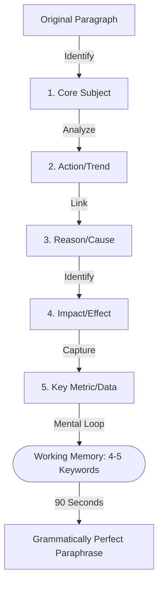

# TCS NQT 2026 — Verbal Ability Part 2
### Complete Preparation Guide · Exam: June 28, 2026

> **Section Stats:** 2 passages × 4Q = 8 Questions total (Passage Recall) · 1 Question (Email Writing)
> 
> **Time Limits:** Passage Recall: 30s to read + 90s to rewrite | Email Writing: 9 minutes (540s)

---

## Quick Navigation

| Block | Contents | Focus |
|-------|----------|-------|
| [Passage Recall](#-section-a-passage-recall-mastery) | Active Reading Strategies & 10 Practice Passages | 30s Read / 90s Write |
| [Email Format](#-section-b-email-writing-mastery) | Format Rules & Professional Rubric | Minimum 100 Words |
| [Model Emails](#3-situation-types--model-emails) | 8 Corporate Solved Emails | Tonal Flow |
| [Phrase Bank](#4-phrase-bank-for-professional-emails) | 46 Copy-Paste Corporate Phrases | Speed Writing |
| [Mock Exercises](#6-5-full-mock-email-writing-exercises) | 5 Practice Email Situations | Practice |

---

# 📋 SECTION A: Passage Recall Mastery

---

## 1. The 30-Second Reading Strategy

The 30-second window is not meant for memorization of every single word. Instead, focus on extracting the **semantic skeleton** of the text.



### ⚡ Shortcut Tricks
1. **The 5-Point Skeleton**: During the 30-second reading time, hold these five questions in your mind:
   * **Subject**: Who or what is the text about?
   * **Trend**: What is happening to the subject?
   * **Cause**: Why is this happening?
   * **Effect**: What is the outcome?
   * **Metric**: Are there any numbers, dates, or percentages?
2. **Mental Keyword Loop**: Do not try to memorize exact sentences. Repeat a list of 4-5 keywords in your head: *"Quantum computing $\to$ RSA threat $\to$ 90% internet transactions $\to$ post-quantum fix"*. Reconstruct these into formal sentences during the 90-second writing phase.

### ⚠️ Common Error
> Memorizing word-for-word. Plagiarism checks will flag exact matches. Write in your own words, maintaining only core technical terms and metrics.

---

## 2. 10 Practice Passage Recall Exercises

Test your active recall. Read the original for 30s, cover it, and write your summary.

### Practice 1
*Original*: "Quantum computing threatens modern cryptography because of its ability to solve integer factorization problems exponentially faster than classical computers. RSA encryption, which secures ninety percent of internet transactions, could become obsolete within the next decade. Consequently, researchers are developing post-quantum cryptographic algorithms to protect data before quantum hardware matures."
<details>
<summary>Model Answer & Key Points</summary>
* **Key Points**: Quantum computing threatens cryptography; RSA securing 90% of transactions will become obsolete; post-quantum algorithms are being developed.
* **Model Rewrite**: Quantum computers pose a severe risk to internet security by solving mathematical problems faster than current systems. RSA encryption, which protects ninety percent of web transactions, faces obsolescence in ten years. Therefore, scientists are creating new cryptographic standards to secure data before quantum machines are deployed. ✓
</details>

### Practice 2
*Original*: "A recent study shows that remote work policies have led to a twenty percent reduction in corporate greenhouse gas emissions. This drop is attributed to decreased office energy usage and fewer daily commutes. However, business leaders argue that long-term remote collaboration leads to a decline in creative brainstorming and project speed."
<details>
<summary>Model Answer & Key Points</summary>
* **Key Points**: Remote work reduced emissions by 20%; reasons are less office energy and commutes; drawback is reduced collaboration and speed.
* **Model Rewrite**: Research indicates that work-from-home models cut corporate carbon emissions by twenty percent by reducing office power consumption and employee travel. Nonetheless, managers caution that remote arrangements weaken creative collaboration and slow project progression. ✓
</details>

### Practice 3
*Original*: "The global microchip shortage has forced automobile manufacturers to curtail production, resulting in a five percent increase in vehicle prices. Because modern cars rely on chips for navigation and safety, factories cannot complete assembly without them. Analysts expect supply chains to stabilize only by late 2026."
<details>
<summary>Model Answer & Key Points</summary>
* **Key Points**: Chip shortage cut car production; prices rose by 5%; cars need chips for safety/nav; stabilization by late 2026.
* **Model Rewrite**: Due to the global semiconductor deficit, car manufacturers have lowered output, driving up prices by five percent. Because modern vehicles require microchips for essential safety and navigation systems, assemblies remain incomplete. Experts predict supply chains will recover in late 2026. ✓
</details>

### Practice 4
*Original*: "Vertical farming in urban high-rises uses ninety-five percent less water than traditional agriculture. By controlling temperature and light, these systems produce crops year-round without pesticides. However, the high electricity consumption required for LED lighting makes vertical farms financially unfeasible in regions with high power tariffs."
<details>
<summary>Model Answer & Key Points</summary>
* **Key Points**: Vertical farming cuts water by 95%; crop year-round, no pesticides; LED power consumption makes it costly.
* **Model Rewrite**: Urban vertical agriculture reduces water consumption by ninety-five percent compared to conventional farming. While controlled indoor environments enable pesticide-free cultivation throughout the year, the high electricity required for LED lights limits financial viability in areas with expensive energy rates. ✓
</details>

### Practice 5
*Original*: "Ocean acidification, caused by carbon dioxide absorption, has led to a dramatic decline in shellfish populations. Corals and oysters cannot form shells in acidic waters, disrupting marine ecosystems. Marine biologists warn that a failure to curb emissions will destroy coral reefs, which support twenty-five percent of marine life."
<details>
<summary>Model Answer & Key Points</summary>
* **Key Points**: CO2 absorption causes ocean acidification; shells cannot form; coral reefs supporting 25% of marine life are threatened.
* **Model Rewrite**: Increased carbon absorption makes seawater acidic, preventing shellfish and corals from building their protective structures. Scientists warn that if greenhouse gases are not reduced, reef ecosystems, which harbor a quarter of all marine species, will face destruction. ✓
</details>

### Practice 6
*Original*: "Cybersecurity experts report a significant increase in ransomware attacks targeting municipal utility networks. Hackers exploit outdated software systems to encrypt operational data, demanding payments in cryptocurrency. Security firms advise local governments to partition control systems from corporate networks to prevent total grid failure."
<details>
<summary>Model Answer & Key Points</summary>
* **Key Points**: Ransomware attacks on utility networks are rising; outdated software is exploited for crypto ransoms; recommendation is to separate control and corporate networks.
* **Model Rewrite**: Local utility networks are increasingly targeted by ransomware attacks that exploit older software to hold operational data hostage for cryptocurrency. To protect infrastructure, security agencies suggest isolating control networks from administrative corporate systems. ✓
</details>

### Practice 7
*Original*: "The use of drones in agricultural monitoring has boosted crop yields by ten percent. Outfitted with multispectral cameras, these aerial devices detect water stress and pest infestations before they are visible to the naked eye. This data allows farmers to apply fertilizers precisely, reducing chemical waste."
<details>
<summary>Model Answer & Key Points</summary>
* **Key Points**: Drones boost yields by 10%; cameras spot water stress/pests early; enables precise fertilizer application.
* **Model Rewrite**: Utilizing monitoring drones in farming has improved crop output by ten percent. Outfitted with specialized cameras, these devices spot hydration issues and pests early, allowing farmers to distribute chemical treatments precisely and minimize waste. ✓
</details>

### Practice 8
*Original*: "Reforestation projects in sub-Saharan Africa have successfully restored ten thousand hectares of degraded land. By planting native trees, local communities have reversed soil erosion and improved water retention in the soil. However, the project faces challenges from illegal logging and grazing during dry seasons."
<details>
<summary>Model Answer & Key Points</summary>
* **Key Points**: Restored 10,000 hectares of land; native trees stopped erosion, helped water; threat is illegal logging and grazing.
* **Model Rewrite**: Tree-planting initiatives in sub-Saharan Africa have reclaimed ten thousand hectares of damaged land. Native tree species have prevented soil loss and enhanced ground moisture, although unauthorized logging and cattle grazing during dry seasons threaten these gains. ✓
</details>

### Practice 9
*Original*: "The development of biodegradable plastics from seaweed offers a solution to marine plastic pollution. Unlike petroleum-based plastics, seaweed packaging decomposes within four weeks in seawater. However, high manufacturing costs remain a barrier to mass market adoption by commercial food brands."
<details>
<summary>Model Answer & Key Points</summary>
* **Key Points**: Seaweed bioplastics decompose in 4 weeks; solves marine pollution; high manufacturing cost prevents mass adoption.
* **Model Rewrite**: Seaweed-based biodegradable packaging provides a solution to ocean plastic pollution, decomposing in water within four weeks. Nevertheless, the expensive production process currently prevents major food companies from adopting this material on a large scale. ✓
</details>

### Practice 10
*Original*: "Studies show that learning a second language increases grey matter density in brain regions associated with memory and attention. Bilingual individuals show symptoms of cognitive decline four years later than monolingual peers. Neurologists attribute this to the cognitive reserve built by switching between languages."
<details>
<summary>Model Answer & Key Points</summary>
* **Key Points**: Second language grows grey matter; bilinguals delay cognitive decline by 4 years; cause is language-switching cognitive reserve.
* **Model Rewrite**: Research indicates that bilingualism enhances brain density in regions managing focus and memory. Individuals speaking two languages experience cognitive decline four years later than others, which neurologists attribute to the mental exercise of alternating between languages. ✓
</details>

---

# 📧 SECTION B: Email Writing Mastery

---

## 1. TCS NQT Email Format

Your email must be structured using standard business blocks.

```
Subject: [Professional Summary - 6 to 8 words]

Dear [Recipient Name/Title],

[Opening Paragraph: Objective of the email - 1 to 2 sentences]

[Body Paragraph 1: Detail the core issue and context parameters]
[Body Paragraph 2: Mention impacts, constraints, or alternatives]

[Closing Paragraph: Proposed solutions, call to action, or next steps]

Best regards,

[Your Name]
[Your Role/Title]
```

### ⚡ Shortcut Tricks
1. **Never use contractions**: Write *do not* (not *don't*), *will not* (not *won't*), *cannot* (not *can't*).
2. **Sequential Outline**: If the prompt gives a set of outline words, you must use them in the exact order they are listed.
3. **Word Count Check**: Aim for **110–130 words**. Under 100 words leads to automatic fail score.

---

## 2. Situation Types & Model Emails

### 🔸 Situation 1: Technical Issue to Manager
* **Description**: Write an email to your project manager explaining a critical server crash that will delay the module delivery.
<details>
<summary>Model Email & Rubric Check</summary>
**Subject**: Critical Server Downtime and Delivery Schedule Impact

Dear Mr. Mehta,

I am writing to formally report a critical database server failure that occurred this morning during our final stress testing phase. Our system administration team is currently working to resolve the issue.

Unfortunately, this server downtime has temporarily halted all integration testing. Consequently, we will not be able to deliver the completed authentication module by the scheduled deadline of tomorrow evening. 

We expect the server to be fully operational by tomorrow morning, after which we will require twenty-four hours to complete validation. Therefore, we propose a revised delivery date of Friday, July 3rd. I apologize for this unexpected delay and will share regular status updates.

Best regards,  
Ravi Ranjan  
Senior Developer ✓
</details>

### 🔸 Situation 2: Request Leave for Important Event
* **Description**: Request your team lead for three days of leave to attend your sister's wedding.
<details>
<summary>Model Email & Rubric Check</summary>
**Subject**: Leave Application for Family Event

Dear Mrs. Sharma,

I am writing to formally request three days of casual leave from November 12 to November 14, 2026. My sister is getting married during this period, and I must travel to my hometown to attend the ceremonies.

Prior to my departure, I will complete all my pending tasks for the current sprint. Furthermore, I have requested my colleague, Amit Kumar, to monitor my active deployment tasks and handle any emergency issues. I will also be available via email for urgent queries.

I have updated our resource management tool to reflect this request. Thank you for your support and understanding regarding this application.

Sincerely,  
Ravi Ranjan  
Software Engineer ✓
</details>

### 🔸 Situation 3: Follow up on Pending Task
* **Description**: Send a follow-up email to a colleague from another team who has not provided the API documentation.
<details>
<summary>Model Email & Rubric Check</summary>
**Subject**: Pending API Documentation for Integration Phase

Dear Vikram,

I hope this email finds you well. I am writing to follow up on the payment gateway API integration documentation, which we discussed during our sync meeting last Tuesday.

Our development team is scheduled to begin the payment integration phase tomorrow morning. Without the detailed API endpoints and schema descriptions, we cannot proceed with the backend connection tasks, which might delay the entire sprint.

Could you please share the documentation or provide an estimated time for its completion? If you need assistance or wish to discuss integration blocks, please let me know.

Regards,  
Ravi Ranjan  
Technical Lead ✓
</details>

---

## 3. Phrase Bank for Professional Emails

| Category | Useful Phrases |
|:---|:---|
| **Openings** | "I am writing to update you regarding..." <br> "I hope this email finds you well." <br> "I would like to bring to your attention..." |
| **Requests** | "Could you please provide..." <br> "I would appreciate it if you could..." <br> "Kindly share the updated details at your earliest convenience." |
| **Apologies** | "Please accept my sincere apologies for..." <br> "We deeply regret the inconvenience caused by..." <br> "We apologize for this oversight." |
| **Follow-ups** | "I am writing to follow up on..." <br> "Could you please provide an update on..." <br> "We are awaiting your response regarding..." |
| **Closings** | "Thank you for your time and consideration." <br> "I look forward to hearing from you soon." <br> "Please let me know if you have any questions." |

---

## 4. 5 Full Mock Email Writing Exercises

### Mock 1
* **Situation**: Write an email to your project client explaining that the software update contains a bug and the deployment must be postponed.
<details>
<summary>Model Answer & Rubric Check</summary>
**Subject**: Postponement of Scheduled Software Deployment

Dear Mr. Richardson,

I am writing to inform you that we must postpone the scheduled deployment of the system update, which was planned for tonight at 9:00 PM.

During our final regression testing cycles, we identified a critical memory leak within the payment gateway module. Under high traffic simulation, this issue causes server slowdowns. To guarantee system stability, our development team must resolve this bug before going live.

We are currently implementing a patch and expect to finish testing by tomorrow afternoon. Therefore, we propose to reschedule the deployment to Friday, June 29th, at the same time.

Thank you for your patience and understanding.

Regards,  
Ravi Ranjan  
Release Manager ✓
</details>

### Mock 2
* **Situation**: Write an email to the facility manager requesting a dedicated parking slot due to medical reasons.
<details>
<summary>Model Answer & Rubric Check</summary>
**Subject**: Request for Dedicated Parking Slot on Medical Grounds

Dear Mr. Thompson,

I am writing to formally request the allocation of a dedicated parking space close to the main entrance of Building B, due to recent medical reasons.

I recently underwent knee surgery and have been advised by my physician to minimize walking long distances. Currently, my parked vehicle is located in the outer lot, which requires a significant walk to my office.

I have attached the medical certificate and recommendation letter from my surgeon for your reference. I would appreciate it if you could assign me a temporary slot in the basement level. Thank you for your support.

Sincerely,  
Ravi Ranjan  
Analyst ✓
</details>

### Mock 3
* **Situation**: Write an email to your team lead requesting permission to work remotely for one week to care for an ailing parent.
<details>
<summary>Model Answer & Rubric Check</summary>
**Subject**: Request for Temporary Remote Work Arrangement

Dear Mr. Gupta,

I am writing to request permission to work from home for one week, from July 6th to July 10th, 2026. My father is recovering from surgery, and I need to be present at home to assist with his recovery.

During this period, I will maintain my regular working hours and attend all scheduled team sync meetings online. My current tasks are independent, and I have stable internet connectivity to access all remote servers.

I will ensure that my remote status does not impact our deliverables. I appreciate your understanding and support regarding this family emergency.

Best regards,  
Ravi Ranjan  
Software Engineer ✓
</details>
