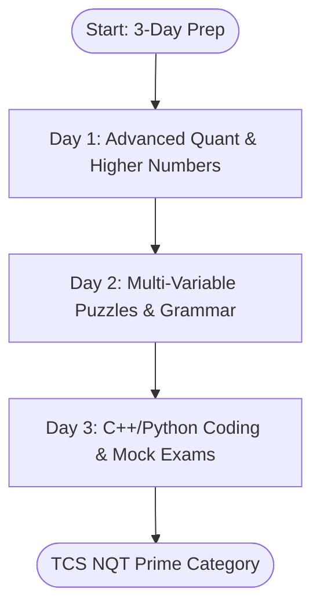
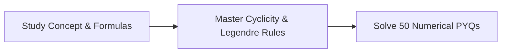
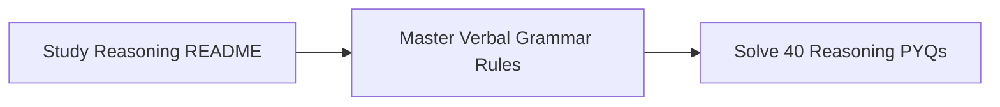
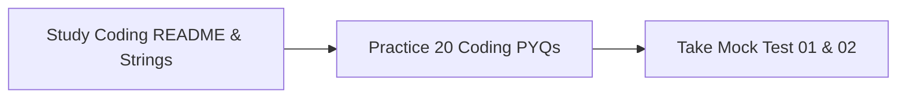

# 3-Day Prime Category Prep Strategy Guide

This guide outlines a high-intensity study schedule designed to take you from a baseline state to passing the **TCS NQT Prime Category Cutoff** (which requires $\ge 65\%$ score on the Advanced sections and passing both private test cases in Coding) in exactly 3 days.



---

## 🎯 Target Benchmarks: Prime vs. Digital vs. Ninja

To qualify for a specific job tier, you must clear the following estimated scoring benchmarks:

| Section | Ninja Cutoff | Digital Cutoff | Prime Cutoff |
| :--- | :--- | :--- | :--- |
| **Foundation Cognitive** | $50\%$ score | $65\%$ score | $75\%$ score |
| **Advanced Aptitude** | Not evaluated | $55\%$ score | **$\ge 65\%$ score** |
| **Advanced Coding** | Not evaluated | $1$ Code (all test cases) | **$2$ Codes (all test cases)** |

---

## 📅 Day 1: Advanced Quant & Higher Numbers

### Focus Area
Mastering speed math, percentage scales, divisibility rules, and modular remainder arithmetic.



### 1. Concept Review (4 Hours)
*   **Number System Foundations:** Read through **[01_Concept.md](file:///d:/Temp/TCS-NQT/01_Numerical_Ability/01_Number_System/01_Concept.md)** to learn cyclicity and factors.
*   **Percentage & Product Constancy:** Review **[02_Percentage/01_Concept.md](file:///d:/Temp/TCS-NQT/01_Numerical_Ability/02_Percentage/01_Concept.md)**. Master the $A \times B = \text{Constant}$ shortcut.
*   **Formula Book Audit:** Read the **[MASTER_FORMULA_BOOK.md](file:///d:/Temp/TCS-NQT/09_Revision/Formula_Sheets/MASTER_FORMULA_BOOK.md)** sections on *Number System* and *Percentages*.
    *   *Legendre's Formula Derivation:* Review why trailing zeros are determined by prime factors of 5:
        $$\text{Trailing Zeros in } n! = \sum_{k=1}^{\infty} \left\lfloor \frac{n}{5^k} \right\rfloor$$

### 2. Practice (4 Hours)
*   Solve the **[COMPLETE_NUMERICAL_PYQS.md](file:///d:/Temp/TCS-NQT/08_PYQ_Bank/Numerical_PYQs/COMPLETE_NUMERICAL_PYQS.md)** booklet.
*   Work through the 50 solved quantitative questions. Pay close attention to the **Variation & Trap** sections.

---

## 📅 Day 2: Multi-Variable Puzzles & Grammar

### Focus Area
Solving logical series, 4-variable seating grids, syllogism Venn diagrams, and spotting grammar errors.



### 1. Concept Review (4 Hours)
*   **Logical Frameworks:** Study the **[Reasoning Ability README.md](file:///d:/Temp/TCS-NQT/02_Reasoning_Ability/README.md)**. Understand how to trace direction vectors and set up family trees.
*   **Verbal Mastery:** Review **[Verbal Ability README.md](file:///d:/Temp/TCS-NQT/04_Verbal_Ability/README.md)**. Memorize the Subject-Verb Agreement proximity rules and preposition collocations.
*   **Advanced Logic:** Read **[Advanced Section README.md](file:///d:/Temp/TCS-NQT/03_Advanced_Section/README.md)**. Master machine input-output rules and critical reasoning weaken/strengthen strategies.

### 2. Practice (4 Hours)
*   Solve the **[COMPLETE_REASONING_PYQS.md](file:///d:/Temp/TCS-NQT/08_PYQ_Bank/Reasoning_PYQs/COMPLETE_REASONING_PYQS.md)** booklet.
*   Solve all 40 logical reasoning questions. Focus on circular arrangements and blood relations.

---

## 📅 Day 3: Advanced Coding & Full-Length Simulation

### Focus Area
Completing two-pointer, sliding window, and frequency array coding solutions under time pressure, and taking full-length mock exams.



### 1. Coding Concept Audit (3 Hours)
*   **Coding Fundamentals:** Study the **[Coding README.md](file:///d:/Temp/TCS-NQT/05_Coding/README.md)**. Master the $O(\log N)$ binary search complexity derivation and the C++ array partial initialization rules.
*   **String Manipulation:** Review **[Strings README.md](file:///d:/Temp/TCS-NQT/05_Coding/02_Strings/00_README.md)**. Pay attention to in-place reversals, frequency arrays, and the KMP LPS array construction details.

### 2. Coding Practice (3 Hours)
*   Solve the **[COMPLETE_CODING_PYQS.md](file:///d:/Temp/TCS-NQT/08_PYQ_Bank/Coding_PYQs/COMPLETE_CODING_PYQS.md)** bank.
*   Examine both the C++14 and Python 3 optimal solutions for the 20 coding problems. Make sure you can write the fast I/O boilerplate:
```cpp
std::ios_base::sync_with_stdio(false);
std::cin.tie(NULL);
```

### 3. Exam Simulation (4 Hours)
*   Take **[MOCK_TEST_01.md](file:///d:/Temp/TCS-NQT/07_Mock_Tests/05_Full_Length_Mocks/MOCK_TEST_01.md)**. Time yourself strictly for 192 minutes.
*   Take **[MOCK_TEST_02.md](file:///d:/Temp/TCS-NQT/07_Mock_Tests/05_Full_Length_Mocks/MOCK_TEST_02.md)** (slightly harder) to build stamina.
*   Review your errors using **[MASTER_MISTAKES.md](file:///d:/Temp/TCS-NQT/09_Revision/Mistake_Book/MASTER_MISTAKES.md)** to check which of the 50 fatal traps you fell into.
